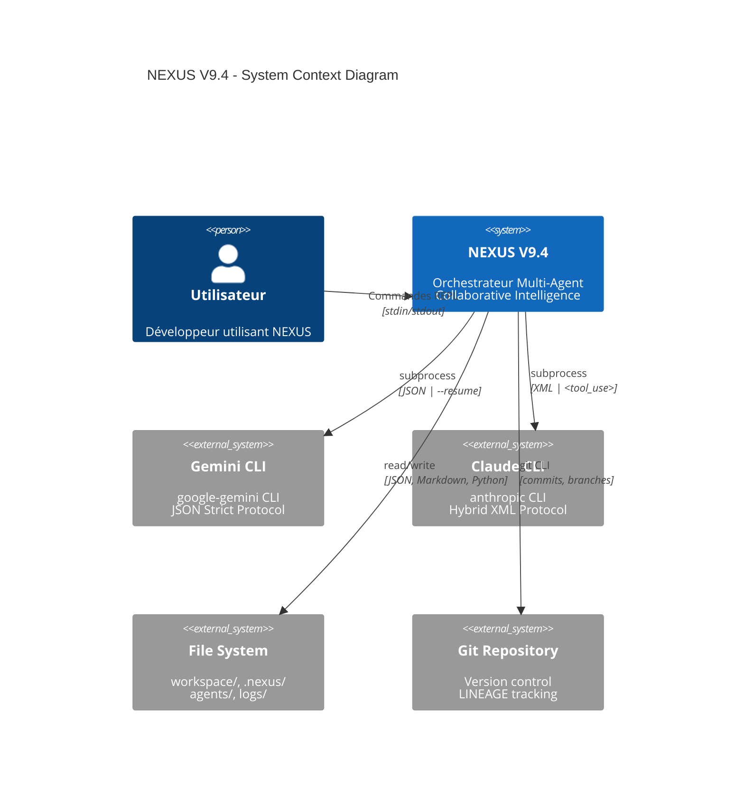
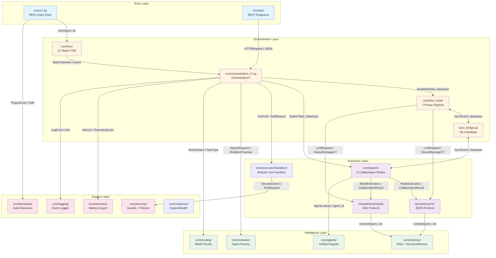
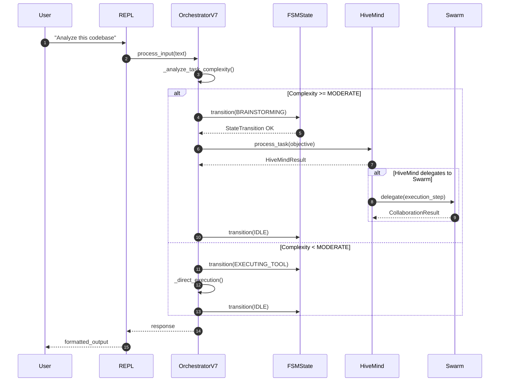
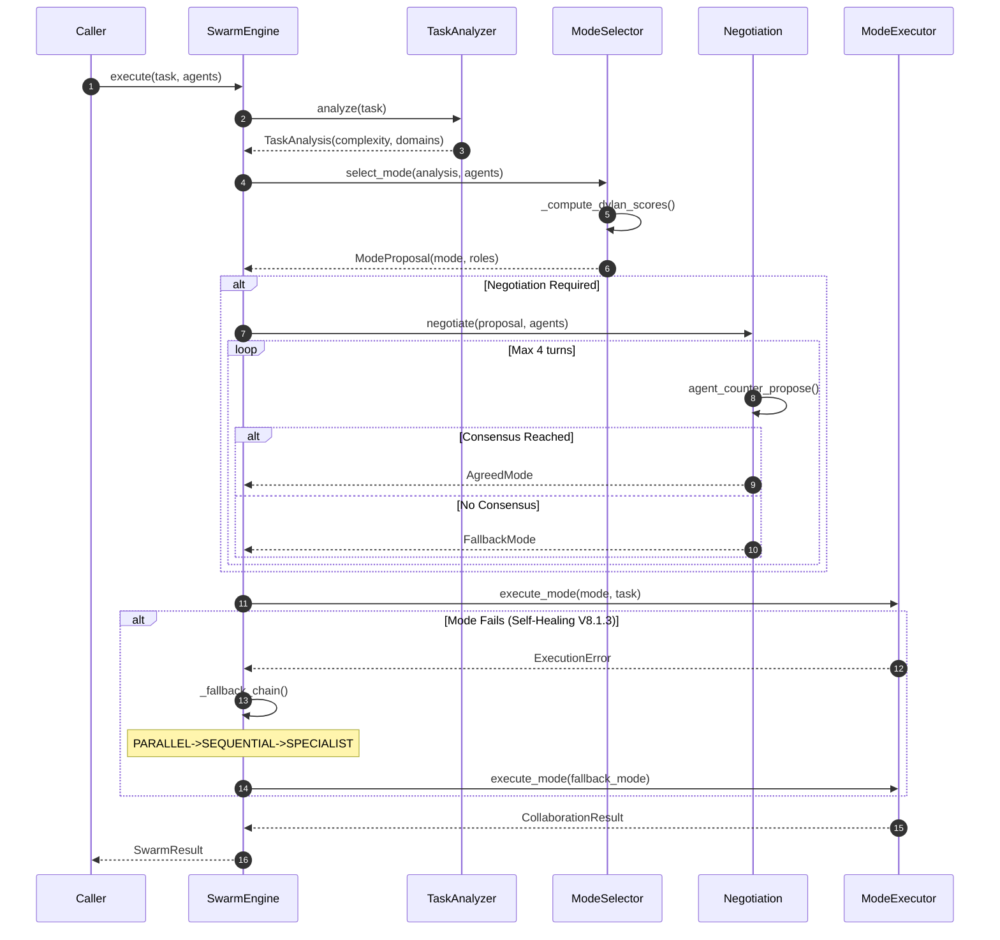
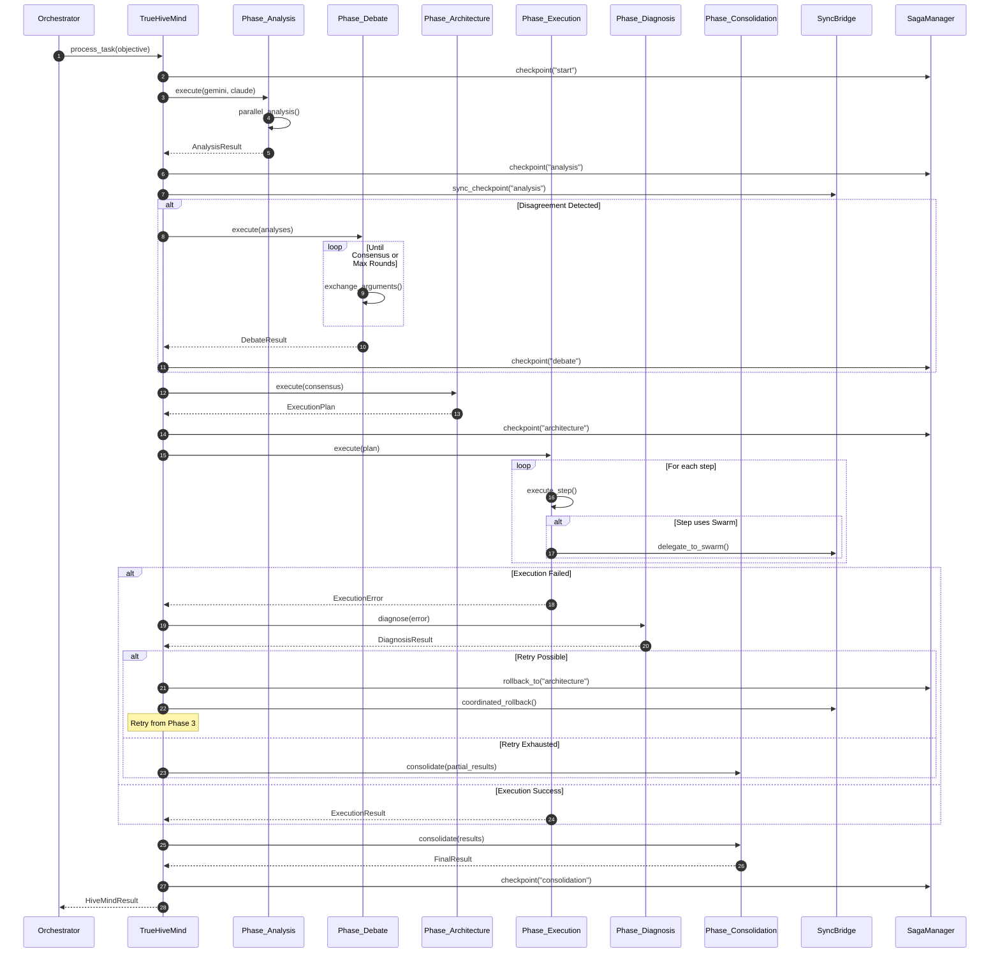

# NEXUS V9.4 - ARCHITECTURE MAP

**Date:** 2025-12-13
**Architecte:** NEXUS PRIME (Claude Opus 4.5)
**Version:** 9.4 (Branch N9AF)
**Status:** Historical architecture snapshot from the pre-consolidation layout.

> This document is kept for historical review only.
> It is **not** the canonical architecture reference for `NX-CG`.
> Use `ROADMAP.md` for governance posture, `README.md` / `START_HERE.md` for supported runtime surfaces,
> and `docs/ARCHITECTURE_MAP_GENERATED.md` plus the live `core/` tree for the current package layout.

---

## LEVEL 1: VUE ORBITALE (C4 Context)

Vue système montrant NEXUS et ses interactions externes.



### Métadonnées Level 1

| Aspect | Valeur |
|--------|--------|
| **Pattern** | Hexagonal Architecture (Ports & Adapters) |
| **Santé** | 🟢 Clean - Boundaries claires |
| **Couplage Externe** | Faible (CLI wrappers isolent les APIs) |
| **Trust Boundary** | KERNEL.py valide toutes les mutations |

### Liens Documentation
- [KERNEL.py](KERNEL.py) - Règles d'alignement immuables
- [core/drivers/README.md](core/drivers/README.md) - Drivers LLM

---

## LEVEL 2: VUE SECTORIELLE (Containers)

Architecture interne montrant les modules et flux de données.



### Métadonnées Level 2

| Module | Pattern | Santé | Couplage | Tests |
|--------|---------|-------|----------|-------|
| **FSM** | State Machine | 🟢 Clean | Low | [test_fsm.py](tests/test_fsm.py) |
| **OrchestratorV7** | Mediator + Facade | 🟡 Complex | Medium | [test_orchestration.py](tests/test_orchestration.py) |
| **HiveMind** | Pipeline | 🟢 Clean | Medium | [test_hive_mind.py](tests/test_hive_mind.py) |
| **Swarm** | Strategy | 🟡 Complex | Medium | [test_swarm.py](tests/test_swarm.py) |
| **Drivers** | Adapter | 🟢 Clean | Low | [test_drivers.py](tests/test_drivers.py) |
| **ToolManager** | Command | 🔴 God Class | High | [test_tool_manager.py](tests/test_tool_manager.py) |
| **Memory** | Repository | 🟢 Clean | Low | [test_memory.py](tests/test_memory.py) |
| **Security** | Chain of Responsibility | 🟢 Clean | Low | [test_security.py](tests/test_security.py) |

### Légende Flux de Données

| Format | Description |
|--------|-------------|
| `Type \| Protocol` | Type de données et protocole utilisé |
| `dataclass` | Structure typée Python (Pydantic-like) |
| `enum` | Énumération (FSMState, SwarmMode) |
| `str` | Texte brut |
| `JSON` | Sérialisation JSON |

### Liens Documentation
- [core/README.md](core/README.md) - Vue d'ensemble core/
- [core/fsm/README.md](core/fsm/README.md) - Machine à états
- [core/swarm/README.md](core/swarm/README.md) - Hybrid Swarm Engine

---

## LEVEL 3: ZOOM TACTIQUE (3 Sous-systèmes Critiques)

### 3.1 OrchestratorV7 + FSM (Cœur du Système)

**Fichiers:** `core/orchestration_v7.py` (1074 LOC), `core/orchestration/fsm_handlers.py` (1408 LOC)



#### Métadonnées 3.1

| Aspect | Valeur |
|--------|--------|
| **Pattern** | Mediator (OrchestratorV7) + State (FSM) |
| **Santé** | 🟡 Complex - fsm_handlers.py trop grand |
| **Couplage** | Medium - Dépend de HiveMind et Swarm |
| **Points de Décision** | `_analyze_task_complexity()`, `FSM.can_transition()` |
| **Chemin d'Erreur** | FSM -> ERROR -> PANIC (si non récupérable) |

#### Recommandation
- Extraire `fsm_handlers.py` en handlers individuels par état

---

### 3.2 HybridSwarmEngine (Sélection de Mode)

**Fichiers:** `core/swarm/engine.py`, `core/swarm/mode_selector.py` (981 LOC), `core/swarm/mode_executors.py` (1323 LOC)



#### Métadonnées 3.2

| Aspect | Valeur |
|--------|--------|
| **Pattern** | Strategy (6 modes) + Chain of Responsibility (Fallback) |
| **Santé** | 🟡 Complex - mode_executors.py contient 6 classes |
| **Couplage** | Medium - Dépend de Drivers et Agents |
| **Points de Décision** | `ModeSelector.select()`, `Negotiation.resolve()` |
| **Self-Healing** | Fallback chains: PARALLEL->SEQUENTIAL->SPECIALIST |

#### Recommandation
- Extraire chaque mode dans `core/swarm/executors/{mode}.py`

---

### 3.3 HiveMind Pipeline (7 Phases)

**Fichiers:** `core/hive_mind/orchestrator.py` (826 LOC), `core/hive_mind/phases/*.py`



#### Métadonnées 3.3

| Aspect | Valeur |
|--------|--------|
| **Pattern** | Pipeline + Saga (Checkpoints & Rollback) |
| **Santé** | 🟢 Clean - Phases bien isolées |
| **Couplage** | Medium - SyncBridge V9.4 coordonne avec Swarm |
| **Points de Décision** | Consensus detection, Retry logic, Rollback target |
| **Checkpoints** | 5 points: start, analysis, debate, architecture, consolidation |

#### Recommandation
- Documenter le flux inverse Swarm->HiveMind (actuellement un angle mort)

---

## RÉSUMÉ ARCHITECTURAL

### Vue d'Ensemble

```
+-----------------------------------------------------------------+
|                    NEXUS V9.4 "SYNC BRIDGE"                     |
+-----------------------------------------------------------------+
|  +---------+    +-------------+    +-------------------------+  |
|  |  REPL   |--->| Orchestrator|--->| HiveMind (7 phases)     |  |
|  | nexus7  |    |     V7      |    | +---+---+---+---+---+--+|  |
|  +---------+    |   + FSM     |    | | A | D | R | E | G | C||  |
|                 +------+------+    | +---+---+---+---+---+--+|  |
|                        |           +------------+------------+  |
|                        |                        |               |
|                        |    +-------------------+-----------+   |
|                        |    |  OrchestratorSyncBridge V9.4  |   |
|                        |    +-------------------+-----------+   |
|                        |                        |               |
|                        |           +------------+------------+  |
|                        +---------->| HybridSwarmEngine       |  |
|                                    | +----+----+----+----+--+|  |
|                                    | |PAR |SEQ |L-S |P-P |SP||  |
|                                    | +----+----+----+----+--+|  |
|                                    +-------------------------+  |
|                                              |                  |
|                        +---------------------+---------------+  |
|                        |           LLM Drivers               |  |
|                        |  +-------------+  +--------------+  |  |
|                        |  |GeminiDriver |  | ClaudeDriver |  |  |
|                        |  |   (JSON)    |  |    (XML)     |  |  |
|                        |  +-------------+  +--------------+  |  |
|                        +-------------------------------------+  |
+-----------------------------------------------------------------+
```

### Patterns Architecturaux Principaux

| Pattern | Localisation | Usage |
|---------|--------------|-------|
| **State Machine** | FSM | 11 états, transitions validées |
| **Mediator** | OrchestratorV7, SyncBridge | Coordination sans couplage direct |
| **Pipeline** | HiveMind | 7 phases séquentielles |
| **Strategy** | Swarm | 6 modes interchangeables |
| **Saga** | SagaManager | Checkpoints + Rollback distribué |
| **Chain of Responsibility** | Security Guards, Fallback Chain | Traitement en cascade |
| **Adapter** | Drivers | Abstraction CLI -> Protocol unifié |
| **Repository** | Memory, AgentRegistry | Accès données centralisé |

### Points de Vigilance

| Zone | Problème | Impact | Priorité |
|------|----------|--------|----------|
| `tool_manager.py` | God Class (1848 LOC) | Maintenance difficile | 🔴 HIGH |
| `fsm_handlers.py` | Fichier monolithique (1408 LOC) | Tests complexes | 🔴 HIGH |
| `mode_executors.py` | 6 classes dans 1 fichier | Couplage artificiel | 🟡 MEDIUM |
| Swarm->HiveMind | Flux non documenté | Angle mort | 🟡 MEDIUM |

---

## CROSS-REFERENCES

| Section | Documentation Détaillée |
|---------|------------------------|
| FSM | [core/fsm/README.md](core/fsm/README.md) |
| Swarm | [core/swarm/README.md](core/swarm/README.md) |
| HiveMind | [core/hive_mind/README.md](core/hive_mind/README.md) |
| Drivers | [core/drivers/README.md](core/drivers/README.md) |
| Security | [core/security/README.md](core/security/README.md) |
| Memory | [core/memory/README.md](core/memory/README.md) |
| Orchestration | [core/orchestration/README.md](core/orchestration/README.md) |
| Audit Complet | [AUDIT_REPORT.md](AUDIT_REPORT.md) |

---

*Généré par NEXUS PRIME - Architecture Map V9.4*
