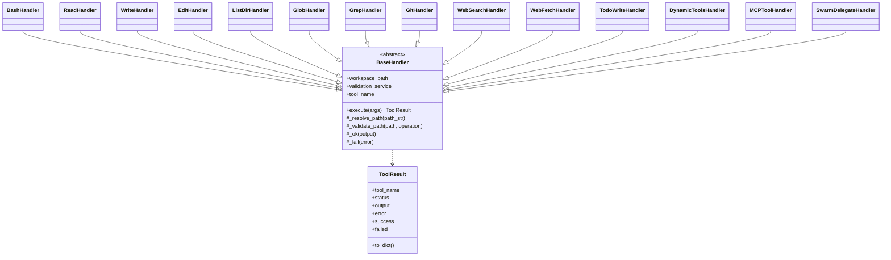

# Execution Handlers

## Synopsis
Individual tool handler implementations extracted from tool_manager.py during V9.6 refactoring. Each handler focuses on one category of tools following Single Responsibility Principle. All handlers inherit from BaseHandler and return standardized ToolResult objects.

## Component Map

| File | Purpose | Key Exports |
|------|---------|-------------|
| `__init__.py` | Exports and factory functions | `create_all_handlers()`, all handler classes |
| `base.py` | Handler protocol and base class | `BaseHandler`, `ToolResult`, `HandlerProtocol` |
| `bash_handler.py` | Shell command execution | `BashHandler`, `create_bash_handler()` |
| `file_handlers.py` | File operations | `ReadHandler`, `WriteHandler`, `EditHandler`, `ListDirHandler` |
| `search_handlers.py` | Code search | `GlobHandler`, `GrepHandler` |
| `git_handler.py` | Git operations | `GitHandler` |
| `web_handlers.py` | Web operations | `WebSearchHandler`, `WebFetchHandler` |
| `todo_handler.py` | Task management | `TodoWriteHandler` |
| `dynamic_tools_handler.py` | Dynamic tool CRUD | `CreateToolHandler`, `DeleteToolHandler`, etc. |
| `mcp_handler.py` | MCP server tools | `MCPToolHandler`, `create_mcp_tool_executor()` |
| `swarm_handler.py` | Swarm delegation | `SwarmDelegateHandler` |

## Architecture



## Key Interfaces

### BaseHandler
Abstract base class providing common functionality for all handlers.

```python
class BaseHandler(ABC):
    def __init__(self, workspace_path, validation_service=None):
        self.workspace_path = Path(workspace_path)
        self.validation_service = validation_service

    @property
    @abstractmethod
    def tool_name(self) -> str:
        pass

    @abstractmethod
    def execute(self, args: Dict[str, Any]) -> ToolResult:
        pass

    def _resolve_path(self, path_str: str) -> Path:
        # Resolve path relative to workspace

    def _validate_path(self, path: Path, operation: str) -> bool:
        # Validate path using ValidationService
```

### ToolResult
Standardized result object for all tool executions.

```python
@dataclass
class ToolResult:
    tool_name: str
    status: str  # SUCCESS, FAILURE, ERROR
    output: str
    error: str = ""

    @property
    def success(self) -> bool

    @classmethod
    def ok(cls, tool_name, output) -> ToolResult

    @classmethod
    def fail(cls, tool_name, error, output="") -> ToolResult
```

### Handler Categories

**File Operations** (file_handlers.py):
- `ReadHandler` - Read file contents
- `WriteHandler` - Create/overwrite files
- `EditHandler` - Search and replace in files
- `ListDirHandler` - List directory contents

**Code Search** (search_handlers.py):
- `GlobHandler` - File pattern matching (like `find`)
- `GrepHandler` - Search code for patterns (like `ripgrep`)

**Execution** (bash_handler.py):
- `BashHandler` - Execute shell commands with timeout and security validation

**Version Control** (git_handler.py):
- `GitHandler` - Git operations (status, diff, log, branch, pull)

**Web** (web_handlers.py):
- `WebSearchHandler` - Search the web (via Gemini CLI)
- `WebFetchHandler` - Fetch URL content

**Task Management** (todo_handler.py):
- `TodoWriteHandler` - Write/update task lists

**Dynamic Tools** (dynamic_tools_handler.py):
- `CreateToolHandler` - Create custom Python tools
- `DeleteToolHandler` - Delete dynamic tools
- `ListDynamicToolsHandler` - List available dynamic tools
- `RunDynamicToolHandler` - Execute dynamic tools

**MCP Integration** (mcp_handler.py):
- `MCPToolHandler` - Execute MCP server tools
- `create_mcp_tool_executor()` - Create executor for specific MCP tool

**Swarm** (swarm_handler.py):
- `SwarmDelegateHandler` - Delegate tasks to Swarm Engine

## Factory Pattern

All handlers can be created via factory functions:

```python
# Create all handlers at once
handlers = create_all_handlers(
    workspace_path=Path("/workspace"),
    validation_service=validator,
    dynamic_tool_manager=dtm,
    swarm_bridge=bridge
)

# Create specific handler categories
file_handlers = create_file_handlers(workspace_path, validator)
search_handlers = create_search_handlers(workspace_path, validator)
web_handlers = create_web_handlers(workspace_path, validator)
```

## Security Integration

All handlers integrate with ValidationService (PathGuardian) for path validation:

```python
handler = ReadHandler(workspace_path, validation_service)
result = handler.execute({"file_path": "../core/security/kernel.py"})

# ValidationService checks:
# - Path is within allowed boundaries
# - Evolution mode restrictions
# - Forbidden patterns (.env, .git, etc.)
```

## Dependencies

### Internal
- `core.security.PathGuardian` - Path validation (via ValidationService)
- `core.security.ExecutionPolicy` - Command validation
- `core.execution.dynamic_tools.DynamicToolManager` - Dynamic tool management
- `core.mcp.MCPRegistry` - MCP server integration
- `core.swarm.SwarmBridge` - Swarm delegation

### External
- `subprocess` - Command execution
- `pathlib` - Path operations
- `json` - Argument serialization
- `logging` - Handler logging
- `abc` - Abstract base classes

## Integration Points

### Used By
- `ExecutionEngine` - Main execution orchestrator
- `ToolManager` - Legacy wrapper

### Uses
- `ValidationService` - Path/command validation
- `DynamicToolManager` - Dynamic tool operations
- `MCPRegistry` - MCP tool operations
- `SwarmBridge` - Swarm task delegation

## Handler Development

To create a new handler:

```python
from .base import BaseHandler, ToolResult

class MyToolHandler(BaseHandler):
    @property
    def tool_name(self) -> str:
        return "my_tool"

    def execute(self, args: Dict[str, Any]) -> ToolResult:
        # Validate inputs
        input_value = args.get("input")
        if not input_value:
            return self._fail("Missing required argument: input")

        # Perform operation
        try:
            result = perform_operation(input_value)
            return self._ok(result)
        except Exception as e:
            return self._error(str(e))

# Factory function
def create_my_tool_handler(workspace_path, validation_service):
    return MyToolHandler(workspace_path, validation_service)
```

## Error Handling

Handlers return three status types:
- **SUCCESS** - Operation completed successfully
- **FAILURE** - Operation failed but error is expected (e.g., file not found)
- **ERROR** - Unexpected error occurred (e.g., exception during execution)

## Logging

Each handler has its own logger:
```python
self._logger = logging.getLogger(f"nexus.tools.{self.tool_name}")
```

Logs are written to `workspace/logs/events_YYYYMMDD.jsonl`.
