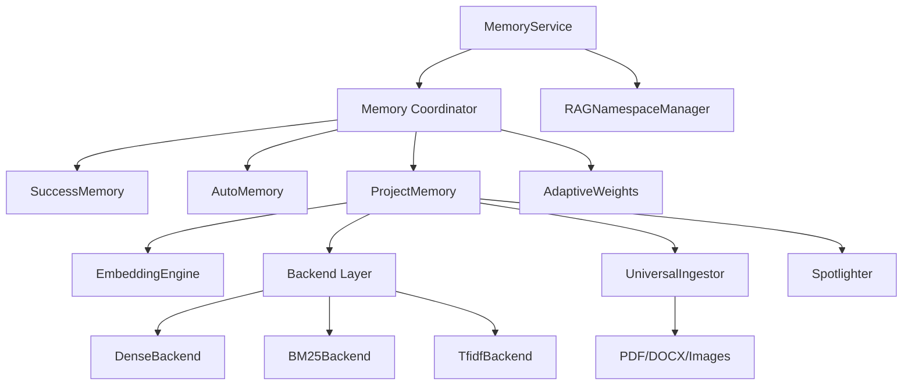

# Memory Module

## Synopsis
NEXUS's V13.0 MEMORIA UNIVERSALIS memory system provides multi-modal knowledge storage and retrieval. It includes episodic memory (SuccessMemory for completed tasks), procedural memory (AutoMemory for learned patterns), and semantic memory (ProjectMemory RAG for codebase knowledge). The system supports pluggable backends (dense/BM25/TF-IDF), multi-format ingestion (PDF, DOCX, images via Docling), and adaptive weight optimization per domain.

**V12.4.1 Epic 1.4**: Introduced LanceDB-backed V2 implementations (`SuccessMemoryV2`, `StrategyBlacklistV2`) with semantic similarity detection for ~+15-20% improved recall over hash-based approaches.

## Component Map

| File | Purpose | Key Exports |
|------|---------|-------------|
| `__init__.py` | Module exports | All memory classes and services |
| `coordinator.py` | Memory fusion (V12.4) | `MemoryCoordinator`, `UnifiedRecommendation` |
| `success_memory.py` | Episodic task memory (V1) | `SuccessMemory`, `SuccessEntry` |
| `success_memory_v2.py` | **LanceDB-backed episodic (V12.4.1)** | `SuccessMemoryV2` |
| `strategy_blacklist_v2.py` | **LanceDB-backed failure tracking (V12.4.1)** | `StrategyBlacklistV2`, `BlacklistedStrategy` |
| `auto_memory.py` | Procedural learning | `AutoMemory`, `MemoryEntry` |
| `project_memory.py` | Codebase RAG | `ProjectMemory`, `Chunk`, `IndexStats` |
| `embedding_engine.py` | Shared embeddings | `EmbeddingEngine` |
| `namespace_manager.py` | Multi-namespace RAG (V13.0) | `RAGNamespaceManager`, `NamespaceInfo` |
| `spotlighting.py` | Prompt injection protection | `Spotlighter` |
| `service.py` | Service layer (V9.1) | `MemoryService`, `MemoryStatus` |
| `types.py` | Common types | `Chunk`, `IndexStats` |
| `backends/` | Retrieval backends | See backends/README.md |
| `ingestors/` | Document ingestion (V13.0) | See ingestors/README.md |

## Architecture



## Key Interfaces

### MemoryCoordinator (V12.4 COGNITIVE BOOST)
Unifies episodic (SuccessMemory) and procedural (AutoMemory) for hybrid recommendations.

```python
coordinator = MemoryCoordinator(success_memory, auto_memory, workspace_path)
recommendation = coordinator.recommend(
    task_description="Implement authentication",
    task_type="CODING",
    complexity="MODERATE"
)
# Returns: UnifiedRecommendation(mode, lead, confidence, source)
```

**Features:**
- **Adaptive Weights**: Learns optimal semantic/procedural weights per domain
- **Score Normalization**: Harmonizes different memory types
- **Conflict Resolution**: Handles disagreements between memories
- **Consolidation**: Migrates episodic -> procedural over time

**V12.4 Adaptive Weights:**
- Tracks recommendation outcomes (success/failure)
- Adjusts weights using exponential moving average
- Starts with defaults (0.6 semantic, 0.4 procedural)
- Improves over time with feedback

### SuccessMemory (Episodic Memory)
Stores completed Swarm task executions with similarity-based retrieval.

```python
memory = SuccessMemory(workspace_path)
memory.record_success(
    task_id="task_123",
    description="Implement user authentication",
    swarm_mode="LEAD_SUPPORT",
    agents_used=["gemini", "claude"],
    duration_seconds=45.2,
    complexity="MODERATE",
    domains=["security", "coding"],
    quality_score=0.95
)

# Retrieve similar tasks
matches = memory.query_similar(
    task_description="Add OAuth login",
    limit=5
)
```

**Storage:** `workspace/memory/successes.json` (AtomicJsonStore)

### SuccessMemoryV2 (V12.4.1 Epic 1.4) - LanceDB-Backed Episodic Memory
Semantic success memory with vectorized retrieval for improved similarity detection.

```python
from core.memory import SuccessMemoryV2

memory = SuccessMemoryV2(workspace_path)
memory.record_success(task_id, analysis, result, quality_score=0.95)

# Semantic search (not hash-based!)
similar = memory.find_similar_tasks(
    "implement JWT authentication",
    limit=3,
    min_score=0.1
)
# Returns: [(SuccessEntry, similarity_score), ...]

# Get best mode for similar task
mode, task_id, score = memory.get_best_mode_for_similar(
    "add OAuth login",
    query_domains=["security", "coding"]
)
```

**Key Improvements over V1:**
- **Semantic Search**: Uses LanceDB embeddings instead of Jaccard similarity
- **Shared Compute**: Uses global `EmbeddingEngine` for efficient batch processing
- **Auto-Migration**: Migrates V1 JSON data to LanceDB on first run
- **Domain Boosting**: Matches tasks by semantic similarity + domain overlap

**Storage:**
- Metadata: `.nexus/project_knowledge.json` (JSON index)
- Vectors: `.nexus/lancedb/` (vector database)

**Backend Detection:**
```python
stats = memory.get_stats()
print(stats["backend"])  # "dense", "bm25", or "tfidf"
```

### StrategyBlacklistV2 (V12.4.1 Epic 1.4) - Anti-Circular Retry Prevention
Semantic failure tracking to prevent retry loops for similar strategies.

```python
from core.memory import StrategyBlacklistV2

blacklist = StrategyBlacklistV2(workspace_path)

# Record a failed strategy
blacklist.add_failed_strategy(
    description="use JWT tokens for auth",
    swarm_mode="ping_pong",
    error_message="KeyError: 'exp' field missing",
    retry_count=3,
    complexity="MODERATE",
    domains=["security", "coding"]
)

# Check if similar strategy is blacklisted (semantic!)
is_bad, reason = blacklist.is_blacklisted(
    "implement token-based authentication",
    swarm_mode="ping_pong"
)

if is_bad:
    print(f"BLOCKED: {reason}")
    # Suggests alternatives based on mode
    alternatives = blacklist.suggest_alternatives(
        "implement token-based authentication", limit=3
    )
```

**Key Improvements over V1:**
- **Semantic Detection**: Detects paraphrased failures (e.g., "JWT auth" ≈ "token-based auth")
- **Lower Threshold**: Uses 0.65 similarity (vs 0.85 hash-based) due to semantic precision
- **Mode Alternatives**: Suggests different collaboration modes on detection
- **Auto-Migration**: Migrates V1 blacklist data to LanceDB

**Anti-Pattern Detection Example:**
```
Failed:  "use JWT tokens for authentication"
Query:   "implement token-based auth with JWT"
Result:  DETECTED (semantic similarity ~0.85)
Action:  BLOCK retry, suggest "lead_support" or "sequential" instead
```

**Storage:** Same as SuccessMemoryV2 (shared ProjectMemory backend)

### AutoMemory (Procedural Memory)
Learns task-type patterns and optimal agent configurations.

```python
memory = AutoMemory(workspace_path)
memory.learn(
    task_type="CODING",
    lead_agent="claude",
    swarm_mode="LEAD_SUPPORT",
    outcome="SUCCESS",
    metrics={"duration": 30.5, "quality": 0.9}
)

# Query learned patterns
pattern = memory.query(task_type="CODING")
# Returns: MemoryEntry with success_rate, avg_duration, preferred_mode
```

**Storage:** `workspace/memory/auto_memory.json`

### ProjectMemory (Semantic Memory - RAG)
Codebase knowledge base with pluggable retrieval backends.

```python
memory = ProjectMemory(nexus_root)
memory.index_file(Path("core/orchestration_v7.py"))
memory.index_directory(Path("core"))

# Semantic search
chunks = memory.retrieve("FSM state transitions", limit=5)
for chunk in chunks:
    print(f"{chunk.file_path}:{chunk.line_start} - {chunk.score:.3f}")
```

**Backends:**
- **DENSE** (DenseBackend): LanceDB + Sentence Transformers (~+10% recall)
- **BM25** (Bm25Backend): BM25S lexical search (~+15% vs TF-IDF)
- **TFIDF** (TfidfBackend): Weighted Jaccard (fallback, no deps)

**Environment:** `PROJECT_MEMORY_BACKEND=auto|dense|bm25|tfidf`

**Chunking Strategies:**
- `.py` files: Function/class boundaries
- `.md` files: Section headers
- Other: 50 lines, 10 line overlap

### RAGNamespaceManager (V13.0 MEMORIA UNIVERSALIS)
Multi-namespace RAG for isolated knowledge domains.

```python
manager = RAGNamespaceManager(workspace_path)
manager.create_namespace("security", backend="dense")
manager.index_to_namespace("security", file_path, content)

chunks = manager.query_namespace("security", "SQL injection patterns", limit=5)
```

**Use Cases:**
- Domain isolation (security, UI, backend)
- Project-specific knowledge
- Tenant-separated data (multi-tenant mode)

### UniversalIngestor (V13.0 MEMORIA UNIVERSALIS)
Multi-format document ingestion via IBM Docling.

```python
ingestor = UniversalIngestor()
chunks = ingestor.ingest_document(Path("design.pdf"))
memory.index_chunks(chunks)
```

**Supported Formats:**
- **Documents**: PDF, DOCX, PPTX, XLSX
- **Images**: PNG, JPG (OCR extraction)
- **Code**: Python, JS, TS, etc.
- **Markup**: MD, HTML, XML, JSON

**Features:**
- Table extraction and structuring
- Image OCR for text extraction
- Markdown conversion
- Metadata preservation

### Spotlighter (V8.8 Security)
OWASP LLM01:2025 protection against prompt injection in RAG content.

```python
from core.security import get_spotlighter
spotlighter = get_spotlighter()

# Sanitize retrieved content before LLM
safe_content = spotlighter.clean_context(retrieved_chunk)
```

**Patterns Detected:**
- Command injection attempts
- Role-switching prompts
- Delimiter escape attempts
- Encoding attacks

## Dependencies

### Internal
- `core.utils.atomic_store.AtomicJsonStore` - Thread-safe JSON storage
- `core.security.Spotlighter` - RAG content protection
- `core.context` - Multi-tenant session context (V10)
- `core.factory.ServiceFactory` - Tenant-scoped instances (V10)

### External (Optional)
- `sentence-transformers` - Dense embeddings (DenseBackend)
- `lancedb` - Vector database (DenseBackend)
- `bm25s[full]` - BM25 search (Bm25Backend)
- `docling` - Document ingestion (UniversalIngestor)
- `numpy`, `scikit-learn` - TF-IDF backend

## Integration Points

### Used By
- `core.orchestration_v7.Orchestrator` - Context injection
- `core.swarm.SwarmEngine` - Mode selection from history
- `core.hive_mind.HiveMindPipeline` - Knowledge retrieval
- `core.interface.commands` - Memory commands (`/memory`, `/forget`)

### Uses
- `backends/` - Retrieval algorithm implementations
- `ingestors/` - Document parsing and chunking
- `core.security.Spotlighter` - Content sanitization
- `core.utils.atomic_store` - Persistent storage

## Memory Backends

| Backend | Algorithm | Dependencies | Pros | Cons |
|---------|-----------|--------------|------|------|
| **Dense** | Semantic embeddings | sentence-transformers, lancedb | Best recall (+10%), semantic understanding | Slower, requires models |
| **BM25** | BM25S sparse retrieval | bm25s | Fast, lexical (+15% vs TF-IDF) | No semantic understanding |
| **TF-IDF** | Weighted Jaccard | scikit-learn | No extra deps, fast | Lower recall, no semantics |

**Selection Strategy (auto):**
1. Try Dense if `sentence-transformers` + `lancedb` available
2. Try BM25 if `bm25s` available
3. Fallback to TF-IDF (always available)

## Configuration

### Environment Variables
- `PROJECT_MEMORY_BACKEND` - Backend selection (auto/dense/bm25/tfidf)
- `PROJECT_MEMORY_MAX_CHUNKS` - Max chunks per index (default 5000, max 50000)
- `SENTENCE_TRANSFORMERS_MODEL` - Model for embeddings (default: all-MiniLM-L6-v2)

### Paths
- `workspace/memory/successes.json` - SuccessMemory storage
- `workspace/memory/auto_memory.json` - AutoMemory storage
- `workspace/memory/project_memory.json` - ProjectMemory metadata
- `workspace/memory/rag_namespaces.json` - Namespace configs
- `workspace/memory/adaptive_weights.json` - V12.4 learned weights

## Multi-Tenancy (V10 PRISM)

All memory components support tenant-scoped instances:
```python
from core.context import has_active_session
from core.factory import ServiceFactory

if has_active_session():
    memory_service = ServiceFactory.get_memory_service()
    project_memory = ServiceFactory.get_project_memory()
```

## Performance Metrics

**SuccessMemory:**
- Query: O(n) similarity scan (optimized with early termination)
- Storage: O(1) append via AtomicJsonStore

**AutoMemory:**
- Query: O(1) hash lookup by task_type
- Learn: O(1) update with exponential moving average

**ProjectMemory:**
- Index: O(n) for n chunks
- Query: O(log n) for Dense/BM25, O(n) for TF-IDF
- Memory: ~5MB per 1000 chunks (Dense), ~1MB (TF-IDF)

## Version History

- **V7.5** - AutoMemory (procedural learning)
- **V7.6** - SuccessMemory (episodic storage)
- **V7.8** - ProjectMemory (RAG)
- **V7.9** - Pluggable backends (Dense/BM25/TF-IDF)
- **V8.8** - Spotlighter (prompt injection protection)
- **V9.1** - MemoryService (service layer)
- **V12.4** - Coordinator + Adaptive Weights (COGNITIVE BOOST)
- **V13.0** - UniversalIngestor + RAGNamespaceManager (MEMORIA UNIVERSALIS)
