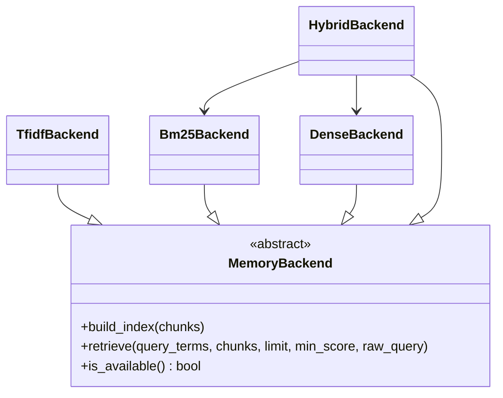

# Memory Backends

## Synopsis
Pluggable retrieval backends for ProjectMemory RAG system. Provides four algorithms with increasing sophistication: TF-IDF (zero-dependency fallback), BM25S (lexical sparse retrieval), Dense (semantic embeddings), and Hybrid (RRF fusion of Dense+BM25S). Each backend implements the MemoryBackend ABC for seamless swapping based on available dependencies and performance requirements.

## Component Map

| File | Purpose | Key Exports |
|------|---------|-------------|
| `base.py` | Abstract backend interface | `MemoryBackend` (ABC) |
| `tfidf.py` | TF-IDF weighted Jaccard | `TfidfBackend` |
| `bm25.py` | BM25S sparse retrieval | `Bm25Backend`, `BM25S_AVAILABLE` |
| `dense.py` | Semantic embeddings | `DenseBackend`, `LANCEDB_AVAILABLE`, `SENTENCE_TRANSFORMERS_AVAILABLE` |
| `hybrid.py` | RRF fusion (V12.4) | `HybridBackend`, `RRF_K`, `DEFAULT_DENSE_WEIGHT` |

## Architecture



## Backend Comparison

| Backend | Algorithm | Dependencies | Recall | Speed | Semantic |
|---------|-----------|--------------|--------|-------|----------|
| **TF-IDF** | Weighted Jaccard | scikit-learn | Baseline | Fast | No |
| **BM25** | BM25S sparse | bm25s | +15% | Fast | No |
| **Dense** | Sentence embeddings | lancedb, sentence-transformers | +10% | Slower | Yes |
| **Hybrid** | RRF fusion (Dense+BM25) | lancedb, bm25s, sentence-transformers | +15% | Moderate | Yes |

## Key Interfaces

### MemoryBackend (ABC)
Abstract base class defining the backend protocol.

```python
from abc import ABC, abstractmethod

class MemoryBackend(ABC):
    @abstractmethod
    def build_index(self, chunks: List[Chunk]) -> None:
        pass

    @abstractmethod
    def retrieve(
        self,
        query_terms: Set[str],
        chunks: List[Chunk],
        limit: int = 5,
        min_score: float = 0.0,
        raw_query: str = ""
    ) -> List[Tuple[Chunk, float]]:
        pass

    @classmethod
    @abstractmethod
    def is_available(cls) -> bool:
        pass
```

### TfidfBackend (Fallback)
Zero-dependency TF-IDF backend using weighted Jaccard similarity.

**Pros:** No external dependencies, fast for small indices
**Cons:** Lower recall, no semantic understanding

**Algorithm:** TF-IDF weighted term vectors + Jaccard similarity

### Bm25Backend (Lexical)
BM25S sparse retrieval with stemming.

**Pros:** ~15% better recall vs TF-IDF, fast, handles stopwords
**Cons:** No semantic understanding, requires bm25s package

**Algorithm:** BM25 with Snowball stemmer

**Availability Check:**
```python
if Bm25Backend.is_available():
    backend = Bm25Backend()
```

### DenseBackend (Semantic)
Semantic search using sentence embeddings via LanceDB.

**Pros:** ~10% better recall, semantic understanding, vector similarity
**Cons:** Slower, requires models (384MB for all-MiniLM-L6-v2)

**Algorithm:** Sentence-BERT embeddings + LanceDB vector search

**Dependencies:**
- `lancedb` - Vector database
- `sentence-transformers` - Embedding models
- Shared `EmbeddingEngine` for multi-index efficiency

**Availability Check:**
```python
if DenseBackend.is_available():
    backend = DenseBackend(storage_dir, embedding_engine)
```

### HybridBackend (V12.4 COGNITIVE BOOST)
RRF (Reciprocal Rank Fusion) of Dense + BM25S backends.

**Pros:** Best recall (+15%), combines semantic + lexical
**Cons:** Requires both Dense and BM25 dependencies

**Algorithm:**
1. Query both Dense and BM25S backends
2. Apply RRF fusion: `score = dense_weight/(k + dense_rank) + sparse_weight/(k + sparse_rank)`
3. Default weights: 0.7 dense, 0.3 sparse
4. RRF constant k=60 (standard)

**Usage:**
```python
from core.memory.backends import HybridBackend

if HybridBackend.is_available():
    backend = HybridBackend(
        storage_dir=Path("workspace/memory"),
        embedding_engine=get_embedding_engine()
    )
    backend.build_index(chunks)
    results = backend.retrieve(
        query_terms={"authentication", "login"},
        chunks=all_chunks,
        limit=5,
        raw_query="How do I implement authentication?"
    )
```

## Selection Strategy

ProjectMemory auto-selects backend based on availability:

```python
def _select_backend() -> MemoryBackend:
    backend_mode = os.getenv("PROJECT_MEMORY_BACKEND", "auto")

    if backend_mode == "auto":
        # V12.4: Prefer Hybrid for best results
        if HybridBackend.is_available():
            return HybridBackend(storage_dir, embedding_engine)
        elif DenseBackend.is_available():
            return DenseBackend(storage_dir, embedding_engine)
        elif Bm25Backend.is_available():
            return Bm25Backend()
        else:
            return TfidfBackend()  # Always available
    elif backend_mode == "hybrid":
        return HybridBackend(storage_dir, embedding_engine)
    elif backend_mode == "dense":
        return DenseBackend(storage_dir, embedding_engine)
    elif backend_mode == "bm25":
        return Bm25Backend()
    elif backend_mode == "tfidf":
        return TfidfBackend()
```

## Dependencies

### TfidfBackend
- `scikit-learn` - TF-IDF vectorization

### Bm25Backend
- `bm25s[full]` - BM25 search with stemming
- `Snowball` stemmer (optional, bundled with bm25s[full])

### DenseBackend
- `sentence-transformers` - Embedding models
- `lancedb` - Vector database
- `numpy` - Array operations

### HybridBackend
- All dependencies from DenseBackend + Bm25Backend

## Performance Metrics

**Index Build Time** (1000 chunks):
- TF-IDF: ~100ms
- BM25: ~150ms
- Dense: ~5s (embedding generation)
- Hybrid: ~5s (same as Dense)

**Query Time** (1000 chunks):
- TF-IDF: ~20ms
- BM25: ~15ms
- Dense: ~50ms (vector search)
- Hybrid: ~70ms (both backends + fusion)

**Memory Usage** (1000 chunks):
- TF-IDF: ~1MB
- BM25: ~2MB
- Dense: ~5MB (embeddings)
- Hybrid: ~7MB (both indices)

## Integration Points

### Used By
- `core.memory.project_memory.ProjectMemory` - RAG retrieval

### Uses
- `core.memory.embedding_engine.EmbeddingEngine` - Shared embeddings (Dense/Hybrid)
- `core.memory.types.Chunk` - Chunk dataclass

## Configuration

Environment variable: `PROJECT_MEMORY_BACKEND`
- `auto` - Auto-select best available (default)
- `hybrid` - Force Hybrid (fails if unavailable)
- `dense` - Force Dense
- `bm25` - Force BM25
- `tfidf` - Force TF-IDF
