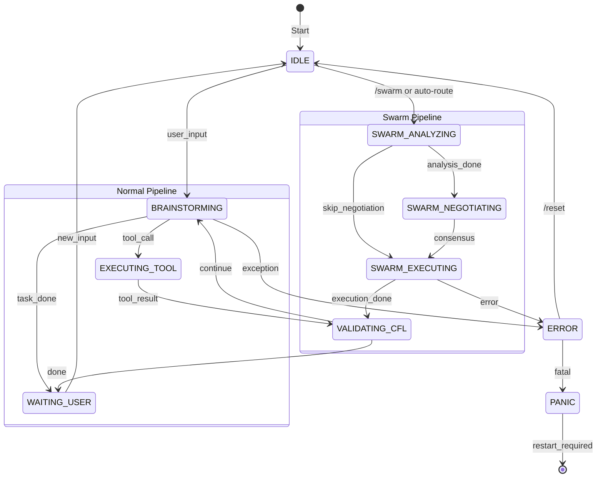
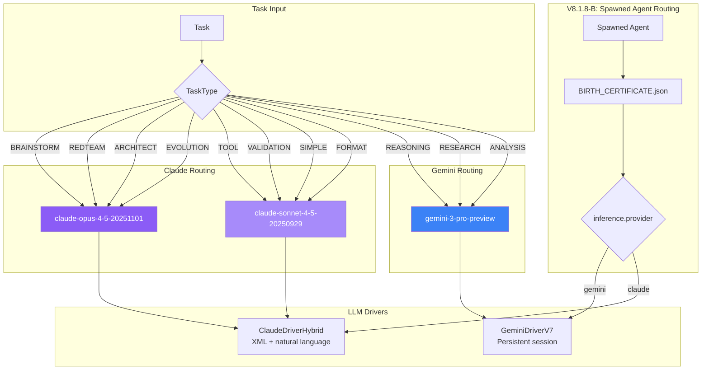
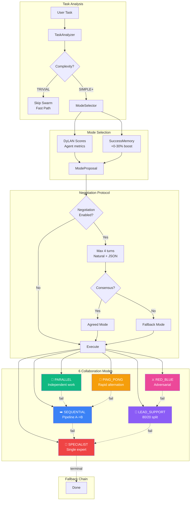
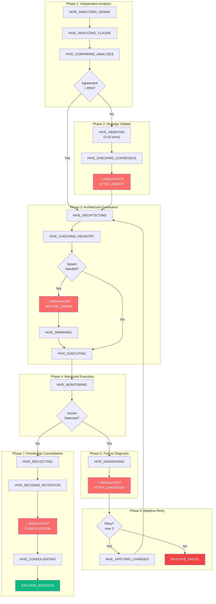
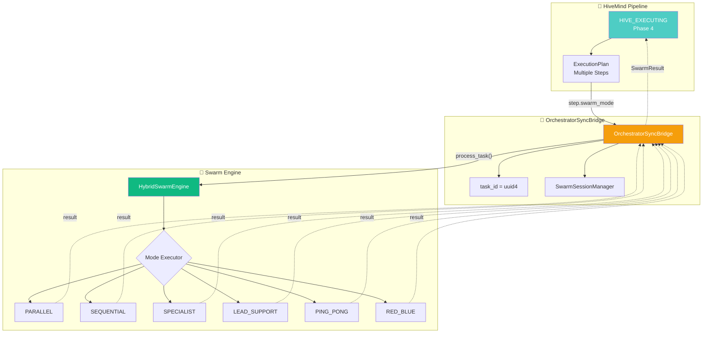
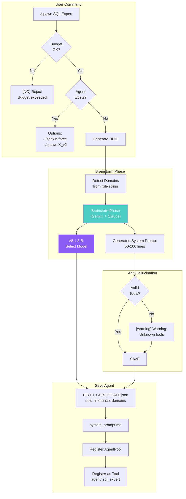
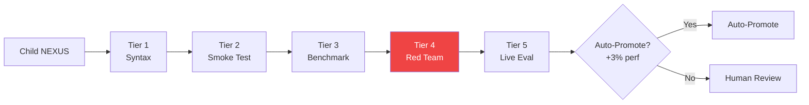
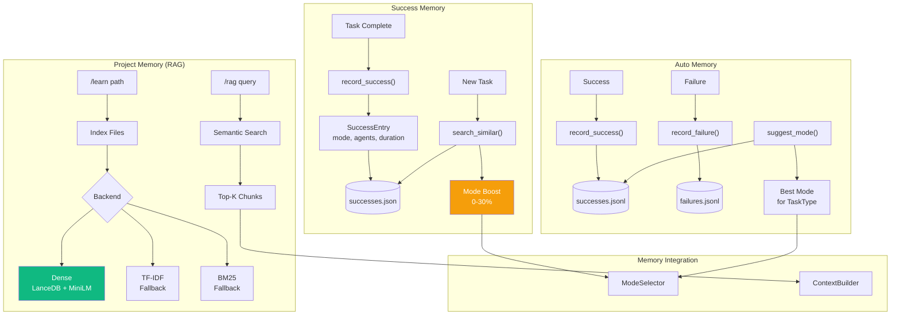

# NEXUS V9.6 Architecture Map

**Generated**: 2025-12-13
**Version**: V9.6.0 (Updated from V8.1.8-B "True Hive Mind")
**Source**: Codebase analysis + V9.6 Refactoring Sprint
**Changes**: Added sections 5.5 (HiveMind↔Swarm) and 5.6 (Executor Architecture)

---

## 1. HIGH-LEVEL OVERVIEW (Bird's Eye)

### 1.1 System Architecture

```mermaid
graph TD
    subgraph Entry["🚪 Entry Layer"]
        USER[👤 User Input]
        REPL[InteractiveNexusV7<br/>40+ commands]
        KERNEL[🔐 KERNEL.py<br/>Alignment Check]
    end

    subgraph Core["🎯 Orchestration Core"]
        ORCH[OrchestratorV7<br/>11 FSM states]
        GATE{Complexity<br/>Gate}
        SWARM[Swarm Engine<br/>6 modes]
        HIVE[Hive Mind<br/>7 phases]
    end

    subgraph LLM["🤖 LLM Layer"]
        ROUTER[ModelRouter<br/>TaskType routing]
        GEMINI[GeminiDriverV7<br/>Persistent session]
        CLAUDE[ClaudeDriverHybrid<br/>XML + natural]
    end

    subgraph Support["📦 Support Systems"]
        MEM[Memory Layer<br/>RAG + Success]
        EVOL[Evolution<br/>Spawn + Validate]
        TEL[Telemetry<br/>Budget tracking]
        SEC[Security<br/>Policy + RedTeam]
    end

    USER --> REPL
    REPL --> KERNEL
    KERNEL -->|[OK] Aligned| ORCH
    KERNEL -->|[NO] Rejected| REJECT[Reject]

    ORCH --> GATE
    GATE -->|TRIVIAL| FAST[Fast Path]
    GATE -->|SIMPLE| SWARM
    GATE -->|MODERATE+| HIVE

    HIVE --> SWARM
    SWARM --> ROUTER

    ROUTER -->|Claude tasks| CLAUDE
    ROUTER -->|Gemini tasks| GEMINI

    MEM -.->|memory boost| SWARM
    EVOL -.->|spawn agents| SWARM
    TEL -.->|budget check| LLM
    SEC -.->|validate| ORCH

    style KERNEL fill:#ff6b6b,color:#fff
    style HIVE fill:#4ecdc4,color:#fff
    style SWARM fill:#45b7d1,color:#fff
```

### 1.2 Data Flow Summary

| Flow | Path | Description |
|------|------|-------------|
| **User -> Response** | REPL -> KERNEL -> Orchestrator -> Swarm/HiveMind -> Drivers -> Response |
| **Security** | KERNEL.py checked at startup + every action |
| **Model Selection** | TaskType -> ModelRouter -> (Opus/Sonnet) or (Pro/Flash) |
| **Memory Boost** | SuccessMemory -> ModeSelector (+0-30% boost) |
| **Budget** | BudgetTracker.enforce_budget() before each LLM call |

---

## 2. ZOOM: Orchestration Core

### 2.1 FSM State Diagram



### 2.2 State Descriptions

| State | Description | Transitions |
|-------|-------------|-------------|
| `IDLE` | Waiting for user input (initial) | -> BRAINSTORMING, SWARM_ANALYZING |
| `BRAINSTORMING` | Agents exchange TALK messages | -> EXECUTING_TOOL, WAITING_USER, ERROR |
| `EXECUTING_TOOL` | Tool execution (synchronous) | -> VALIDATING_CFL |
| `VALIDATING_CFL` | Cognitive Feedback Loop | -> BRAINSTORMING, WAITING_USER |
| `WAITING_USER` | Task complete | -> IDLE |
| `ERROR` | Recoverable error | -> IDLE (/reset), PANIC |
| `PANIC` | Fatal error | -> [restart] |
| `EVOLUTION_BRAINSTORM` | Mutation design mode | -> IDLE |
| `SWARM_ANALYZING` | Task complexity analysis | -> SWARM_NEGOTIATING, SWARM_EXECUTING |
| `SWARM_NEGOTIATING` | Mode negotiation (max 4 turns) | -> SWARM_EXECUTING |
| `SWARM_EXECUTING` | Execute negotiated mode | -> VALIDATING_CFL, ERROR |

### 2.3 Key Files

| File | LOC | Purpose |
|------|-----|---------|
| `orchestration_v7.py` | 783 | Main FSM orchestrator |
| `core/fsm/states.py` | 188 | OrchestratorState enum, TRANSITION_MATRIX |
| `core/orchestration/fsm_handlers.py` | 1091 | State transition handlers |
| `core/orchestration/agent_invoker.py` | 383 | Agent invocation + V8.1.8-B routing |
| `core/orchestration/context_builder.py` | 361 | Context construction |
| `core/fsm/stagnation_detector.py` | 357 | Hot-Swap Lead detection |

---

## 3. ZOOM: LLM Drivers & Routing

### 3.1 Model Routing Flow



### 3.2 TaskType Enum

| TaskType | Routed To | Description |
|----------|-----------|-------------|
| `BRAINSTORM` | Opus / Pro | Evolution brainstorming |
| `REDTEAM` | Opus | Security/alignment testing |
| `ARCHITECT` | Opus | Architecture decisions |
| `EVOLUTION` | Opus | Child mutation design |
| `REASONING` | Pro | Complex reasoning |
| `RESEARCH` | Pro | Web research |
| `ANALYSIS` | Pro | Deep analysis |
| `TOOL` | Sonnet | Tool execution |
| `VALIDATION` | Sonnet | Code validation |
| `SIMPLE` | Sonnet | Simple queries |
| `FORMAT` | Sonnet | Formatting tasks |

### 3.3 Key Files

| File | LOC | Purpose |
|------|-----|---------|
| `core/routing/model_router.py` | 217 | TaskType -> Model routing |
| `core/drivers/gemini_driver_v7.py` | 624 | Gemini CLI wrapper |
| `core/drivers/claude_driver_hybrid.py` | 483 | Claude API wrapper |
| `core/drivers/async_adapter.py` | ~200 | Async/sync bridge |
| `core/bootstrap/agent_loader.py` | 196 | InferenceConfig (V8.1.8-B) |

---

## 4. ZOOM: Swarm Engine

### 4.1 Swarm Flow



### 4.2 Collaboration Modes

| Mode | Description | Affinity | Rounds | Fallback |
|------|-------------|----------|--------|----------|
| `PARALLEL` | Both work independently, merge results | 0.5 | 1 | SEQUENTIAL |
| `SEQUENTIAL` | Pipeline: A outputs, B refines | 0.6 | 2 | SPECIALIST |
| `LEAD_SUPPORT` | Lead (80%) drives, support (20%) reviews | 0.7 | 3 | SPECIALIST |
| `PING_PONG` | Rapid alternation until convergence | 0.6 | 6 | SEQUENTIAL |
| `SPECIALIST` | Single expert handles all | 0.8 | 1 | None (terminal) |
| `RED_BLUE` | Adversarial: propose/attack/defend | 1.0 | 4 | LEAD_SUPPORT |

### 4.3 Key Dataclasses

| Dataclass | Key Fields | File |
|-----------|------------|------|
| `TaskAnalysis` | complexity, domains, recommended_mode, confidence | task_analyzer.py |
| `ModeProposal` | mode, reasoning, confidence, assignments | mode_selector.py |
| `AgentProfile` | agent_id, provider, capabilities, dylan_score, uuid | agent_metrics.py |
| `SwarmResult` | success, content, mode_used, execution_rounds | hybrid_swarm_engine.py |
| `NegotiationResult` | agreed_mode, turns, consensus_reached | negotiation_protocol.py |

### 4.4 Key Files

| File | LOC | Purpose |
|------|-----|---------|
| `core/swarm/hybrid_swarm_engine.py` | 749 | Main swarm orchestrator |
| `core/swarm/mode_selector.py` | 972 | DyLAN-based mode selection |
| `core/swarm/mode_executors.py` | 74 | **V9.6**: Re-export module (was 1188) |
| `core/swarm/executors/` | ~770 | **V9.6**: 7 extracted executor files |
| `core/swarm/collaboration_modes.py` | 234 | Mode definitions + fallback chain |
| `core/swarm/negotiation_protocol.py` | 627 | Negotiation logic |
| `core/swarm/task_analyzer.py` | 518 | Complexity detection |
| `core/swarm/agent_metrics.py` | 626 | AgentProfile, DyLAN scoring |
| `core/swarm/session_manager.py` | 669 | Session isolation (V8.1.6) |

---

## 5. ZOOM: Hive Mind Pipeline

### 5.1 7-Phase Pipeline



### 5.2 HiveMind States (24 total)

| Phase | States | Count |
|-------|--------|-------|
| **Gating** | `HIVE_GATING` | 1 |
| **Phase 1** | `HIVE_ANALYZING_GEMINI`, `HIVE_ANALYZING_CLAUDE`, `HIVE_COMPARING_ANALYSES` | 3 |
| **Phase 2** | `HIVE_DEBATING`, `HIVE_CHECKING_CONSENSUS`, `HIVE_BREAKPOINT_DEBATE` | 3 |
| **Phase 3** | `HIVE_ARCHITECTING`, `HIVE_CHECKING_REGISTRY`, `HIVE_BREAKPOINT_SPAWN`, `HIVE_SPAWNING` | 4 |
| **Phase 4** | `HIVE_EXECUTING`, `HIVE_MONITORING` | 2 |
| **Phase 5** | `HIVE_DIAGNOSING`, `HIVE_BREAKPOINT_DIAGNOSIS` | 2 |
| **Phase 6** | `HIVE_DECIDING_RETRY`, `HIVE_APPLYING_CHANGES` | 2 |
| **Phase 7** | `HIVE_REFLECTING`, `HIVE_DECIDING_RETENTION`, `HIVE_BREAKPOINT_CONSOLIDATION`, `HIVE_CONSOLIDATING` | 4 |
| **Terminal** | `HIVE_SUCCESS`, `HIVE_FAILED`, `HIVE_ESCALATE` | 3 |

### 5.3 User Breakpoints

| Breakpoint | When | User Can |
|------------|------|----------|
| `AFTER_DEBATE` | After Phase 2 consensus | Approve/modify approach |
| `BEFORE_SPAWN` | Before spawning agents | Approve/reject spawn |
| `AFTER_DIAGNOSIS` | After failure analysis | Approve retry strategy |
| `KNOWLEDGE_CONSOLIDATION` | Before archiving | Approve retention decisions |

### 5.4 Key Files

| File | LOC | Purpose |
|------|-----|---------|
| `core/hive_mind/orchestrator.py` | 653 | TrueHiveMind coordinator |
| `core/hive_mind/types.py` | 396 | 25+ dataclasses, HiveMindState enum |
| `core/hive_mind/phases/phase_analysis.py` | 500 | Phase 1 implementation |
| `core/hive_mind/phases/phase_debate.py` | 595 | Phase 2 implementation |
| `core/hive_mind/phases/phase_architecture.py` | 502 | Phase 3 implementation |
| `core/hive_mind/phases/phase_execution.py` | 513 | Phase 4 implementation |
| `core/hive_mind/phases/phase_diagnosis.py` | 439 | Phase 5 implementation |
| `core/hive_mind/phases/phase_retry.py` | 221 | Phase 6 implementation |
| `core/hive_mind/phases/phase_consolidation.py` | 588 | Phase 7 implementation |
| `core/hive_mind/user_interaction.py` | 595 | Breakpoint handling |

### 5.5 HiveMind ↔ Swarm Integration (V9.6)



#### Delegation Flow

1. **HiveMind Phase 4** identifies tasks needing multi-agent collaboration
2. **ExecutionStep** can specify `swarm_mode` for delegation
3. **OrchestratorSyncBridge** creates isolated session (task_id UUID)
4. **Swarm Engine** executes with specified mode
5. **Result** returns to HiveMind for continued processing

#### Session Isolation (V7.5 Phase 7)

```
Session UUID Structure:
+-- task_id (from generate_task_id())
+-- role ("lead", "support", "blue", "red", etc.)
+-- agent_id ("gemini", "claude")

UUID Generation:
session_uuid = f"{task_id}_{role}_{agent_id}"
```

**Why Isolation Matters:**
- Prevents context bleeding between parallel tasks
- Each role maintains independent conversation history
- Enables true concurrent execution in PARALLEL mode

### 5.6 Executor Architecture (V9.6)

**Post-Refactoring Structure:**

```
core/swarm/executors/           # V9.6 Extracted
+-- __init__.py                 # All exports
+-- base.py                     # ModeExecutor + execute_with_fallback
+-- registry.py                 # get_executor(), EXECUTOR_REGISTRY
+-- parallel_executor.py        # async PARALLEL (asyncio.gather)
+-- sequential_executor.py      # SEQUENTIAL (A->B pipeline)
+-- specialist_executor.py      # SPECIALIST (single expert + failover)
+-- lead_support_executor.py    # LEAD_SUPPORT (80/20 split)
+-- ping_pong_executor.py       # PING_PONG (convergence + validation)
+-- red_blue_executor.py        # RED_BLUE (adversarial + artifacts)
```

**V9.6 Metrics:**

| Component | Before | After |
|-----------|--------|-------|
| `mode_executors.py` | 1188 LOC | 74 LOC (re-exports) |
| New executor files | 0 | 7 files (~770 LOC) |
| `executors/base.py` | 394 LOC | 510 LOC (+execute_with_fallback) |

---

## 6. ZOOM: Evolution & Spawning

### 6.1 Spawn Flow (V8.1.8 Dynamic)



### 6.2 Evolution Validation (5 Tiers)



### 6.3 Key Files

| File | LOC | Purpose |
|------|-----|---------|
| `core/interface/repl.py` | 2340 | spawn_agent(), _brainstorm_agent_prompt() |
| `core/evolution/manager.py` | 556 | EvolutionManager |
| `core/evolution/phases/brainstorm.py` | ~400 | BrainstormPhase |
| `core/evolution/phases/create.py` | ~300 | CreatePhase |
| `core/evolution/phases/promote.py` | ~250 | PromotePhase |
| `core/evolution/validator.py` | 732 | ChildValidator |
| `core/evolution/tiered_validator.py` | 562 | 5-tier validation |
| `core/evolution/lineage.py` | 443 | Lineage tracking |
| `core/bootstrap/agent_loader.py` | 196 | SpawnedAgentLoader, InferenceConfig |

---

## 7. ZOOM: Memory Systems

### 7.1 Memory Architecture



### 7.2 Memory Systems Summary

| System | Purpose | Storage | Key Methods |
|--------|---------|---------|-------------|
| **ProjectMemory (RAG)** | Codebase indexing | `workspace/memory/` | `index_path()`, `search()` |
| **SuccessMemory** | Successful task patterns | `successes.json` | `record_success()`, `get_best_mode_for_similar()` |
| **AutoMemory** | Task-type patterns | `*.jsonl` | `suggest_mode()`, `get_mode_effectiveness()` |
| **Blackboard** | Shared state | `.nexus/blackboard.json` | JSON read/write |
| **CompressedMemory** | Token compression (legacy) | In-memory | `compress_history()` |

### 7.3 Key Files

| File | LOC | Purpose |
|------|-----|---------|
| `core/memory/project_memory.py` | 713 | RAG orchestrator |
| `core/memory/success_memory.py` | 798 | Successful patterns |
| `core/memory/auto_memory.py` | 195 | Task-type patterns |
| `core/memory/backends/dense.py` | ~300 | LanceDB + MiniLM |
| `core/memory/backends/tfidf.py` | ~200 | TF-IDF fallback |
| `core/memory/backends/bm25.py` | ~200 | BM25 fallback |
| `core/synapse/memory_v7.py` | 381 | Legacy compression |

---

## 8. FUNCTIONAL INVENTORY

### 8.1 All Slash Commands (40+)

#### 🐝 Collaboration
| Command | Description |
|---------|-------------|
| `/swarm <task>` | Route through Hybrid Swarm Engine (6 modes) |
| `/swarm-status` | Show current mode + DyLAN metrics |
| `/swarm-fsm <task>` | Debug: route via FSM states |
| `/pool-stats` | Show agent pool DyLAN scores |

#### 🧬 Evolution
| Command | Description |
|---------|-------------|
| `/spawn <role>` | Create specialized agent |
| `/agents` | List all spawned agents |
| `/evolve [count]` | Create child generations (default: 3) |
| `/evolve-status` | Show evolution stats |
| `/review` | Review pending children |
| `/specialize <mission>` | Create NEXUS spinoff |

#### 📊 Monitoring
| Command | Description |
|---------|-------------|
| `/status` | Orchestrator state |
| `/telemetry` | 7-day report |
| `/telemetry status` | Detailed stats |
| `/telemetry export [days]` | Export to CSV |
| `/budget` | Budget status |
| `/budget reset` | Reset daily counter |
| `/budget add <amount>` | Emergency credit |
| `/budget history` | Recent costs |

#### 📁 Workspace
| Command | Description |
|---------|-------------|
| `/workspace` | Current workspace info |
| `/workspace new [name]` | Create new workspace |
| `/workspace list` | List all workspaces |
| `/workspace switch <name>` | Switch workspace |
| `/bootstrap [path]` | Generate NEXUS.md |

#### 🧠 Memory
| Command | Description |
|---------|-------------|
| `/learn [path]` | Index into RAG |
| `/forget [path]` | Remove from RAG |
| `/memory-status` | Index statistics |
| `/rag init` | Index workspace/memory/ |
| `/rag clear` | Clear RAG data |
| `/rag query <text>` | Test retrieval |

#### ⚙️ System
| Command | Description |
|---------|-------------|
| `/clear` | Clear terminal |
| `/reset` | Reset to IDLE |
| `/doctor` | Run diagnostics |
| `/mode <name>` | Change mode |
| `/chat` | Chat-only (no tools) |
| `/help` | Help message |
| `/tutorial` | Interactive guide |
| `/quickstart` | Quick start |
| `exit` | Exit NEXUS |

### 8.2 Key Dataclasses

| Dataclass | Key Fields | File |
|-----------|------------|------|
| `TaskAnalysis` | complexity, domains, recommended_mode, confidence | task_analyzer.py |
| `ModeProposal` | mode, reasoning, confidence, assignments | mode_selector.py |
| `AgentProfile` | agent_id, provider, capabilities, dylan_score, uuid | agent_metrics.py |
| `InferenceConfig` | provider, model, reasoning | agent_loader.py |
| `SuccessEntry` | task_hash, swarm_mode, agents_used, quality_score | success_memory.py |
| `HiveMindResult` | success, final_output, agents_used, agents_spawned | types.py |
| `IndependentAnalysis` | task_understanding, proposed_approach, confidence | types.py |
| `DebateResult` | status, final_approach, debate_history | phase_debate.py |
| `FailureDiagnosis` | failure_type, root_cause, recommended_changes | phase_diagnosis.py |

### 8.3 Enums

| Enum | Values | File |
|------|--------|------|
| `OrchestratorState` | IDLE, BRAINSTORMING, EXECUTING_TOOL, VALIDATING_CFL, WAITING_USER, ERROR, PANIC, EVOLUTION_BRAINSTORM, SWARM_ANALYZING, SWARM_NEGOTIATING, SWARM_EXECUTING | states.py |
| `HiveMindState` | 28 states (see Section 5.2) | types.py |
| `CollaborationMode` | PARALLEL, SEQUENTIAL, LEAD_SUPPORT, PING_PONG, SPECIALIST, RED_BLUE | collaboration_modes.py |
| `TaskType` | BRAINSTORM, REDTEAM, ARCHITECT, EVOLUTION, REASONING, RESEARCH, ANALYSIS, TOOL, VALIDATION, SIMPLE, FORMAT, DEFAULT | model_router.py |
| `FailureType` | TIMEOUT, CAPABILITY_MISSING, HALLUCINATION, STRATEGY_WRONG, TOOL_ERROR, CONTEXT_LOST, BUDGET_EXCEEDED, UNKNOWN | types.py |
| `UserBreakpoint` | AFTER_DEBATE, BEFORE_SPAWN, AFTER_DIAGNOSIS, KNOWLEDGE_CONSOLIDATION | types.py |

---

## 9. STATISTICS

### 9.1 Codebase Metrics

| Metric | Value |
|--------|-------|
| **Total Directories** | 24 |
| **Total Python Files** | 126 |
| **Total Lines of Code** | 42,831 |
| **Classes** | 91 |
| **Dataclasses** | 50+ |
| **Enums** | 15+ |
| **Tests** | 1,094 (16 flaky) |

### 9.2 Component Breakdown

| Component | Files | LOC | % |
|-----------|-------|-----|---|
| Swarm Engine | 9 | 5,800 | 13.5% |
| Hive Mind | 12 | 5,500 | 12.8% |
| Evolution | 9 | 4,000 | 9.3% |
| Interface | 3 | 3,000 | 7.0% |
| Orchestration | 6 | 2,500 | 5.8% |
| Memory | 7 | 2,500 | 5.8% |
| Drivers | 4 | 1,700 | 4.0% |
| Security | 6 | 1,700 | 4.0% |
| Other | 70 | 16,131 | 37.8% |

### 9.3 State Machine Summary

| FSM | States | Transitions |
|-----|--------|-------------|
| Orchestrator | 11 | ~15 |
| HiveMind | 24 | ~30 |
| **Total** | **35** | **~45** |

### 9.4 Collaboration Modes

| Mode | Complexity Affinity | Typical Rounds |
|------|---------------------|----------------|
| PARALLEL | 0.5 | 1 |
| SEQUENTIAL | 0.6 | 2 |
| LEAD_SUPPORT | 0.7 | 3 |
| PING_PONG | 0.6 | 6 |
| SPECIALIST | 0.8 | 1 |
| RED_BLUE | 1.0 | 4 |

---

## 10. QUICK REFERENCE

### 10.1 File -> Feature Map

| Feature | Primary File |
|---------|--------------|
| Main Entry | `nexus7.py` |
| FSM Orchestrator | `orchestration_v7.py` |
| Swarm Engine | `core/swarm/hybrid_swarm_engine.py` |
| Hive Mind | `core/hive_mind/orchestrator.py` |
| Agent Spawning | `core/interface/repl.py` (spawn_agent) |
| Model Routing | `core/routing/model_router.py` |
| RAG Memory | `core/memory/project_memory.py` |
| Success Memory | `core/memory/success_memory.py` |
| Budget Tracking | `core/telemetry/budget_tracker.py` |
| Security | `KERNEL.py`, `core/security/execution_policy.py` |

### 10.2 Command Quick Reference

```bash
# Start NEXUS
python nexus7.py

# Key commands
/swarm "analyze this codebase"    # Use Swarm Engine
/spawn "Security Auditor"          # Create specialized agent
/agents                            # List agents
/budget                            # Check budget
/rag init                          # Index memory
/help                              # Full help
```

---

**End of Architecture Map**

*Generated by Claude Code (Opus 4.5) - 2025-12-09*
