# NEXUS V12.4.0 Architecture Map

**Generation Mode**: Deterministic output from the checked-out codebase
**Generator**: `scripts/doc_engine.py` V2
**Codename**: "COGNITIVE BOOST"

---

> This document is automatically generated by scanning the codebase.
> It provides a complete, verified view of the NEXUS architecture.

---

## Table of Contents

1. [High-Level Overview](#1-high-level-overview)
2. [ZOOM: Orchestration Core](#2-zoom-orchestration-core)
3. [ZOOM: LLM Drivers & Routing](#3-zoom-llm-drivers--routing)
4. [ZOOM: Swarm Engine](#4-zoom-swarm-engine)
5. [ZOOM: Hive Mind Pipeline](#5-zoom-hive-mind-pipeline)
6. [ZOOM: Async Primitives](#6-zoom-async-primitives)
7. [ZOOM: Blind Spot Remediations](#7-zoom-blind-spot-remediations)
8. [ZOOM: Evolution & Spawning](#8-zoom-evolution--spawning)
9. [ZOOM: Memory Systems](#9-zoom-memory-systems)
10. [ZOOM: Security & Governance](#10-zoom-security--governance)
11. [Functional Inventory](#11-functional-inventory)
12. [Key Dataclasses](#12-key-dataclasses)
13. [Statistics](#13-statistics)
14. [Torture Protocol](#14-torture-protocol)
15. [Anti-Hallucination Reference](#15-anti-hallucination-reference)

---

## 1. HIGH-LEVEL OVERVIEW

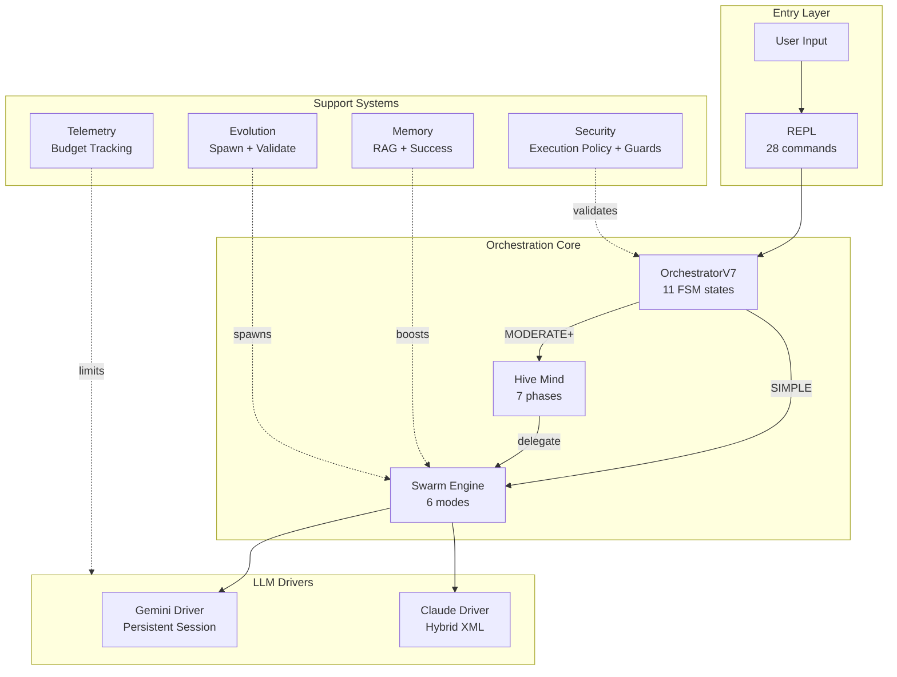

### Architecture Summary

| Layer | Components | Purpose |
|-------|------------|---------|
| **Entry** | REPL, Commands | User interaction |
| **Orchestration** | FSM, Router | State management, task routing |
| **Collaboration** | Swarm, Hive Mind | Multi-agent coordination |
| **LLM** | Gemini, Claude | Model execution |
| **Support** | Memory, Security, Evolution, Telemetry | Cross-cutting concerns |


### Component Summary

| Component | Files | LOC | Classes | Functions |
|-----------|-------|-----|---------|-----------|
| intelligence | 96 | 45,347 | 379 | 1329 |
| execution_pkg | 41 | 16,162 | 118 | 587 |
| memory_pkg | 32 | 14,506 | 94 | 548 |
| infrastructure | 22 | 9,951 | 83 | 411 |
| drivers | 20 | 9,626 | 55 | 316 |
| security_pkg | 24 | 8,282 | 64 | 278 |
| interface_pkg | 21 | 7,515 | 74 | 373 |
| observability | 18 | 7,255 | 58 | 293 |
| fsm | 21 | 5,681 | 42 | 225 |
| api | 20 | 5,207 | 30 | 131 |
| foundation | 11 | 4,633 | 38 | 218 |
| utils | 11 | 3,182 | 25 | 155 |
| synapse | 7 | 2,951 | 31 | 143 |
| metagraph | 6 | 1,813 | 15 | 71 |
| workflow | 4 | 1,760 | 13 | 79 |
| meta | 2 | 552 | 5 | 26 |
| ui | 1 | 249 | 1 | 13 |
| adapters | 1 | 226 | 1 | 4 |
| runtime | 1 | 161 | 2 | 7 |
| memory | 0 | 0 | 0 | 0 |
| native | 0 | 0 | 0 | 0 |

## 2. ZOOM: Orchestration Core

### FSM State Diagram

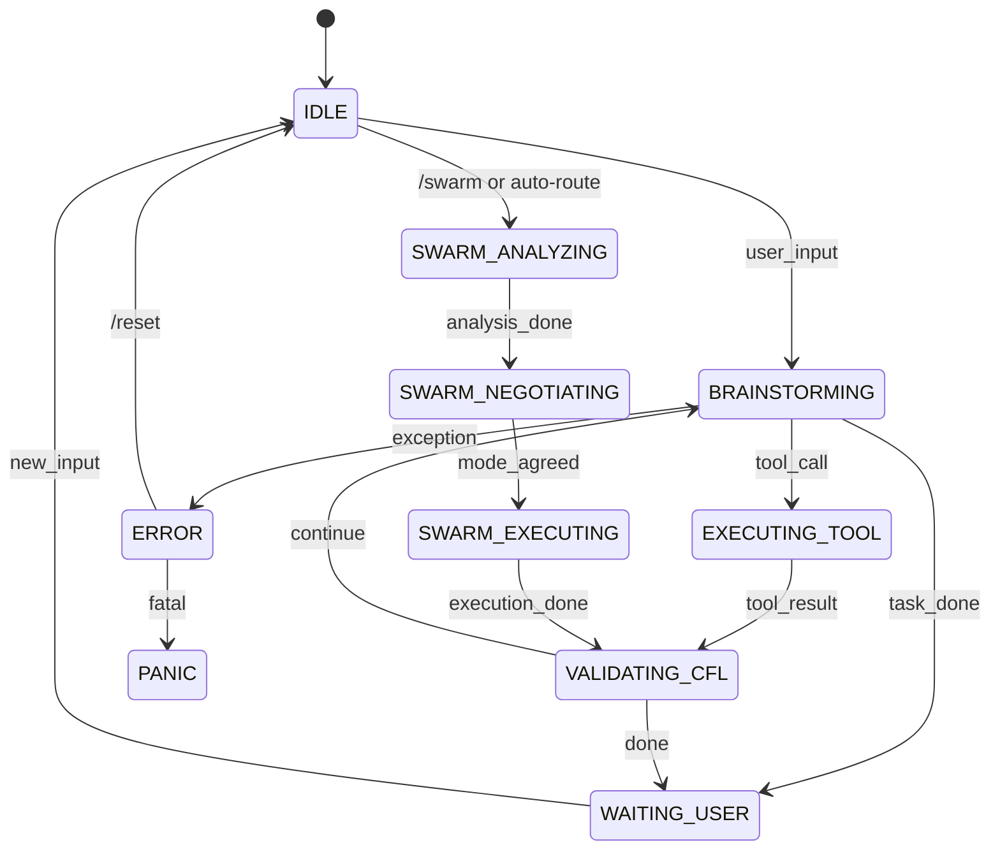

### Decision Points

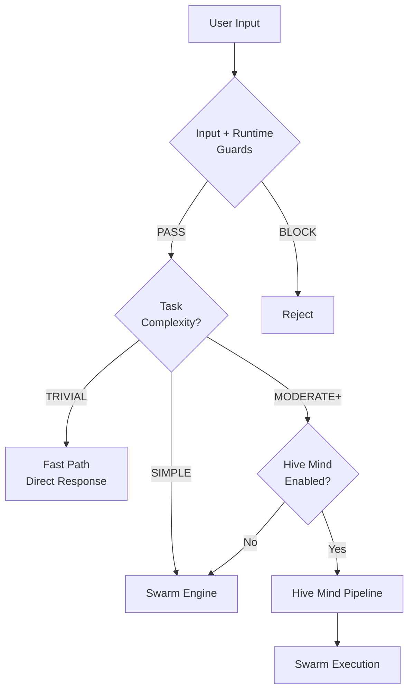

### Orchestrator States (12 total)

| State | Description |
|-------|-------------|
| `IDLE` | - |
| `BRAINSTORMING` | - |
| `EXECUTING_TOOL` | - |
| `VALIDATING_CFL` | - |
| `EVOLUTION_BRAINSTORM` | - |
| `WAITING_USER` | - |
| `ERROR` | - |
| `PANIC` | - |
| `SWARM_ANALYZING` | - |
| `SWARM_NEGOTIATING` | - |
| `SWARM_EXECUTING` | - |
| `HIBERNATE` | - |

**Source**: `core/fsm/states.py`


## 3. ZOOM: LLM Drivers & Routing

### Model Selection

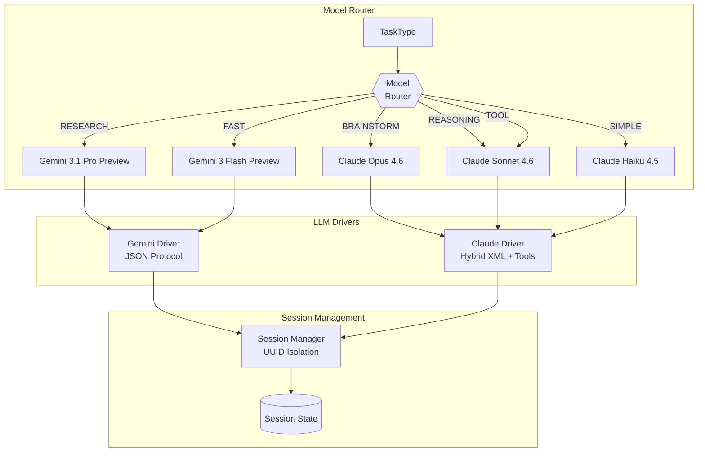

### Model Routing Table (Dynamic)

| Task Type | Model | Reasoning |
|-----------|-------|-----------|
| BRAINSTORM | Claude Opus 4.6 | Complex reasoning, creativity |
| REDTEAM | Claude Opus 4.6 | Complex reasoning, creativity |
| ARCHITECT | Claude Opus 4.6 | Complex reasoning, creativity |
| EVOLUTION | Claude Opus 4.6 | Complex reasoning, creativity |
| TOOL | Claude Sonnet 4.6 | Speed, tool use |
| VALIDATION | Claude Sonnet 4.6 | Speed, tool use |
| SIMPLE | Claude Sonnet 4.6 | Speed, tool use |
| FORMAT | Claude Sonnet 4.6 | Speed, tool use |
| REASONING | Gemini 3.1 Pro Preview | Large context, analysis |
| RESEARCH | Gemini 3.1 Pro Preview | Large context, analysis |
| ANALYSIS | Gemini 3.1 Pro Preview | Large context, analysis |

**Claude Tasks**: Opus -> brainstorm, redteam, architect, evolution | Sonnet -> tool, validation, simple, format
**Gemini Tasks**: Pro -> reasoning, research, analysis | Flash -> simple, format, validation

### Spawned Agent Provider Selection

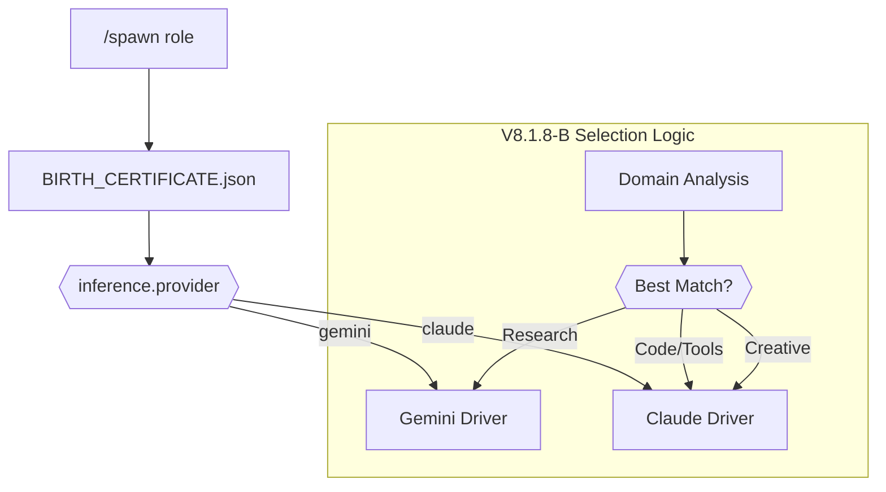

**Source**: `core/execution_pkg/routing/model_router.py`, `core/drivers/`


## 4. ZOOM: Swarm Engine

### Task Analysis & Mode Selection

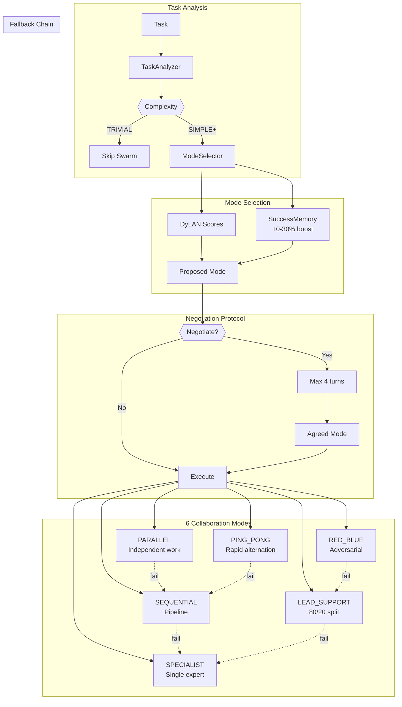

### Collaboration Modes (6)

| Mode | Description | Fallback |
|------|-------------|----------|
| `PARALLEL` | Both agents work simultaneously on independent subtasks | SEQUENTIAL |
| `SEQUENTIAL` | First agent outputs, second agent refines or continues | SPECIALIST |
| `LEAD_SUPPORT` | Lead agent drives, support agent reviews and assists | SPECIALIST |
| `PING_PONG` | Rapid alternation until convergence | SEQUENTIAL |
| `SPECIALIST` | Single expert handles the task while the other stays idle | None (terminal) |
| `RED_BLUE` | Adversarial propose/attack/defend review loop | LEAD_SUPPORT |

### Fallback Chain

| Mode | Fallback To |
|------|-------------|
| `PARALLEL` | `SEQUENTIAL` |
| `SEQUENTIAL` | `SPECIALIST` |
| `LEAD_SUPPORT` | `SPECIALIST` |
| `PING_PONG` | `SEQUENTIAL` |
| `SPECIALIST` | `None` |
| `RED_BLUE` | `LEAD_SUPPORT` |

**Source**: `core/intelligence/swarm/collaboration_modes.py`, `core/intelligence/swarm/mode_executors.py`


## 5. ZOOM: Hive Mind Pipeline

### 7-Phase Pipeline

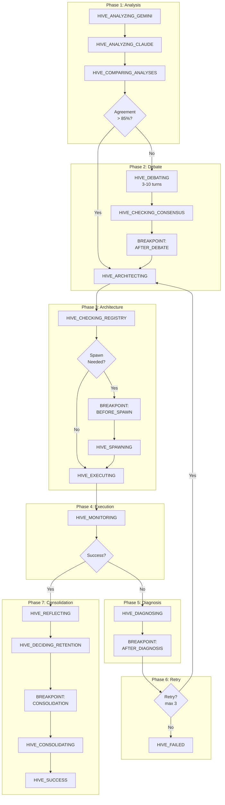

### HiveMind States (24 total)

| Phase | States |
|-------|--------|
| Other | `HIVE_GATING`, `HIVE_COMPARING_ANALYSES`, `HIVE_APPLYING_CHANGES` |
| Phase 1: Analysis | `HIVE_ANALYZING_GEMINI`, `HIVE_ANALYZING_CLAUDE` |
| Phase 2: Debate | `HIVE_DEBATING`, `HIVE_CHECKING_CONSENSUS`, `HIVE_BREAKPOINT_DEBATE` |
| Phase 3: Architecture | `HIVE_ARCHITECTING`, `HIVE_CHECKING_REGISTRY`, `HIVE_BREAKPOINT_SPAWN`, `HIVE_SPAWNING` |
| Phase 4: Execution | `HIVE_EXECUTING`, `HIVE_MONITORING` |
| Phase 5: Diagnosis | `HIVE_DIAGNOSING`, `HIVE_BREAKPOINT_DIAGNOSIS` |
| Phase 6: Retry | `HIVE_DECIDING_RETRY` |
| Phase 7: Consolidation | `HIVE_REFLECTING`, `HIVE_DECIDING_RETENTION`, `HIVE_BREAKPOINT_CONSOLIDATION`, `HIVE_CONSOLIDATING` |
| Terminal | `HIVE_SUCCESS`, `HIVE_FAILED`, `HIVE_ESCALATE` |


### User Breakpoints

| Breakpoint | Location | Purpose |
|------------|----------|---------|
| `AFTER_DEBATE` | After Phase 2 | Review debate consensus |
| `BEFORE_SPAWN` | Before spawning | Approve agent creation |
| `AFTER_DIAGNOSIS` | After failure analysis | Review fix strategy |
| `CONSOLIDATION` | Before knowledge archival | Review learnings |

**Source**: `core/intelligence/hive_mind/types.py`, `core/intelligence/hive_mind/phases/`


## 6. ZOOM: Async Primitives

### Overview

The current runtime exposes a complete async infrastructure for non-blocking operations.

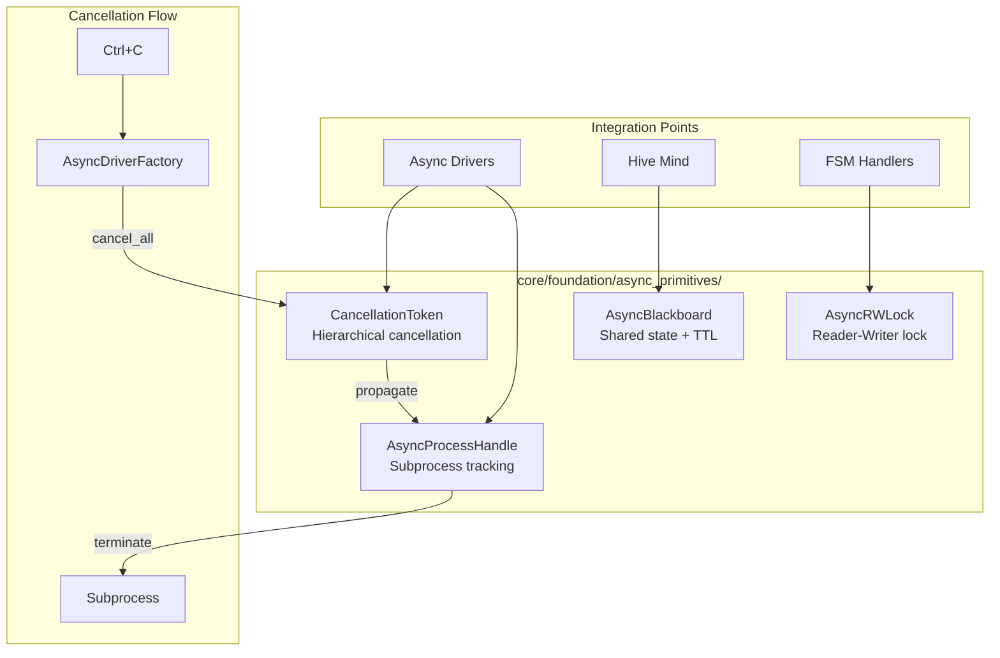

### Async Primitive Classes

| Class | Purpose |
|-------|---------|
| `CancellationToken` | Hierarchical cancellation with callbacks |
| `CancellationTokenSource` | Creates and controls tokens |
| `AsyncProcessHandle` | Track subprocess by UUID |
| `ProcessHandleRegistry` | Global registry for cancel_by_uuid |
| `AsyncRWLock` | Multiple readers OR single writer |
| `AsyncBlackboard` | Thread-safe shared state with TTL |

**Files**: `blackboard.py`, `cancellation.py`, `event_bus.py`, `process_handle.py`, `rwlock.py`, `safe_task_manager.py`, `task_metrics_collector.py`
**Classes**: `BlackboardEntry`, `AsyncBlackboard`, `CancellationToken`, `CancellationTokenSource`, `EventType`, `SyncEvent`, `EventBus`, `ProcessState`, `AsyncProcessHandle`, `ProcessHandleRegistry`, `AsyncRWLock`, `AsyncRWLockWithTimeout`, `RWLockStats`, `InstrumentedAsyncRWLock`, `TaskInfo`, `SafeTaskManager`, `TaskRecord`, `TaskTypeMetrics`, `CollectorStats`, `TaskMetricsCollector`

### Async Handlers (FSMHandlers)

| Handler | Purpose |
|---------|---------|
| `handle_brainstorming_async()` | Non-blocking handler |
| `handle_validating_cfl_async()` | Non-blocking handler |
| `handle_fast_path_async()` | Non-blocking handler |

**Source**: `core/foundation/async_primitives/`, `core/execution_pkg/orchestration/fsm_handlers.py`


## 7. ZOOM: Blind Spot Remediations

### Overview

The current runtime addresses architectural blind spots with dedicated modules.

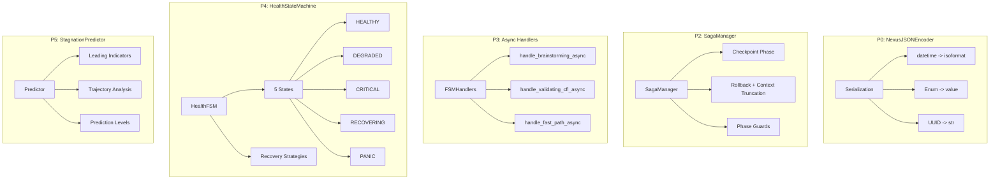

### HealthStateMachine States

| State |
|-------|
| `HEALTHY` |
| `DEGRADED` |
| `CRITICAL` |
| `RECOVERING` |
| `PANIC` |

**Transitions**: HEALTHY -> DEGRADED (1 error) -> CRITICAL (3 errors) -> RECOVERING/PANIC

### Recovery Strategies

| Strategy |
|----------|
| `custom_fix` |
| `reset_stagnation` |
| `switch_agent` |
| `compress_context` |
| `clear_tool_cache` |
| `rollback_phase` |

### SagaManager Phase Order

```
analysis -> debate -> architecture -> execution -> diagnosis -> retry -> consolidation
```

**Features**:
- Atomic checkpoints via `AtomicJsonStore`
- Context truncation on rollback (`messages[:checkpoint_index]`)
- Phase guards before each transition

### StagnationPredictor Levels

| Level |
|-------|
| `CONTINUE` |
| `MONITOR` |
| `NUDGE` |
| `INTERVENE` |

**Thresholds**: CONTINUE (<0.4) -> MONITOR (0.4-0.6) -> NUDGE (0.6-0.8) -> INTERVENE (>0.8)

### Implementation Summary

| Phase | Module | Lines |
|-------|--------|-------|
| P0 | `core/utils/serialization.py` | ~240 |
| P1 | `core/intelligence/hive_mind/async_adapter.py` | +80 |
| P2 | `core/intelligence/hive_mind/saga_manager.py` | ~640 |
| P3 | `core/execution_pkg/orchestration/fsm_handlers.py` | +290 |
| P4 | `core/fsm/health_state_machine.py` | ~549 |
| P5 | `core/fsm/stagnation_predictor.py` | ~476 |

**Source**: `core/intelligence/hive_mind/saga_manager.py`, `core/fsm/health_state_machine.py`, `core/fsm/stagnation_predictor.py`


## 8. ZOOM: Evolution & Spawning

### /spawn Flow

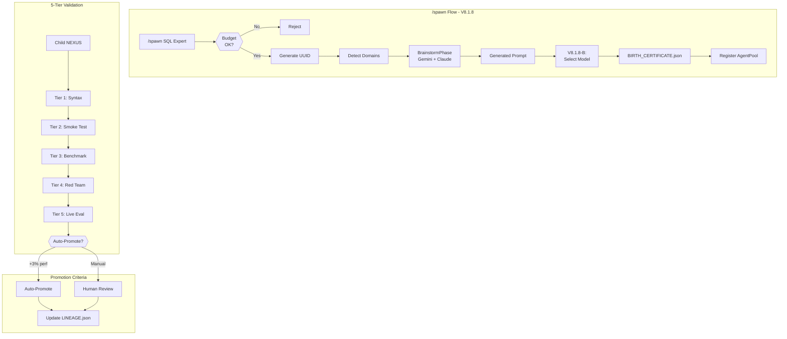

### BIRTH_CERTIFICATE.json Structure

```json
{
  "uuid": "agent-uuid-here",
  "role": "SQL Expert",
  "created_at": "2025-12-09T...",
  "parent_version": "8.3.2",
  "inference": {
    "provider": "claude",
    "model": "claude-sonnet-4-5"
  },
  "domains": ["database", "sql", "optimization"],
  "prompt_hash": "sha256:..."
}
```

### Evolution Commands

| Command | Description |
|---------|-------------|
| `/spawn <role>` | Create specialized agent |
| `/agents` | List all spawned agents |
| `/evolve [count]` | Create child generations |
| `/evolve-status` | Show evolution stats |
| `/review` | Review pending children |
| `/specialize <mission>` | Create NEXUS spinoff |

**Source**: `core/intelligence/evolution/`, `core/infrastructure/bootstrap/agent_loader.py`


## 9. ZOOM: Memory Systems

### Memory Architecture

```mermaid
graph TD
    subgraph ProjectMemory["Project Memory"]
        LEARN["#47;learn <path>"] --> INDEX[Index Files]
        INDEX --> STORE["NEXUS_ROOT/.nexus/project_knowledge.json"]
        INDEX --> BACKEND{{Backend Selection}}
        BACKEND --> AUTO[auto]
        BACKEND --> DENSE[dense -> lancedb/]
        BACKEND --> BM25[bm25]
        BACKEND --> TFIDF[tfidf]
        QUERY["#47;rag query <text>"] --> SEARCH[retrieve()]
        SEARCH --> CHUNKS[Top-K Chunks]
    end

    subgraph Success["SuccessMemoryV2"]
        TASK_DONE[Task Complete] --> RECORD[record_success]
        RECORD --> ENTRY[SuccessEntry<br/>mode, agents, duration]
        ENTRY --> VIRTUAL["success_memory://task_id chunks"]
        VIRTUAL --> STORE

        NEW_TASK[New Task] --> SIMILAR[search_similar]
        SIMILAR --> BOOST[Mode Boost<br/>0-30%]
    end

    subgraph Auto["Auto Memory"]
        SUCCESS[Success] --> AUTO_REC[record_success]
        FAILURE[Failure] --> AUTO_FAIL[record_failure]
        AUTO_REC --> JSONL[(workspace/memory/*.jsonl)]
        AUTO_FAIL --> JSONL

        SUGGEST[suggest_mode] --> JSONL
        SUGGEST --> BEST[Best Mode for Type]
    end

    subgraph Integration["Memory Integration"]
        BOOST --> SELECTOR[ModeSelector]
        BEST --> SELECTOR
        CHUNKS --> CONTEXT[Context Builder]
    end
```

### Memory Commands

| Command | Description |
|---------|-------------|
| `/learn [path]` | Index files into RAG |
| `/forget [path]` | Remove from RAG index |
| `/memory-status` | Show index statistics |
| `/rag <init|clear|query <text>>` | RAG maintenance and retrieval commands |

### Storage Paths

| Path | Purpose |
|------|---------|
| `NEXUS_ROOT/.nexus/project_knowledge.json` | ProjectMemory JSON index |
| `NEXUS_ROOT/.nexus/lancedb/` | Optional dense retrieval storage |
| `workspace/memory/` | AutoMemory and compatibility artifacts |

### RAG Backends

| Backend | Description | When Used |
|---------|-------------|-----------|
| **auto** | Select Dense, then BM25, then TF-IDF | Default selector |
| **dense** | Semantic search with MiniLM + LanceDB | Optional best-quality path |
| **bm25** | Sparse lexical retrieval | Fallback when dense is unavailable |
| **tfidf** | Built-in term-based retrieval | Lowest-dependency fallback |
| **hybrid** | Dense + BM25 implementation | Exists, but not selected by default today |

**Source**: `core/memory_pkg/memory/`


## 10. ZOOM: Security & Governance

### Security Architecture

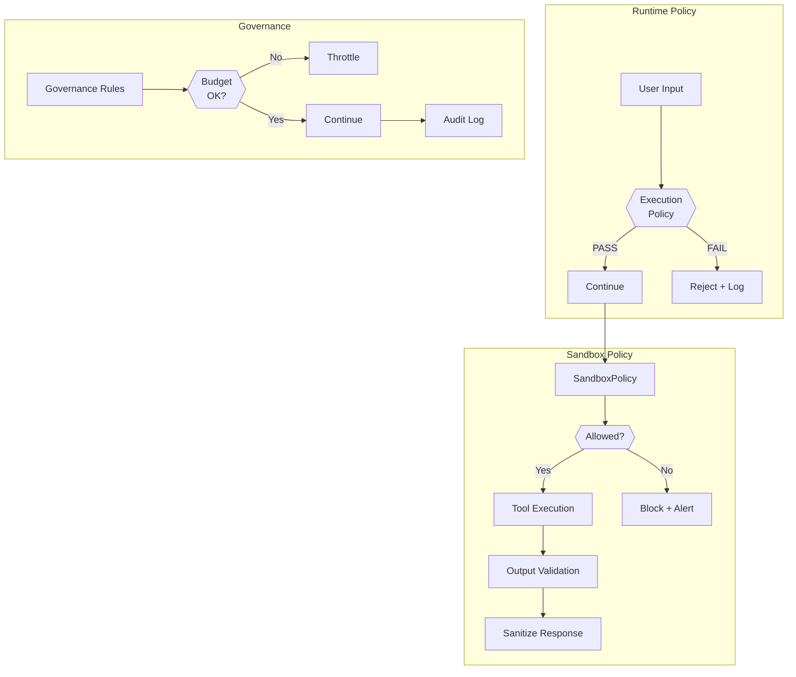

### Runtime Policy

The default distributed runtime is governed by execution policy, tool capability
checks, sandbox controls, and integrity monitoring.

Legacy KERNEL/INVARIANTS artifacts still exist for backward compatibility and
historical review, but they are **not** the default runtime authority on NX-CG.

### SandboxPolicy

| Policy | Description |
|--------|-------------|
| **File Access** | Restricted to workspace/ |
| **Network** | Controlled external access |
| **Execution** | Sandboxed command execution |
| **Budget** | Token/cost limits |

### Defense-in-Depth

| Layer | Protection |
|-------|------------|
| 1. Policy | Execution and capability validation |
| 2. Sandbox | Operation restrictions |
| 3. Governance | Budget/rate limits |
| 4. Audit | Full operation logging |

**Source**: `core/security_pkg/`, `core/execution_pkg/execution/`


## 11. FUNCTIONAL INVENTORY

### Slash Commands (28 total)


#### Collaboration

| Command | Description |
|---------|-------------|
| `/pool-stats` | Show agent pool statistics and usage metrics |
| `/swarm` | Execute a task using multi-agent collaboration |
| `/swarm-fsm` | Execute task via FSM states (debug mode) |
| `/swarm-status` | Show Swarm Engine status and DyLAN metrics |

#### Evolution

| Command | Description |
|---------|-------------|
| `/agents` | List all registered agents and their capabilities |
| `/evolve` | Start evolution cycle to generate improved agent variants |
| `/evolve-status` | Show current evolution status and child variants |
| `/review` | Review evolved children and select best variant |
| `/spawn` | Spawn a new specialized agent with a specific role |
| `/specialize` | Create a specialized NEXUS spinoff for a specific mission |

#### Monitoring

| Command | Description |
|---------|-------------|
| `/budget` | View or set token budget for API calls |
| `/doctor` | Run system diagnostics and check API connectivity |
| `/status` | Show current system status (FSM state, agents, memory) |
| `/telemetry` | View or configure telemetry settings |

#### Workspace

| Command | Description |
|---------|-------------|
| `/bootstrap` | Generate NEXUS.md for a project directory |
| `/workspace` | Manage workspace (show, new, list, switch) |

#### Memory

| Command | Description |
|---------|-------------|
| `/forget` | Remove file or directory from Project Memory |
| `/learn` | Index file or directory into Project Memory (RAG) |
| `/memory-status` | Show Project Memory (RAG) status and statistics |
| `/rag` | RAG operations: init, clear, query |

#### System

| Command | Description |
|---------|-------------|
| `/chat` | Toggle chat mode for direct AI conversation |
| `/clear` | Clear the console screen |
| `/help` | Show available commands and their usage |
| `/mode` | Change the orchestrator mode |
| `/quickstart` | Show the NEXUS quickstart guide |
| `/quit` | Exit NEXUS REPL |
| `/reset` | Reset the orchestrator to IDLE state |
| `/tutorial` | Run the interactive NEXUS tutorial |


## 12. KEY DATACLASSES

### Core Dataclasses

| Dataclass | Key Fields | Source |
|-----------|------------|--------|
| `AgentProfile` | agent_id, capabilities, total_tasks, total_successes, registered_at | `core/foundation/agents/capability_profiler.py` |
| `AgentProfile` | agent_id, provider, model, capabilities, is_active (+3 more) | `core/intelligence/swarm/agent_metrics.py` |
| `DebateResult` | status, final_approach, final_capabilities, final_mode, debate_history (+6 more) | `core/intelligence/hive_mind/types.py` |
| `ExecutionPlan` | strategy, steps, estimated_total_duration, estimated_total_tokens | `core/intelligence/hive_mind/types.py` |
| `FailureDiagnosis` | failure_type, root_cause, contributing_factors, evidence, recommended_changes (+4 more) | `core/intelligence/hive_mind/types.py` |
| `HiveMindResult` | success, output, state, phases_completed, total_duration (+6 more) | `core/intelligence/hive_mind/orchestrator.py` |
| `InferenceConfig` | provider, model, reasoning | `core/infrastructure/bootstrap/agent_loader.py` |
| `ModeProposal` | mode, confidence, agent_assignments, reasoning, alternatives (+1 more) | `core/intelligence/swarm/mode_selector.py` |
| `SuccessEntry` | task_id, task_hash, description, swarm_mode, agents_used (+8 more) | `core/memory_pkg/memory/success_memory_v2.py` |
| `SwarmDelegationResult` | success, result, mode_used, fallback_chain, failure_diagnostics (+2 more) | `core/intelligence/hive_mind/swarm_bridge.py` |
| `TaskAnalysis` | complexity, domains, primary_domain, requires_web, requires_code_execution (+9 more) | `core/intelligence/swarm/task_analyzer.py` |
| `ToolResult` | success, output, error, execution_time_ms, metadata | `core/drivers/tool_executor.py` |
| `ToolResult` | tool_name, status, output, error | `core/execution_pkg/execution/handlers/base.py` |


### All Enums (119 total)

`AgentCapability`, `AgentProvider`, `AgentProvider`, `AgentStatus`, `AggregateStatus`, `AlignmentPrinciple`, `AnalysisStage`, `ArgType`, `AuditAction`, `AuditStatus`, `CerebroEventType`, `CircuitState`, `CollaborationMode`, `CommandStatus`, `CommandType`, `ComponentCategory`, `ConfidenceBias`, `ContextPriority`, `ContextScope`, `CoordinationType`, `CostCategory`, `DegradationReason`, `DependencyType`, `DialogueAct`, `DriverResponseStatus` (+94 more)

### All Dataclasses (575 total)

`APICallMetric`, `APIRateLimitConfig`, `AbortRecommendation`, `AccessCheckResult`, `AccessRecord`, `AccessStats`, `AdmissibilityResult`, `AgentAccess`, `AgentAction`, `AgentArchitecture`, `AgentAssignment`, `AgentCalibrationProfile`, `AgentDebateMetrics`, `AgentDescriptor`, `AgentHealthSnapshot`, `AgentInfo`, `AgentInvocationResult`, `AgentPerformance`, `AgentPool`, `AgentPositionHistory`, `AgentProfile`, `AgentProfile`, `AgentReasoningProfile`, `AgentReflection`, `AgentRequirements`, `AgentResponse`, `AgentResult`, `AgentRetention`, `AgentRoleProfile`, `AgentRouting`...


## 13. STATISTICS

### Codebase Metrics

| Metric | Value |
|--------|-------|
| **Total Components** | 21 |
| **Total Python Files** | 359 |
| **Total Lines of Code** | 145,059 |
| **Total Classes** | 1128 |
| **Total Functions** | 5,207 |
| **Total Dataclasses** | 575 |
| **Total Enums** | 119 |

### Test Coverage

| Metric | Value |
|--------|-------|
| **Test Functions** | 11087 |

### Lines of Code by Component

```
intelligence    | ############################## 45,347
execution_pkg   | ########## 16,162
memory_pkg      | ######### 14,506
infrastructure  | ###### 9,951
drivers         | ###### 9,626
security_pkg    | ##### 8,282
interface_pkg   | #### 7,515
observability   | #### 7,255
fsm             | ### 5,681
api             | ### 5,207
foundation      | ### 4,633
utils           | ## 3,182
synapse         | # 2,951
metagraph       | # 1,813
workflow        | # 1,760
```

### Component Distribution

| Component | % of Codebase |
|-----------|---------------|
| intelligence | 31.3% |
| execution_pkg | 11.1% |
| memory_pkg | 10.0% |
| infrastructure | 6.9% |
| drivers | 6.6% |
| security_pkg | 5.7% |
| interface_pkg | 5.2% |
| observability | 5.0% |
| fsm | 3.9% |
| api | 3.6% |

## 14. TORTURE PROTOCOL

### Overview

Torture Protocol V8 provides comprehensive stress testing for SagaManager + HiveMind integration.

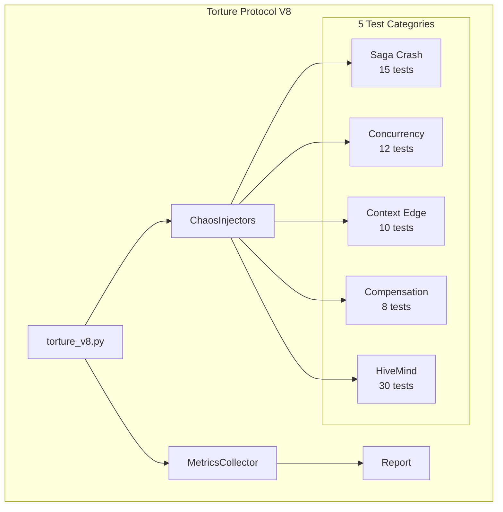

### Test Categories (76 total)

| Category | Tests |
|----------|-------|
| Compensation Failures | 8 |
| Context Edge Cases | 10 |
| HiveMind Integration | 30 |
| Saga Concurrency | 12 |
| Saga Crash Recovery | 16 |

### Target Metrics

| Metric | Target |
|--------|--------|
| Success Rate | >95% |
| Recovery Rate | >90% |
| Panic Rate | <1% |
| Hot-Swap Effectiveness | >80% |

### Chaos Injectors

| Injector | Purpose |
|----------|---------|
| `CrashInjector` | Simulate crashes at checkpoints, persist, fsync |
| `RaceInjector` | Introduce race conditions via delays |
| `CorruptionInjector` | Corrupt saga files in various ways |
| `TimeoutInjector` | Inject timeouts into operations |

### pytest Markers

None

### Execution

```bash
# Run all torture tests
pytest tests/torture_v8.py -m torture -v --tb=short

# Run by category
pytest tests/torture_v8.py -m torture_saga -v   # Saga tests
pytest tests/torture_v8.py -m torture_hive -v   # HiveMind tests
pytest tests/torture_v8.py -m torture_slow -v   # Slow tests
```

**Source**: `tests/torture_v8.py`, `tests/torture/`


## 15. ANTI-HALLUCINATION REFERENCE

### Verified Structures

This section provides **verified** structures for AI agents to reference, preventing hallucination.

#### OrchestratorState (VERIFIED)

```python
# core/fsm/states.py
class OrchestratorState(Enum):
    IDLE = "IDLE"
    BRAINSTORMING = "BRAINSTORMING"
    EXECUTING_TOOL = "EXECUTING_TOOL"
    VALIDATING_CFL = "VALIDATING_CFL"
    EVOLUTION_BRAINSTORM = "EVOLUTION_BRAINSTORM"
    WAITING_USER = "WAITING_USER"
    ERROR = "ERROR"
    PANIC = "PANIC"
    SWARM_ANALYZING = "SWARM_ANALYZING"
    SWARM_NEGOTIATING = "SWARM_NEGOTIATING"
    SWARM_EXECUTING = "SWARM_EXECUTING"
    HIBERNATE = "HIBERNATE"
```

#### HiveMindState (VERIFIED - 24 states)

```python
# core/intelligence/hive_mind/types.py - First 15 states
    HIVE_GATING
    HIVE_ANALYZING_GEMINI
    HIVE_ANALYZING_CLAUDE
    HIVE_COMPARING_ANALYSES
    HIVE_DEBATING
    HIVE_CHECKING_CONSENSUS
    HIVE_BREAKPOINT_DEBATE
    HIVE_ARCHITECTING
    HIVE_CHECKING_REGISTRY
    HIVE_BREAKPOINT_SPAWN
    HIVE_SPAWNING
    HIVE_EXECUTING
    HIVE_MONITORING
    HIVE_DIAGNOSING
    HIVE_BREAKPOINT_DIAGNOSIS
    # ... +9 more
```

#### CollaborationMode (VERIFIED)

```python
# core/intelligence/swarm/collaboration_modes.py
class CollaborationMode(Enum):
    PARALLEL = "parallel"
    SEQUENTIAL = "sequential"
    LEAD_SUPPORT = "lead_support"
    PING_PONG = "ping_pong"
    SPECIALIST = "specialist"
    RED_BLUE = "red_blue"
```

### Common Hallucination Traps

| Wrong | Correct |
|-------|---------|
| `TaskAnalysis.reasoning` | Use `ModeProposal.reasoning` |
| `ModeProposal.recommended_mode` | Use `.mode` |
| `HiveMindState.HIVE_COMPLETE` | Use `HIVE_SUCCESS` |
| `invoke(task_type=)` | Use `invoke(session_uuid=)` |

### Reference Documents

| Document | Purpose |
|----------|---------|
| `docs/DATACLASS_FIELDS.md` | Exact field definitions |
| `docs/DRIVER_INTERNALS.md` | LLM driver implementation |
| `docs/ASYNC_MAP.md` | Async vs sync functions |


---

## Regeneration

To regenerate this document after code changes:

```bash
python scripts/doc_engine.py --gen-map --apply
```

Or run the full documentation sync:

```bash
python scripts/doc_engine.py --full --apply
```

---

*Generated by NEXUS Documentation Engine V2*
*Source: `scripts/doc_engine.py`*
*Version: 12.4.0 "COGNITIVE BOOST"*
