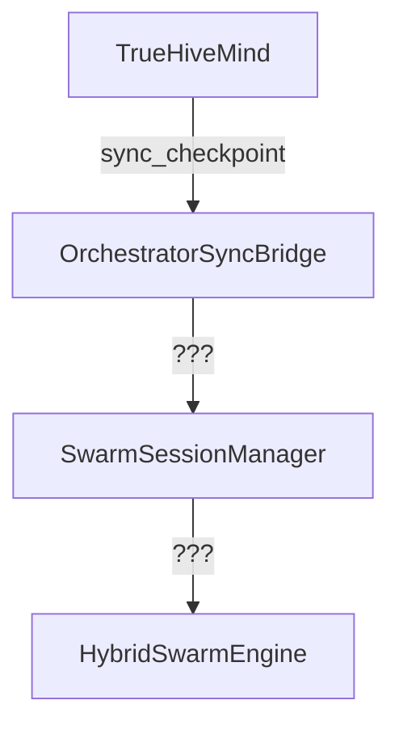
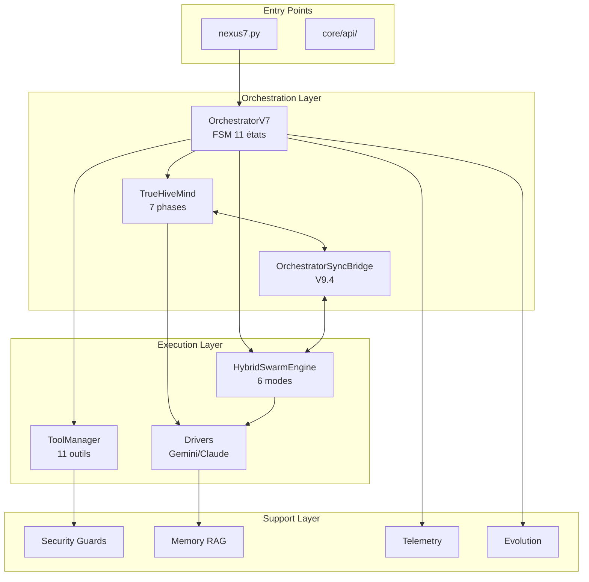

# NEXUS V9.4 - AUDIT TECHNIQUE COMPLET

**Date:** 2025-12-13
**Auditeur:** NEXUS PRIME (Claude Opus 4.5)
**Version:** 9.4 (Branch N9AF)
**Méthode:** Reverse-engineering bottom-up + analyse statique

---

## MÉTRIQUES GLOBALES

| Métrique | Valeur | Évaluation |
|----------|--------|------------|
| Fichiers Python (core/) | 176 | Grande base de code |
| Lignes de code totales | 61,087 | Projet mature |
| Fichiers de test | 71 | Couverture correcte |
| Ratio test/code | 0.40 | À améliorer |
| Dataclasses | 155 | Bon typage structurel |
| Docstrings (""") | 3,474 | Bien documenté |
| Async/await usages | 330 | Architecture moderne |
| TODO/FIXME markers | 17 | Dette technique faible |
| Bare except clauses | 5 | À corriger |

---

## 🛡️ FORCES (STRENGTHS)

### 1. Architecture Modulaire Robuste

```
NEXUS/
+-- core/                    # 176 modules bien séparés
|   +-- fsm/                 # Machine à états explicite
|   +-- swarm/               # 6 modes de collaboration
|   +-- hive_mind/           # Pipeline 7 phases
|   +-- security/            # Guards multi-couches
|   +-- orchestration/       # Composition V7.8
```

**Points forts:**
- **Separation of Concerns:** Chaque module a une responsabilité claire
- **Composition over Inheritance:** `OrchestratorV7` utilise `ContextBuilder`, `AgentInvoker`, `FSMHandlers`
- **Mediator Pattern:** `OrchestratorSyncBridge` (V9.4) coordonne HiveMind/Swarm

### 2. Typage Fort avec Dataclasses

```python
# 155 dataclasses pour typage structurel
@dataclass
class TaskExecutionContext:    # V9.3 - Thread-safe
@dataclass
class SyncEvent:               # V9.4 - Audit trail
@dataclass
class CircuitBreaker:          # V9.3 - Resilience
```

**Patterns exemplaires:**
- `core/synapse/protocol_v7.py`: `LightMessageV7`, `HeavyMessageV7`
- `core/evolution/models.py`: `MutationProposal`, `BrainstormResult`
- `core/swarm/types.py`: `CollaborationResult`, `NegotiationState`

### 3. Sécurité Multi-Couches (OWASP LLM01:2025)

| Couche | Module | Protection |
|--------|--------|------------|
| Input | `input_guard.py` | Prompt injection detection |
| Output | `output_guard.py` | Sensitive data filtering |
| Execution | `execution_policy.py` | Command sandboxing |
| Path | `path_guardian.py` | Path traversal prevention |
| Mutation | `mutation_validator.py` | Evolution security |

### 4. Résilience et Self-Healing

- **Circuit Breaker** (V9.3): `core/resilience/circuit_breaker.py`
  - Exponential backoff
  - 3 états: CLOSED -> OPEN -> HALF_OPEN

- **Self-Healing Swarm** (V8.1.3): `core/swarm/self_healing.py`
  - Fallback automatique entre modes
  - Hot-swap du lead agent

- **Saga Pattern** (V8.4.4b): `core/hive_mind/saga_manager.py`
  - Checkpoints par phase
  - Rollback coordonné

### 5. Documentation Inline Excellente

- 3,474 docstrings triple-quotes
- Headers explicatifs dans chaque fichier
- Version tracking (V7.x, V8.x, V9.x)

---

## [warning]️ FAIBLESSES (WEAKNESSES)

### 1. Fichiers Monolithiques

| Fichier | Lignes | Problème |
|---------|--------|----------|
| `tool_manager.py` | 1,848 | God class - trop de responsabilités |
| `fsm_handlers.py` | 1,408 | Extraction partielle (V7.8) |
| `repl.py` | 1,346 | UI + Logic mélangés |
| `mode_executors.py` | 1,323 | 6 modes dans 1 fichier |
| `orchestration_v7.py` | 1,074 | Orchestrateur principal |

**Impact:** Difficulté de maintenance, tests complexes

### 2. Bare Except Clauses (Anti-Pattern)

```python
# 5 occurrences détectées
except:  # [NO] Attrape tout, masque les erreurs
```

**Fichiers concernés à vérifier:**
```bash
grep -rn "except:" core --include="*.py" | grep -v "Exception"
```

### 3. Couplage Élevé sur `unified_registry`

```python
# 7 imports directs dans différents modules
from core.agents.unified_registry import get_registry
```

**Risque:** Single point of failure, circular imports potentiels

### 4. Tests Manquants pour Nouveaux Modules

| Module (V9.x) | Tests | Status |
|---------------|-------|--------|
| `sync_bridge.py` | `test_sync_bridge.py` | [OK] 31 tests |
| `circuit_breaker.py` | `test_circuit_breaker.py` | [OK] 13 tests |
| `context_scope.py` | - | [NO] Non testé |
| `session_integration.py` | - | [NO] Non testé |

### 5. Subprocess/Exec Usage Élevé

```
919 occurrences de subprocess/exec/os.system
```

**Contexte:** Normal pour un orchestrateur CLI, mais nécessite audit sécurité continu.

---

## 👁️ ANGLES MORTS (BLIND SPOTS)

### 1. Flux de Données HiveMind -> Swarm



**Problème:** La synchronisation bidirectionnelle est implémentée (V9.4) mais le flux inverse Swarm->HiveMind manque de documentation.

### 2. Gestion d'Erreurs Async

```python
# Pattern observé - erreurs potentiellement perdues
asyncio.create_task(some_coroutine())  # No await, no error handling
```

**Fichiers à auditer:**
- `core/drivers/async_*.py`
- `core/hive_mind/phases/*.py`

### 3. État Partagé dans Swarm PARALLEL

```python
# core/swarm/mode_executors.py
# Exécution parallèle avec état potentiellement partagé
async def _parallel_execute():
    results = await asyncio.gather(*tasks)  # Race conditions?
```

**V9.3 Fix:** `TaskExecutionContext` immutable, mais vérifier tous les usages.

### 4. Magic Numbers

```python
max_attempts = 4      # Pourquoi 4?
window_size = 3       # Pourquoi 3?
budget_limit = 50000  # Tokens - justification?
```

**Recommandation:** Centraliser dans `core/config/constants.py`

### 5. Hacks Legacy (ASI)

```python
# Références obsolètes détectées
expected_asi_impact  # Legacy - mappe vers fitness score
```

**Fichiers:**
- `core/evolution/phases/brainstorm.py`
- Documentation historique dans `docs/archive/legacy_asi/`

---

## 🔧 RÉSOLUTIONS (ACTIONABLE FIXES)

### Priorité CRITIQUE

| # | Action | Fichier | Effort |
|---|--------|---------|--------|
| 1 | Corriger 5 bare except clauses | Multiple | 1h |
| 2 | Ajouter tests pour `context_scope.py` | `tests/` | 2h |
| 3 | Ajouter tests pour `session_integration.py` | `tests/` | 2h |

### Priorité HAUTE

| # | Action | Fichier | Effort |
|---|--------|---------|--------|
| 4 | Refactorer `tool_manager.py` (1848 -> 3×600) | `core/execution/` | 1j |
| 5 | Extraire modes de `mode_executors.py` | `core/swarm/executors/` | 1j |
| 6 | Créer `core/config/constants.py` | `core/config/` | 2h |

### Priorité MOYENNE

| # | Action | Fichier | Effort |
|---|--------|---------|--------|
| 7 | Documenter flux Swarm->HiveMind | `docs/ARCHITECTURE.md` | 2h |
| 8 | Audit async error handling | `core/drivers/async_*.py` | 4h |
| 9 | Nettoyer références ASI legacy | `core/evolution/` | 2h |

### Priorité BASSE

| # | Action | Fichier | Effort |
|---|--------|---------|--------|
| 10 | Améliorer ratio tests (0.40 -> 0.60) | `tests/` | 1sem |
| 11 | Réduire couplage unified_registry | Multiple | 2j |
| 12 | Séparer UI/Logic dans `repl.py` | `core/interface/` | 1j |

---

## ARCHITECTURE GLOBALE (MERMAID)



---

## CONCLUSION

NEXUS V9.4 présente une architecture **mature et bien structurée** avec:

- [OK] Séparation claire des responsabilités
- [OK] Typage fort avec dataclasses
- [OK] Sécurité multi-couches
- [OK] Patterns de résilience (Circuit Breaker, Saga, Self-Healing)
- [OK] Documentation inline abondante

**Axes d'amélioration prioritaires:**
1. Refactoring des fichiers monolithiques (>1000 lignes)
2. Couverture de tests pour les nouveaux modules V9.x
3. Centralisation des constantes magiques
4. Documentation du flux bidirectionnel HiveMind↔Swarm

**Score global:** 8.2/10

---

*Généré par NEXUS PRIME - Audit automatisé V9.4*
