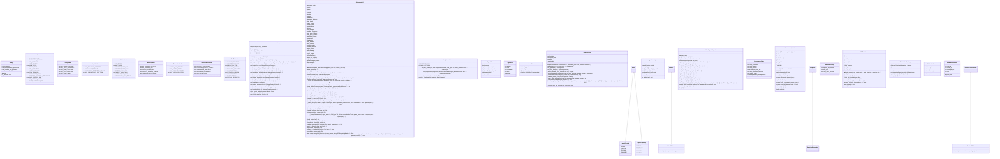

# NEXUS Class Diagrams

```mermaid
classDiagram
    class Config {
        +fitness_metrics
        +min_hours_between_generations
        +max_children_per_generation
        -__init__(self)
        +to_dict(self) dict
    }
    class Timeouts {
        +float BASH_COMMAND
        +float BASH_LONG_RUNNING
        +float GIT_COMMAND
        +float WEB_SEARCH
        +float WEB_FETCH
        +float TODO_WRITE
        +float CFL_VALIDATION
        +float HIVE_MIND_ASYNC
        +float FSM_ITERATION
        +float BREAKPOINT_USER
        +float PROCESS_GRACEFUL_TERMINATION
        +float MCP_PROCESS_WAIT
        +float CLI_VERSION_CHECK
        +float RATE_LIMITER_ACQUIRE
    }
    class RetryLimits {
        +int MAX_PARSE_FAILURES
        +int MAX_TOOL_ITERATIONS
        +int MAX_FSM_ITERATIONS
        +int MAX_CFL_ITERATIONS
        +int MAX_LEAD_SWAPS
    }
    class SagaLimits {
        +int MAX_ROLLBACK_ATTEMPTS
        +float ROLLBACK_TIMEOUT
        +int CHECKPOINT_RETENTION_HOURS
        +int MAX_CHECKPOINTS_PER_TASK
    }
    class DebateLimits {
        +int MIN_TURNS
        +int MAX_TURNS
        +int COMPLEX_TURNS_MIN
        +int COMPLEX_TURNS_MAX
        +int EXPERT_TURNS_MIN
        +int EXPERT_TURNS_MAX
        +int ADAPTIVE_TURN_CAP
        +int NEGOTIATION_MAX_TURNS
    }
    class MemoryLimits {
        +int RAG_CHUNKS_RETRIEVE
        +int RAG_CHUNKS_MAX
        +int SIMILAR_TASKS_LIMIT
        +int CONTEXT_WINDOW_TOKENS
        +float MIN_SIMILARITY_SCORE
    }
    class ExecutionLimits {
        +int SWARM_MAX_ROUNDS
        +int MAX_SWARM_DEPTH
        +int MAX_PARALLEL_AGENTS
        +int MAX_EXECUTION_STEPS
    }
    class ThresholdConstants {
        +float DEFAULT_CONFIDENCE
        +float FALLBACK_QUALITY_PENALTY
        +float STAGNATION_SIMILARITY
        +float HIVE_MIND_AGREEMENT
        +float RED_TEAM_PASS
    }
    class CostEstimates {
        +int ANALYSIS_COMPARE
        +int CONSENSUS_CHECK
        +int EXECUTION_STEP
        +int DIAGNOSIS_SINGLE
        +int DIAGNOSIS_SYNTHESIS
        +int CHANGES_APPLY
        +int RETENTION_DECIDE
        +int CONSOLIDATION
        +int RAG_INJECTION
        +int DEFAULT_OPERATION
    }
    class ServiceFactory {
        -Dict[str, Dict[str, Any]] _instances
        -_lock
        -Optional[Path] _nexus_root
        -_embedding_engine
        -_embedding_engine_lock
        +initialize(cls, nexus_root: Path) None
        +get_nexus_root(cls) Path
        -_get_tenant_cache(cls, tenant_id: str) Dict[str, Any]
        -_get_or_create(cls, service_name: str, factory_func, ctx: Optional[SessionContext]=...) Any
        +get_tenant_workspace_path(cls, ctx: Optional[SessionContext]=...) Path
        +get_registry(cls, ctx: Optional[SessionContext]=...)
        +get_workspace_manager(cls, ctx: Optional[SessionContext]=...)
        +get_tool_registry(cls, ctx: Optional[SessionContext]=...)
        +get_rate_limiter_registry(cls, ctx: Optional[SessionContext]=...)
        +get_interaction_provider(cls, ctx: Optional[SessionContext]=...)
        +get_execution_engine(cls, ctx: Optional[SessionContext]=...)
        +get_system_health(cls, ctx: Optional[SessionContext]=...)
        +get_budget_tracker(cls, ctx: Optional[SessionContext]=...)
        +get_path_guardian(cls, ctx: Optional[SessionContext]=...)
        +get_config(cls, ctx: Optional[SessionContext]=...)
        +get_embedding_engine(cls)
        +get_project_memory(cls, ctx: Optional[SessionContext]=...)
        +get_auto_memory(cls, ctx: Optional[SessionContext]=...)
        +get_success_memory(cls, ctx: Optional[SessionContext]=...)
        +get_spotlighter(cls, ctx: Optional[SessionContext]=...)
        +clear_tenant_cache(cls, tenant_id: str) None
        +clear_all_caches(cls) None
        +get_cache_stats(cls) Dict[str, int]
    }
    class OrchestratorV7 {
        +workspace_path
        +config
        +logger
        +state
        -_registry
        +iteration
        +memory
        +blackboard
        +stagnation_detector
        +plan_health
        +panic_system
        +model_router
        +gemini_driver
        +drivers
        +tool_manager
        +pending_tool_result
        +json_parse_failures
        +max_parse_failures
        +stalemate_counter
        +gemini_info
        +claude_info
        +task_analyzer
        +auto_memory
        +context_builder
        +mutation_detector
        +agent_invoker
        +swarm_bridge
        +fsm_handlers
        -_sync_bridge
        +project_memory
        +agent_tool_registry
        +agent_pool
        +spawned_agent_loader
        +swarm_engine
        +telemetry
        -__init__(self, workspace_path: Path, config, gemini_info: Dict, claude_info: Dict)
        +active_agent(self) str
        +active_agent(self, agent: str)
        -_build_execution_context(self, objective: str=...) TaskExecutionContext
        +current_context(self) TaskExecutionContext
        -_sync_context_agent(self, context: TaskExecutionContext)
        -_get_claude_driver(self, task_type: TaskType, timeout_override: int=...) ClaudeDriverHybrid
        -_invoke_agent(self, task_type: TaskType, context: str) Dict
        -_invoke_for_swarm(self, agent_id: str, task_type: str, context: str, session_uuid: str=...) str
        -_invoke_agent_direct(self, task_type: TaskType, context: str, target_agent: str) Dict
        -_build_swarm_context(self, task_context: str, task_type: str, target_agent: str=...) str
        +check_project_context(self, project_path: Optional[Path]=...) Dict
        +get_startup_hints(self) list
        +process_turn(self, user_input: Optional[str]=...) Dict
        +process_turn_async(self, user_input: Optional[str]=...) Dict
        -_handle_async_state(self, user_input: Optional[str]=...) Dict
        -_handle_brainstorming_async(self, factory, user_input: Optional[str]) Dict
        -_handle_cfl_async(self, factory) Dict
        -_build_simple_context(self, user_input: str, task_analysis: TaskAnalysis) str
        -_transition_to(self, new_state: OrchestratorState)
        -_make_result(self, state: str, output: Optional[str], agent: Optional[str], finished: bool, error: Optional[str]=..., tool: Optional[str]=...) Dict
        -_detect_mutation_complete(self, content: str) bool
        -_handle_stagnation(self) Dict
        -_handle_error(self, error_msg: str) Dict
        -_trigger_panic(self, reason: str) Dict
        -_calculate_quality_score(self, message: dict, validation_ok: bool, is_stagnant: bool) float
        -_record_invocation(self, agent_name: str, task_type: str, success: bool, duration: float, quality_score: float=..., response_text: Optional[str]=...)
        -_build_context(self) str
        -_build_context_with_tool_result(self) str
        -_format_tool_result(self, result) str
        -_validate_message(self, response: Dict, expect_heavy: bool=...) Dict
        +reset_to_idle(self, clear_task: bool=...)
        +get_system_status(self) Dict
        +rollback_to_backup(self, backup_file: Path=...) bool
        +consolidate_memory(self) Dict
        +start_swarm_mode(self, objective: str, force_mode: Optional[CollaborationMode]=...) Dict
        +process_with_swarm(self, task_input: str, force_mode: Optional[CollaborationMode]=..., skip_negotiation: bool=..., on_negotiation_turn: Optional[Callable]=..., on_execution_round: Optional[Callable]=...) Dict
    }
    class AnalysisAdapter {
        +COMPLEXITY_MAP
        +DOMAIN_PATTERNS
        +to_task_analysis(cls, hive: IndependentAnalysis, raw_input: str, detect_domains: bool=...) TaskAnalysis
        +to_independent_analysis(cls, swarm: TaskAnalysis, agent_id: str, reasoning: str=...) IndependentAnalysis
        +complexity_to_string(cls, complexity: TaskComplexity) str
        +string_to_complexity(cls, text: str) TaskComplexity
    }
    class SpawnResult {
        +bool success
        +Optional[str] agent_id
        +Optional[str] agent_uuid
        +Optional[Path] agent_path
        +Optional[str] error
        +int prompt_lines
    }
    class AgentInfo {
        +str agent_id
        +str role
        +str created_at
        +str uuid
        +Path path
    }
    class PoolStats {
        +int total_agents
        +int total_invocations
        +float average_importance
        +Dict[str, Dict[str, Any]] agents_detail
    }
    class AgentService {
        +orchestrator
        +workspace_path
        +console
        -_agents_dir
        -__init__(self, orchestrator: 'OrchestratorV7', workspace_path: Path, console: 'ConsoleV7')
        +spawn(self, role: str, force: bool=...) SpawnResult
        +list_agents(self) List[AgentInfo]
        +get_pool_stats(self) Optional[PoolStats]
        -_detect_domains_from_role(self, role: str) List[str]
        -_brainstorm_agent_prompt(self, role: str, agent_uuid: str, domains: List[str]) Optional[str]
        -_extract_inference_config(self, prompt: str) Optional[Dict[str, str]]
        -_validate_prompt_tools(self, prompt: str) List[str]
        -_static_agent_template(self, role: str, agent_uuid: str, domains: List[str]) str
        -_run_redteam_validation(self, prompt: str) bool
        -_create_agent_config(self, role_slug: str, agent_uuid: str, role: str, domains: List[str], inference_config: Dict[str, str], generated_prompt: str) Dict[str, Any]
        -_register_agent_as_tool(self, role_slug: str) None
    }
    class AgentProvider {
        +GEMINI
        +CLAUDE
        +OLLAMA
        +SPAWNED
    }
    Enum <|-- AgentProvider
    class AgentCapability {
        +CODING
        +RESEARCH
        +CREATIVE
        +ANALYSIS
        +GENERAL
    }
    Enum <|-- AgentCapability
    class AgentDescriptor {
        +str id
        +AgentProvider provider
        +str display_name
        +List[AgentCapability] capabilities
        +Dict[str, float] dylan_scores
        +Optional[Path] config_path
        +bool is_available
        +is_builtin(self) bool
    }
    class DriverProtocol {
        +invoke(self, prompt: str, **kwargs) str
    }
    Protocol <|-- DriverProtocol
    class UnifiedAgentRegistry {
        -__init__(self) None
        -_register_builtins(self) None
        +register(self, agent: AgentDescriptor) None
        +unregister(self, agent_id: str) bool
        +register_driver(self, agent_id: str, driver: DriverProtocol) None
        -_normalize_id(self, agent_id: str) str
        +get(self, agent_id: str) Optional[AgentDescriptor]
        +get_driver(self, agent_id: str) Optional[DriverProtocol]
        +get_display_name(self, agent_id: str) str
        +get_alternate(self, agent_id: str) Optional[str]
        +is_gemini(self, agent_id: str) bool
        +is_claude(self, agent_id: str) bool
        +is_builtin(self, agent_id: str) bool
        +list_available(self) List[AgentDescriptor]
        +list_builtins(self) List[AgentDescriptor]
        +list_spawned(self) List[AgentDescriptor]
        +select_for_capability(self, capability: AgentCapability, exclude: Optional[List[str]]=...) Optional[AgentDescriptor]
        +update_dylan_score(self, agent_id: str, capability: str, score: float) bool
        -__contains__(self, agent_id: str) bool
        -__len__(self) int
    }
    class ConcurrencyStats {
        +int total_acquisitions
        +int total_releases
        +int total_timeouts
        +float total_wait_time_ms
        +int max_concurrent_observed
        +int current_active
        +Optional[datetime] last_acquisition
    }
    class ConcurrencyLimiter {
        -Optional['ConcurrencyLimiter'] _instance
        -_init_lock
        -_max_concurrent
        -_async_semaphore
        -_sync_semaphore
        -_stats
        -_stats_lock
        -_active_count
        -_initialized
        -__new__(cls) 'ConcurrencyLimiter'
        -__init__(self)
        +max_concurrent(self) int
        +active_count(self) int
        +available_permits(self) int
        +acquire_async(self, timeout: float=...)
        +acquire_async_nowait(self) bool
        +release_async(self)
        +acquire_sync_context(self, timeout: float=...)
        +acquire_sync(self, timeout: float=...) bool
        +release_sync(self)
        +get_stats(self) dict
        +reset_stats(self)
    }
    class RateLimitExceeded {
    }
    Exception <|-- RateLimitExceeded
    class RateLimitConfig {
        +int requests_per_minute
        +int burst_size
        +float retry_after_seconds
    }
    class APIRateLimiter {
        +rpm
        +burst
        +provider
        -_token_interval
        -_async_lock
        -_sync_lock
        -_total_requests
        -_total_waits
        -_total_wait_time
        -__init__(self, requests_per_minute: int=..., burst_size: int=..., provider: str=...)
        -_refill_tokens(self) int
        -_try_acquire(self) bool
        -_time_until_available(self) float
        +acquire(self, timeout: float=...) None
        +acquire_async(self, timeout: float=...) None
        +acquire_sync(self, timeout: float=...) None
        +get_stats(self) Dict
        +reset(self) None
    }
    class RateLimiterRegistry {
        -Optional['RateLimiterRegistry'] _instance
        -_lock
        -__new__(cls)
        +get_limiter(self, provider: str) APIRateLimiter
        +get_all_stats(self) Dict[str, Dict]
        +reset_all(self) None
    }
    class WebSocketContext {
        +str tenant_id
        +str user_id
        +str workspace_id
        -__str__(self) str
    }
    class AuthenticatedUser {
        +str user_id
        +str tenant_id
        +str workspace_id
        +str role
        -__str__(self) str
    }
    class TenantContextMiddleware {
        +dispatch(self, request: Request, call_next) Response
    }
    BaseHTTPMiddleware <|-- TenantContextMiddleware
```
