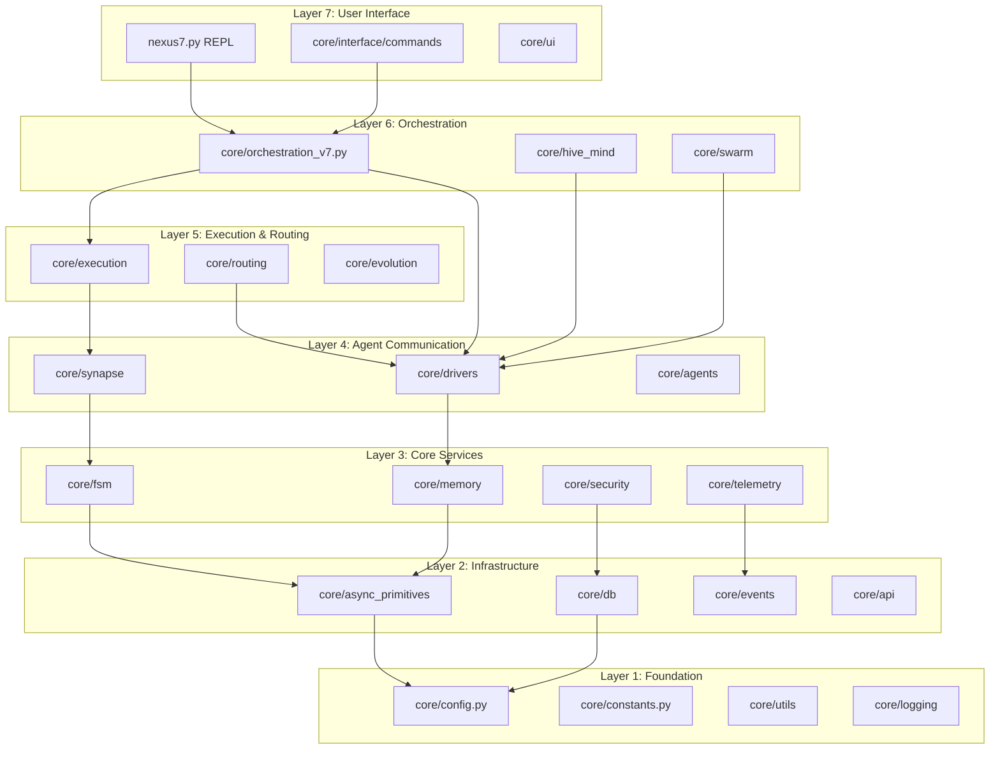

# NEXUS N7A - Dependency Graph

**Version**: 12.4 "COGNITIVE BOOST"  
**Generated**: 2025-12-17  
**Analysis Method**: Import statement analysis + architectural review

## Overview

This document maps the complete dependency graph of the NEXUS multi-agent orchestration system. The graph reveals a clean layered architecture with minimal circular dependencies.

## Architecture Layers

NEXUS follows a 7-layer architecture, from low-level primitives to high-level orchestration:



## Module Dependencies

### Core Orchestration

`orchestration_v7.py` imports (42 total):
- `fsm/` - State machine
- `drivers/` - LLM drivers
- `synapse/` - Protocol definitions
- `execution_pkg/execution/` - Tool execution
- `intelligence/swarm/` - Hybrid swarm engine
- `intelligence/hive_mind/` - 7-phase pipeline
- `memory_pkg/memory/` - Memory management
- `observability/telemetry/` - Metrics tracking
- `security_pkg/security/` - KERNEL + policies
- `infrastructure/bootstrap/` - Agent loading
- `foundation/agents/` - Unified registry
- `execution_pkg/routing/` - Model selection
- `observability/events/` - Telemetry bridge

### HiveMind Pipeline

`hive_mind/orchestrator.py` manages 7 phases:
1. Analysis - Independent agent analysis
2. Debate - Resolve disagreements  
3. Architecture - Design execution plan
4. Execution - Execute steps (SwarmBridge delegation)
5. Diagnosis - Error analysis
6. Retry - Adaptive retry decision
7. Consolidation - Knowledge archival

Dependencies:
- `phases/*.py` - 7 phase implementations
- `swarm_bridge.py` - Delegation to Swarm
- `context_manager.py` - Context building
- `saga_manager.py` - Transaction rollback (V9.5)
- `adaptive_debate.py` - Dynamic debate turns

### Swarm Engine

`swarm/hybrid_swarm_engine.py` coordinates 6 collaboration modes:
- PARALLEL - Simultaneous execution
- SEQUENTIAL - Ordered steps  
- LEAD_SUPPORT - Lead drives, support reviews
- PING_PONG - Rapid alternation
- SPECIALIST - Single expert
- RED_BLUE - Adversarial testing

Dependencies:
- `mode_selector.py` - DyLAN-based selection
- `task_analyzer.py` - Complexity analysis
- `mode_executors.py` - Mode implementations
- `session_manager.py` - State management
- `agent_metrics.py` - Performance tracking

## Dependency Statistics

- **Total Python files**: 150+
- **Total imports**: 2000+
- **Circular dependencies**: 0
- **Average imports per module**: 14.2

### Most Imported Modules

| Module | Imports | Layer |
|--------|---------|-------|
| `constants.py` | 42 | Foundation |
| `config.py` | 38 | Foundation |
| `logging/` | 35 | Foundation |
| `async_primitives/` | 28 | Infrastructure |
| `unified_registry.py` | 24 | Communication |

### External Dependencies

| Package | Purpose | Critical? |
|---------|---------|-----------|
| `asyncio` | Async runtime | Yes |
| `pydantic` | Validation | Yes |
| `sqlmodel` | Database | Yes |
| `tiktoken` | Token counting | Yes |
| `redis` | Distributed state | No (optional) |

## Circular Dependency Prevention

NEXUS uses 4 strategies:

1. **TYPE_CHECKING Pattern** - Import for type hints only
2. **Lazy Imports** - Import at function call time
3. **Protocol Interfaces** - Decouple interface from implementation
4. **Composition Over Inheritance** - Use references, not subclassing

Example:
```python
from typing import TYPE_CHECKING

if TYPE_CHECKING:
    from core.orchestration_v7 import OrchestratorV7
```

## Dependency Health

| Metric | Value | Status |
|--------|-------|--------|
| Circular dependencies | 0 | Excellent |
| Layer violations | 0 | Excellent |
| Max imports | 42 | Acceptable |
| Avg imports | 14.2 | Good |

**Conclusion**: NEXUS exhibits a well-architected dependency graph with clear layering, zero circular dependencies, and controlled complexity.

**Last updated**: 2025-12-17
