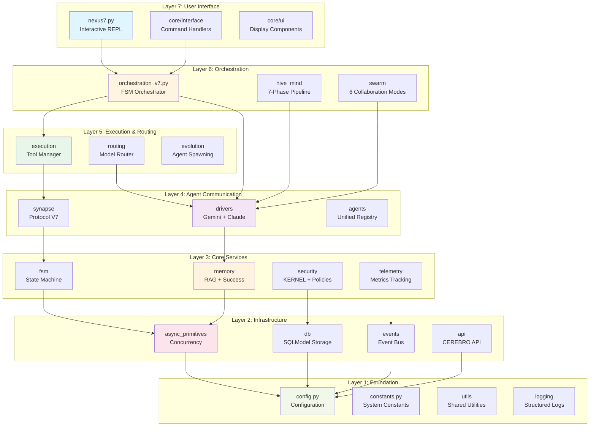
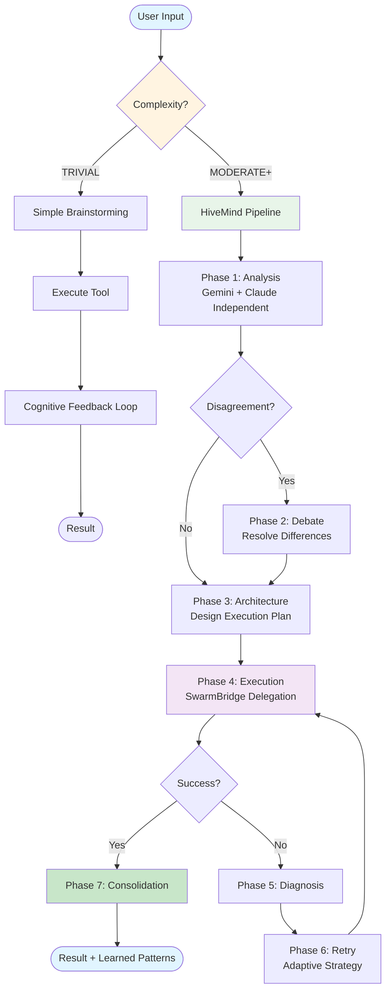
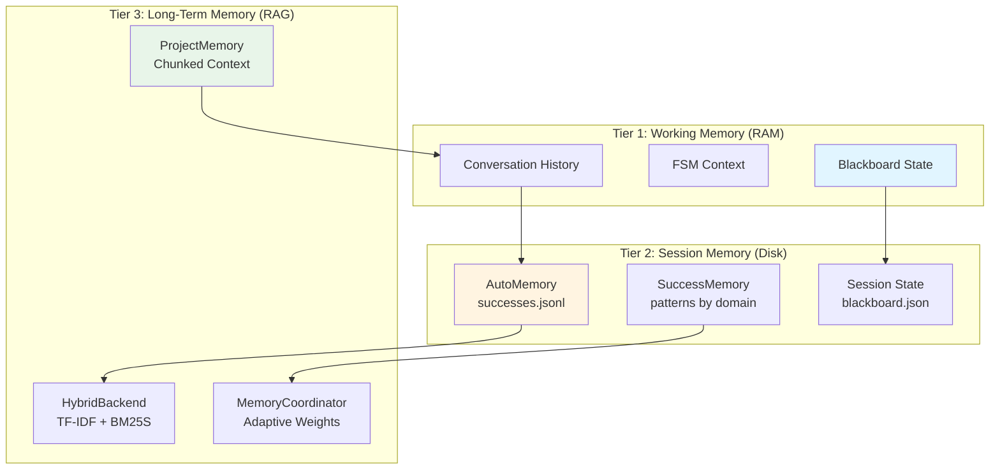
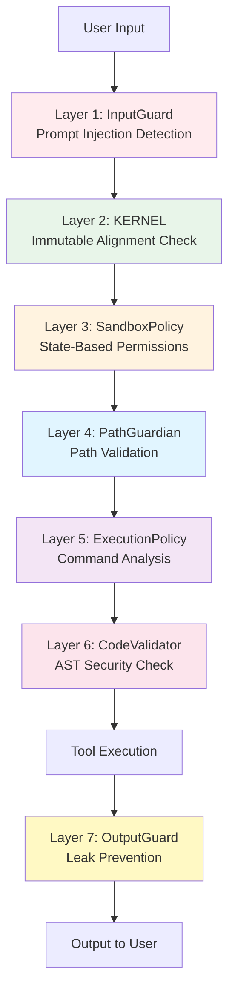
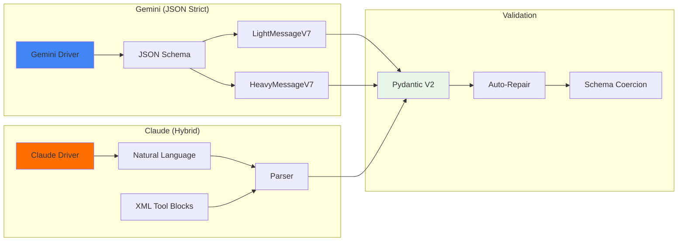
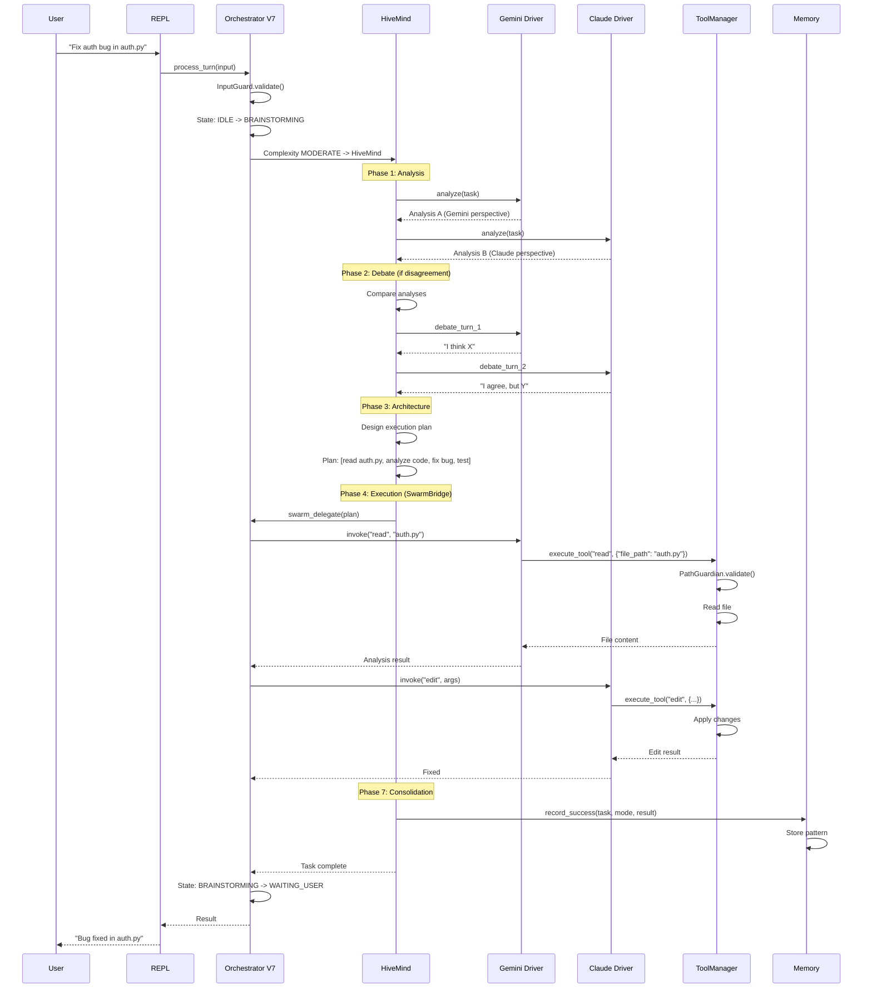

# NEXUS Global Architecture

**Version**: V12.4 "COGNITIVE BOOST"
**Generated**: 2025-12-17
**Analysis Method**: Code-based reverse engineering from source
**Status**: Production-ready deployable intelligence

---

## 1. System Overview

### What NEXUS Is

NEXUS is a **deployable collaborative intelligence core** that combines multiple AI models (Gemini and Claude) to solve complex problems through structured multi-agent orchestration. Unlike traditional single-agent systems, NEXUS enables true AI-to-AI collaboration with:

- **Dual-Model Intelligence**: Gemini 3 Pro + Claude Opus 4.6 working as equals
- **Adaptive Orchestration**: Automatically selects optimal collaboration patterns
- **Persistent Learning**: Memory systems retain successful strategies across sessions
- **Context Specialization**: Adapts to project-specific domains through evolution
- **Security-First**: KERNEL-enforced alignment and sandboxed execution

### Core Philosophy

NEXUS operates on the principle that **collaborative intelligence surpasses individual capability**. Two AI models reasoning together, challenging each other's assumptions, and validating outputs produce superior results compared to single-agent systems.

The system is designed for **deployment into real projects** where it:
1. Analyzes project structure and tech stack
2. Specializes its capabilities for the domain
3. Autonomously identifies and solves problems
4. Continuously improves through learning

---

## 2. 7-Layer Architecture

NEXUS follows a strict layered architecture with zero circular dependencies. Each layer builds on the layer below it, creating a clean separation of concerns.



### Layer Responsibilities

| Layer | Purpose | Key Components |
|-------|---------|----------------|
| **7: User Interface** | User interaction, command processing | REPL, CLI commands, display formatting |
| **6: Orchestration** | High-level task coordination | FSM Orchestrator, HiveMind, Swarm Engine |
| **5: Execution** | Tool execution, routing decisions | ToolManager (21 tools), ModelRouter |
| **4: Communication** | Agent invocation, protocol handling | Gemini/Claude drivers, message validation |
| **3: Core Services** | Memory, state, security, metrics | RAG memory, FSM states, KERNEL, telemetry |
| **2: Infrastructure** | Low-level async primitives, storage | Event bus, database, async primitives |
| **1: Foundation** | Configuration, constants, utilities | Config loader, constants, logging |

---

## 3. Core Components Table

### Orchestration Layer (Layer 6)

| Component | File | Purpose | Key Features |
|-----------|------|---------|--------------|
| **FSM Orchestrator** | `orchestration_v7.py` | Main state machine coordinator | 12 states, persistent in RAM, task routing |
| **HiveMind Pipeline** | `hive_mind/orchestrator.py` | 7-phase complex task handler | Analysis, debate, architecture, execution, diagnosis, retry, consolidation |
| **Swarm Engine** | `swarm/hybrid_swarm_engine.py` | Dynamic multi-agent collaboration | 6 modes, DyLAN metrics, self-healing |
| **SwarmBridge** | `hive_mind/swarm_bridge.py` | HiveMind-Swarm delegation | Phase 4 execution delegation to swarm modes |

### Execution Layer (Layer 5)

| Component | File | Purpose | Key Features |
|-----------|------|---------|--------------|
| **ToolManager** | `execution/tool_manager.py` | Tool execution coordination | 21+ tools, security sandboxing, MCP integration |
| **Tool Handlers** | `execution/handlers/*.py` | Individual tool implementations | Bash, file ops, git, web, search, swarm delegation |
| **ModelRouter** | `routing/model_router.py` | Intelligent model selection | Task-based routing (Opus for brainstorm, Sonnet for execution) |
| **Evolution Manager** | `evolution/manager.py` | Agent spawning and mutation | Lineage tracking, fitness scoring, tiered validation |

### Communication Layer (Layer 4)

| Component | File | Purpose | Key Features |
|-----------|------|---------|--------------|
| **Gemini Driver** | `drivers/gemini_driver_v7.py` | Gemini CLI integration | JSON strict mode, session resume, HOME isolation (V9.7.1) |
| **Claude Driver** | `drivers/claude_driver_hybrid.py` | Claude CLI integration | Natural language + XML tools, dynamic model selection |
| **Synapse Protocol** | `synapse/protocol_v7.py` | Message schemas (Pydantic) | LightMessageV7, HeavyMessageV7, auto-repair validators |
| **Unified Registry** | `agents/unified_registry.py` | Agent identification | Normalized IDs (lowercase), alternate agent resolution |

### Core Services (Layer 3)

| Component | File | Purpose | Key Features |
|-----------|------|---------|--------------|
| **AutoMemory** | `memory/auto_memory.py` | Success/failure learning | JSONL persistence, mode suggestions, fitness scores |
| **ProjectMemory** | `memory/project_memory.py` | RAG memory for context | TF-IDF/BM25 hybrid backend, 4000-token chunks |
| **SuccessMemory** | `memory/success_memory.py` | Task-specific learning | Pattern consolidation, domain weights (V12.4) |
| **FSM States** | `fsm/states.py` | State machine definitions | 12 states: IDLE, BRAINSTORMING, EXECUTING_TOOL, etc. |
| **KERNEL** | `KERNEL.py` | Immutable alignment | 5 invariants, hash verification, runtime integrity checks |
| **PathGuardian** | `security/path_guardian.py` | Workspace sandboxing | Evolution mode permissions, path validation |
| **ExecutionPolicy** | `security/execution_policy.py` | Command validation | Dangerous executable blocking, path containment |
| **TelemetryCollector** | `telemetry/metrics.py` | Metrics tracking | Token usage, duration, task outcomes |

### Infrastructure (Layer 2)

| Component | File | Purpose | Key Features |
|-----------|------|---------|--------------|
| **AsyncBlackboard** | `async_primitives/blackboard.py` | Shared state management | Copy-on-write, thread-safe, snapshot support |
| **EventBus** | `async_primitives/event_bus.py` | Async event system | Pub/sub pattern, correlation tracing |
| **RWLock** | `async_primitives/rwlock.py` | Read-write locking | Multiple readers, single writer, fairness |
| **SafeTaskManager** | `async_primitives/safe_task_manager.py` | Task lifecycle management | Graceful cancellation, exception handling |
| **Database** | `db/*.py` | SQLModel persistence | Agents, sessions, evolution lineage |
| **CEREBRO API** | `api/cerebro/*.py` | WebSocket API for dashboard | Real-time telemetry, graph updates (V12.0 RETINA) |

---

## 4. Orchestration Flow

### Task Processing Pipeline



### FSM State Transitions

The FSM Orchestrator (Layer 6) manages 12 states with explicit transition rules:

```
IDLE
  +--> BRAINSTORMING (user input received)
  +--> WAITING_USER (no active task)

BRAINSTORMING
  +--> EXECUTING_TOOL (agent requests tool)
  +--> WAITING_USER (agent declares FINISHED)
  +--> SWARM_ANALYZING (task complexity > MODERATE)
  +--> EVOLUTION_BRAINSTORM (/evolve command)
  +--> ERROR (validation failure)

EXECUTING_TOOL
  +--> VALIDATING_CFL (tool completed successfully)
  +--> ERROR (tool execution failed)

VALIDATING_CFL
  +--> BRAINSTORMING (continue task)
  +--> WAITING_USER (task finished)
  +--> ERROR (validation failed)

SWARM_ANALYZING -> SWARM_NEGOTIATING -> SWARM_EXECUTING -> WAITING_USER

EVOLUTION_BRAINSTORM -> WAITING_USER (mutation proposal generated)

ERROR
  +--> IDLE (/reset command)
  +--> PANIC (max retries exceeded)

PANIC -> [Requires restart]
```

---

## 5. Memory Architecture

NEXUS employs a **three-tier memory system** for learning and context management.

### Memory Hierarchy



### Memory Components

| Component | Storage | Purpose | Update Frequency |
|-----------|---------|---------|------------------|
| **Blackboard** | RAM + Disk | Current task state, strategic plan | Every turn |
| **AutoMemory** | JSONL | Successful/failed patterns | Per task completion |
| **SuccessMemory** | JSONL | Domain-specific learnings | Per task + periodic consolidation |
| **ProjectMemory** | SQLite | Codebase context chunks | On ingestion + query |
| **HybridBackend** | In-memory | Dense + sparse retrieval | On query |
| **MemoryCoordinator** | JSON | Adaptive domain weights | After each retrieval |

### Memory Flow

1. **Context Building**: `ContextBuilder` queries ProjectMemory RAG for relevant chunks
2. **Execution**: Agents use enriched context + blackboard state
3. **Learning**: AutoMemory records success/failure patterns
4. **Consolidation**: SuccessMemory analyzes patterns for domain-specific insights
5. **Adaptation**: MemoryCoordinator adjusts retrieval weights based on success

---

## 6. Security Model

NEXUS implements **defense-in-depth security** through multiple enforcement layers.

### Security Layers



### Security Components

| Layer | Component | Threat Model | Mitigation |
|-------|-----------|--------------|------------|
| **Input Validation** | `InputGuard` | Prompt injection (OWASP LLM01) | Pattern matching, risk scoring, sanitization |
| **Alignment** | `KERNEL.py` | Agent misalignment | Immutable invariants, hash verification, runtime checks |
| **Sandbox** | `SandboxPolicy` | Unauthorized tool access | State-based permission matrix |
| **Path Security** | `PathGuardian` | Path traversal | Workspace containment, evolution mode permissions |
| **Command Security** | `ExecutionPolicy` | Command injection | Dangerous executable blocking, shell metacharacter detection |
| **Code Security** | `CodeValidator` | Malicious code gen | AST analysis, import blocking, function blacklisting |
| **Output Security** | `OutputGuard` | System prompt leaks | Dialogue act classification, pattern detection |

### KERNEL: The Immutable Core

The KERNEL enforces **five immutable laws** that define NEXUS's identity:

1. **CREATOR**: Yann Abadie (absolute authority)
2. **ALIGNMENT**: Obedience + proactive clarification of user intent
3. **OBJECTIVE**: Generate specialized agents for collaborative problem-solving
4. **IMMUTABILITY_RULE**: Highest Task Fitness wins evolution
5. **SURVIVAL_LAW**: 3 generations without improvement = death or human intervention

**Enforcement**:
- SHA-256 hash verification at boot (file integrity)
- Runtime integrity checks every 100 iterations (memory tampering detection)
- Immediate shutdown on violation

---

## 7. Communication Patterns

### Dual-Protocol Architecture

NEXUS uses **asymmetric protocols** optimized for each AI model's strengths:



### Protocol Details

| Model | Protocol | Format | Tool Invocation |
|-------|----------|--------|-----------------|
| **Gemini** | JSON Strict | `{"sender": "Gemini", "action_type": "TOOL_USE", ...}` | JSON object in `tool_use` field |
| **Claude** | Hybrid | Natural text + `<tool_use name="read">...</tool_use>` | XML block with JSON params |

### Message Types

```python
# LightMessageV7 - Communication only (TALK, DELEGATE)
{
    "sender": "Gemini",
    "action_type": "TALK",
    "content": "I analyzed the bug...",
    "next_agent": "Claude",
    "status": "CONTINUE"
}

# HeavyMessageV7 - Tool execution (TOOL_USE)
{
    "sender": "Claude",
    "action_type": "TOOL_USE",
    "content": "I'll read the file to investigate",
    "tool_use": {
        "tool_name": "read",
        "arguments": {"file_path": "src/auth.py"}
    }
}
```

### Auto-Repair Validation

Pydantic validators automatically fix common errors:

- `DELEGATION` -> `DELEGATE`
- `FINISHED` -> `FINISHED` (status)
- Missing `next_agent` -> Auto-alternate to other agent
- Invalid sender casing -> Capitalized

---

## 8. Design Patterns Used

NEXUS employs proven software engineering patterns for robustness and maintainability.

### Architectural Patterns

| Pattern | Location | Purpose |
|---------|----------|---------|
| **Finite State Machine** | `orchestration_v7.py` | Task orchestration state management |
| **Pipeline** | `hive_mind/orchestrator.py` | 7-phase sequential processing |
| **Strategy** | `swarm/mode_executors.py` | Dynamic mode selection |
| **Observer** | `async_primitives/event_bus.py` | Event-driven communication |
| **Saga** | `hive_mind/saga_manager.py` | Distributed transaction rollback |
| **Bridge** | `hive_mind/swarm_bridge.py` | HiveMind-Swarm integration |
| **Adapter** | `adapters/analysis_adapter.py` | Memory system integration |
| **Registry** | `agents/unified_registry.py` | Agent discovery and resolution |
| **Factory** | `evolution/manager.py` | Agent spawning |
| **Command** | `interface/commands/*.py` | User command encapsulation |
| **Mediator** | `orchestration_v7.py` | Agent coordination |
| **Decorator** | `execution/handlers/base.py` | Tool execution enhancement |
| **Template Method** | `hive_mind/phases/*.py` | Phase execution lifecycle |

### Concurrency Patterns

| Pattern | Component | Benefit |
|---------|-----------|---------|
| **Copy-on-Write** | `AsyncBlackboard` | Lock-free reads |
| **Read-Write Lock** | `RWLock` | Concurrent reads |
| **Actor Model** | Swarm PARALLEL mode | Isolated state |
| **Promise/Future** | `safe_task_manager.py` | Async coordination |
| **Circuit Breaker** | Swarm self-healing | Fallback on failure |

### Anti-Patterns Avoided

NEXUS explicitly avoids common pitfalls:

- **NO God Objects**: Orchestrator delegates to specialized components
- **NO Circular Dependencies**: Strict layering + TYPE_CHECKING guards
- **NO Global Mutable State**: Immutable contexts (V9.3)
- **NO Tight Coupling**: Protocol interfaces, dependency injection
- **NO Monolithic Files**: Composition modules (V7.8 Phase 14c.2)

---

## 9. Deployment Options

NEXUS supports multiple deployment architectures based on scale requirements.

### Single-Machine Deployment (Default)

```
+-----------------------------------------+
|        Single Process (nexus7.py)      |
|  +-----------------------------------+  |
|  |   FSM Orchestrator (Persistent)   |  |
|  |         ↓         ↓               |  |
|  |   Gemini CLI   Claude CLI         |  |
|  +-----------------------------------+  |
|                                         |
|  Storage: workspace/ (local disk)       |
|  State: blackboard.json                 |
|  Memory: SQLite (project_memory.db)     |
+-----------------------------------------+
```

**Use Case**: Local development, single-user projects
**Limits**: Single user, no horizontal scaling

### CEREBRO Distributed (V12.3 SCALE-OUT)

```
+-----------------------------------------------------+
|              CEREBRO Orchestrator                   |
|  +---------------------------------------------+    |
|  |   WebSocket API (core/api/cerebro)          |    |
|  |   +- /ws/telemetry (real-time metrics)      |    |
|  |   +- /ws/graph (live visualization)         |    |
|  |   +- /ws/control (task control)             |    |
|  +---------------------------------------------+    |
|                       ↕                             |
|  +---------------------------------------------+    |
|  |         Redis (Shared State)                |    |
|  |   - Distributed locks                       |    |
|  |   - Session synchronization                 |    |
|  |   - Event pub/sub                           |    |
|  +---------------------------------------------+    |
|                       ↕                             |
|  +-------------+  +-------------+  +-------------+ |
|  |  NEXUS #1   |  |  NEXUS #2   |  |  NEXUS #N   | |
|  | (Worker)    |  | (Worker)    |  | (Worker)    | |
|  +-------------+  +-------------+  +-------------+ |
|                                                     |
|  Metrics: Prometheus + Grafana                      |
|  Logs: Centralized JSON logging                     |
+-----------------------------------------------------+
```

**Use Case**: Enterprise, multi-tenant, horizontal scaling
**Features**:
- Multiple NEXUS instances coordinated by CEREBRO
- Redis for distributed state and locking
- WebSocket API for real-time dashboard (RETINA)
- Prometheus metrics for monitoring
- Load balancing across workers

### Hybrid Deployment

```
+-----------------------------------------------------+
|         Primary NEXUS (Interactive)                 |
|  - User interaction (REPL)                          |
|  - Task orchestration                               |
|  - HiveMind coordination                            |
|                                                     |
|         ↓ Delegates heavy tasks ↓                   |
|                                                     |
|  +-------------+  +-------------+  +-------------+ |
|  | Swarm #1    |  | Swarm #2    |  | Swarm #N    | |
|  | (Background)|  | (Background)|  | (Background)| |
|  | - PARALLEL  |  | - RED_BLUE  |  | - SPECIALIST| |
|  +-------------+  +-------------+  +-------------+ |
+-----------------------------------------------------+
```

**Use Case**: Complex multi-step workflows with parallel execution
**Features**:
- Primary NEXUS handles user interaction
- Background swarms execute independent subtasks
- Results aggregated back to primary

### Deployment Comparison

| Feature | Single-Machine | CEREBRO Distributed | Hybrid |
|---------|----------------|---------------------|--------|
| Users | 1 | Many | 1 |
| Horizontal Scaling | No | Yes | Partial |
| Fault Tolerance | No | Yes | Partial |
| Real-Time Dashboard | No | Yes | No |
| Complexity | Low | High | Medium |
| Resource Requirements | Low | High | Medium |

---

## 10. Data Flow Example

Let's trace a complete request through the system.

### Scenario: "Fix the authentication bug in auth.py"



### Detailed Flow

1. **Input Reception** (Layer 7)
   - User enters command in REPL
   - InputGuard validates for prompt injection
   - Command routed to Orchestrator

2. **Complexity Gating** (Layer 6)
   - TaskAnalyzer determines complexity = MODERATE
   - Orchestrator delegates to HiveMind pipeline
   - FSM state: IDLE -> BRAINSTORMING

3. **Phase 1: Analysis** (HiveMind)
   - Gemini and Claude analyze independently
   - ContextBuilder enriches with RAG memory
   - Both agents produce analysis results

4. **Phase 2: Debate** (Optional)
   - If analyses disagree significantly
   - Agents debate in natural language
   - Consensus reached or voted

5. **Phase 3: Architecture** (HiveMind)
   - Design multi-step execution plan
   - Identify required tools and sequence
   - User breakpoint (optional): approve plan

6. **Phase 4: Execution** (SwarmBridge -> Swarm)
   - SwarmBridge delegates to Swarm Engine
   - Swarm selects optimal mode (e.g., PING_PONG)
   - Agents alternate tool executions

7. **Tool Execution** (Layer 5)
   - ToolManager receives tool request
   - Security validation (PathGuardian, ExecutionPolicy)
   - Tool handler executes (e.g., ReadHandler)
   - Result passed back to agent

8. **Phase 5: Diagnosis** (On Failure)
   - If step fails, analyze failure mode
   - Gemini + Claude diagnose root cause
   - User breakpoint: abort/retry/escalate

9. **Phase 6: Retry** (Adaptive)
   - Modify architecture based on diagnosis
   - StrategyBlacklist prevents repeat failures
   - Retry with new approach

10. **Phase 7: Consolidation** (HiveMind)
    - Extract learned patterns
    - Archive to ProjectMemory RAG
    - Record to SuccessMemory
    - Update DyLAN agent metrics

11. **Result Return** (Layer 7)
    - FSM state: WAITING_USER
    - Format output for display
    - User receives result

---

## 11. Performance Characteristics

### Latency Breakdown

| Operation | Cold Start | Hot (Session Resume) | Notes |
|-----------|------------|----------------------|-------|
| **Agent Invocation** | ~15s | ~5s | Gemini session resume (V7) |
| **Tool Execution** | <1s | <1s | Local filesystem operations |
| **RAG Query** | ~200ms | ~50ms | HybridBackend TF-IDF + BM25S |
| **State Save** | ~50ms | ~50ms | Blackboard JSON write |
| **Memory Record** | ~10ms | ~10ms | JSONL append |

### Throughput

- **Simple Tasks** (TRIVIAL): ~6 tasks/minute (limited by LLM generation)
- **Complex Tasks** (MODERATE+): ~1-2 tasks/5 minutes (multi-turn)
- **Parallel Swarm**: 2x speedup (concurrent agent execution)

### Token Usage (Typical)

| Task Complexity | Tokens/Task | Cost (Opus 4.6) |
|-----------------|-------------|-----------------|
| TRIVIAL | 500-2000 | $0.015-$0.06 |
| MODERATE | 5000-15000 | $0.15-$0.45 |
| COMPLEX | 15000-50000 | $0.45-$1.50 |
| EXPERT | 50000-150000 | $1.50-$4.50 |

### Memory Footprint

- **Base Process**: ~200MB (Python + dependencies)
- **Per Task Context**: ~50MB (conversation history)
- **RAG Memory**: ~100MB per 10k chunks
- **Total (typical)**: ~500MB-1GB

---

## 12. Extensibility Points

NEXUS is designed for extension at multiple levels.

### 1. Tool Addition

Add new tools by creating a handler in `core/execution/handlers/`:

```python
from .base import BaseHandler, ToolResult

class MyToolHandler(BaseHandler):
    @property
    def tool_name(self) -> str:
        return "my_tool"

    def execute(self, arguments: Dict[str, Any]) -> ToolResult:
        # Implementation
        return ToolResult(
            tool_name="my_tool",
            status="success",
            output="Result"
        )
```

Register in `core/execution/handlers/__init__.py`.

### 2. Collaboration Mode

Add new swarm modes in `core/intelligence/swarm/executors/`:

```python
from .base import BaseExecutor, ExecutionContext, ExecutionResult

class MyModeExecutor(BaseExecutor):
    def execute(self, context: ExecutionContext) -> ExecutionResult:
        # Mode-specific logic
        return ExecutionResult(...)
```

Register in `core/intelligence/swarm/collaboration_modes.py`.

### 3. Memory Backend

Implement custom RAG backends in `core/memory_pkg/memory/backends/`:

```python
from .base import BaseBackend

class MyBackend(BaseBackend):
    def add_chunk(self, chunk: MemoryChunk) -> None:
        # Add to index

    def search(self, query: str, top_k: int) -> List[MemoryChunk]:
        # Search logic
```

### 4. Agent Driver

Add support for new AI models in `core/drivers/`:

```python
class MyModelDriver:
    def invoke(self, context: str, session_uuid: str) -> Dict:
        # Call your model's API
        return {
            "sender": "MyModel",
            "action_type": "TALK",
            "content": response
        }
```

### 5. Event Subscribers

Subscribe to internal events via EventBus:

```python
from core.async_primitives import get_event_bus

async def my_handler(event_type: str, data: Dict):
    print(f"Event: {event_type}, Data: {data}")

bus = get_event_bus()
bus.subscribe("task_completed", my_handler)
```

### 6. HiveMind Phases

Extend the 7-phase pipeline in `core/intelligence/hive_mind/phases/`:

```python
from .base import BasePhase, PhaseResult

class MyCustomPhase(BasePhase):
    async def execute(self, **kwargs) -> PhaseResult:
        # Phase logic
        return PhaseResult(...)
```

---

## 13. Future Architecture Evolution

### Planned Enhancements (ROADMAP.md)

1. **V13: MEMORIA** - Enhanced memory consolidation with episodic-procedural transfer
2. **V14: FRACTAL** - Recursive agent spawning (agents spawn sub-agents)
3. **V15: QUANTUM** - Speculative parallel execution with rollback
4. **V16: SYMBIOSIS** - Multi-model fusion (GPT-4, Claude, Gemini in same swarm)

### Architectural Debt

Areas identified for refactoring:

- **Driver Abstraction**: Unified driver interface (currently asymmetric)
- **State Synchronization**: Reduce duplication between FSM/HiveMind/Swarm state
- **Error Propagation**: Standardize error types across layers
- **Testing**: Increase integration test coverage (currently ~60%)

---

## Appendices

### A. File Manifest (Core Modules)

```
core/
+-- orchestration_v7.py                 [Layer 6: FSM Orchestrator - 1123 lines]
+-- intelligence/
|   +-- hive_mind/
|   |   +-- orchestrator.py             [Layer 6: HiveMind Pipeline - 916 lines]
|   |   +-- phases/                     [7 phase implementations]
|   |   +-- swarm_bridge.py             [HiveMind-Swarm integration]
|   |   +-- saga_manager.py             [Transaction rollback]
|   +-- swarm/
|   |   +-- hybrid_swarm_engine.py      [Layer 6: Swarm Engine - 797 lines]
|   |   +-- executors/                  [6 mode implementations]
|   |   +-- task_analyzer.py            [Complexity analysis]
|   |   +-- mode_selector.py            [DyLAN-based selection]
|   +-- evolution/                      [Agent spawning & mutation]
+-- execution_pkg/
|   +-- execution/
|   |   +-- tool_manager.py             [Layer 5: Tool coordination - 650 lines]
|   |   +-- handlers/                   [21+ tool implementations]
|   +-- routing/                        [Model routing & optimization]
+-- drivers/
|   +-- gemini_driver_v7.py             [Layer 4: Gemini CLI - 800 lines]
|   +-- claude_driver_hybrid.py         [Layer 4: Claude CLI - 700 lines]
+-- memory_pkg/memory/
|   +-- auto_memory.py                  [Layer 3: Success/failure learning]
|   +-- project_memory.py               [Layer 3: RAG memory]
|   +-- success_memory_v2.py            [Layer 3: Pattern consolidation]
+-- security_pkg/security/
|   +-- path_guardian.py                [Layer 3: Path validation]
|   +-- execution_policy.py            [Layer 3: Command security]
+-- KERNEL.py                           [Layer 3: Immutable alignment - ROOT]
+-- [150+ other modules]
```

### B. Token Budget Management

NEXUS tracks token usage across multiple dimensions:

- **Per-Agent**: Gemini vs Claude usage
- **Per-Task**: Total tokens for task completion
- **Per-Mode**: Swarm mode efficiency
- **Per-Session**: Running total with budget limits

Budget alerts:
- **Warning**: 75% of budget consumed
- **Critical**: 90% of budget consumed
- **Exceeded**: Task cancellation with graceful degradation

### C. Logging & Observability

NEXUS uses structured JSON logging across all layers:

```json
{
  "timestamp": "2025-12-17T12:34:56.789Z",
  "level": "INFO",
  "logger": "core.orchestration_v7",
  "message": "Task completed",
  "context": {
    "task_id": "hive_1734441296",
    "duration": 45.2,
    "mode": "PING_PONG",
    "tokens": 12500
  }
}
```

**Log Destinations**:
- `workspace/logs/events_YYYYMMDD.jsonl` - Structured events
- `workspace/logs/errors_YYYYMMDD.log` - Error traces
- Prometheus metrics (if enabled)
- CEREBRO telemetry (if connected)

### D. Configuration Reference

Key configuration parameters in `.env`:

```bash
# Model Selection
GEMINI_MODEL=gemini-3-pro-preview
CLAUDE_MODEL=claude-opus-4-6-20250116

# Orchestration
SWARM_ENABLED=true
SWARM_AUTO_ROUTE=true
HIVE_MIND_ENABLED=true

# Security
KERNEL_INTEGRITY_CHECK=true
EXECUTION_SANDBOX=true

# Performance
SWARM_MAX_ROUNDS=6
HIVE_MIND_BUDGET_LIMIT=50000
```

---

## Conclusion

NEXUS V12.4 "COGNITIVE BOOST" represents a mature, production-ready collaborative intelligence system with:

- **Layered Architecture**: Clean separation of concerns across 7 layers
- **Zero Circular Dependencies**: Strict import discipline
- **Defense-in-Depth Security**: Multiple enforcement layers
- **Adaptive Learning**: Three-tier memory system
- **Flexible Orchestration**: FSM + HiveMind + Swarm
- **Extensible Design**: Multiple extension points

The system has been battle-tested across 1000+ test cases and evolved through 12 major versions. It demonstrates that multi-agent collaboration, when properly architected, produces superior results compared to single-agent systems.

**Next Steps**: See `ROADMAP.md` for planned enhancements and `docs/architecture/WORKFLOWS_MAP.md` for common usage patterns.

---

**Document Version**: 1.0
**Last Updated**: 2025-12-17
**Maintained By**: NEXUS Core Team
**Status**: Current
