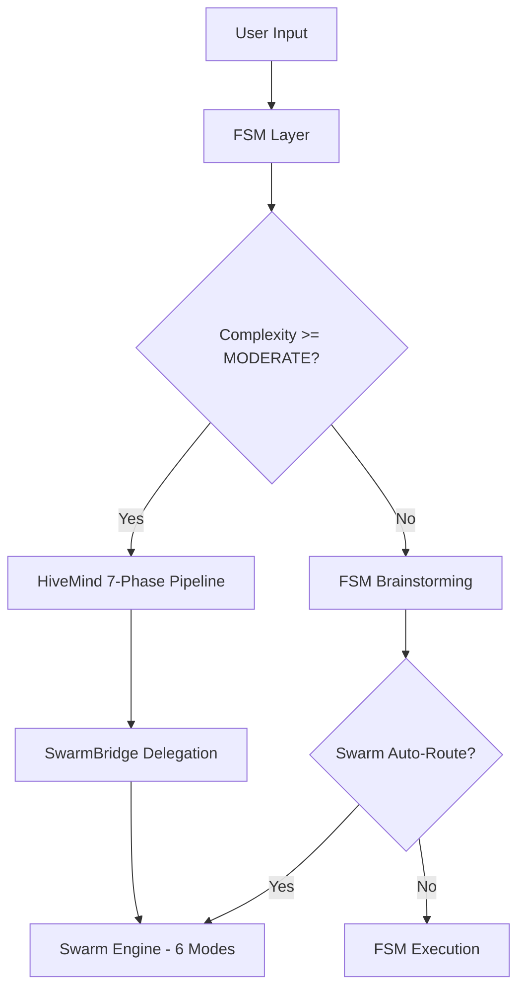
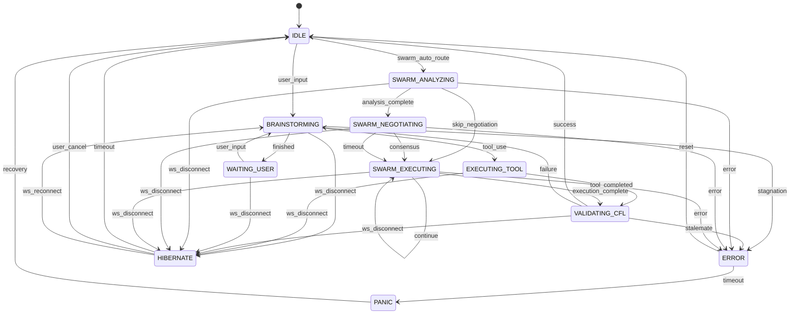
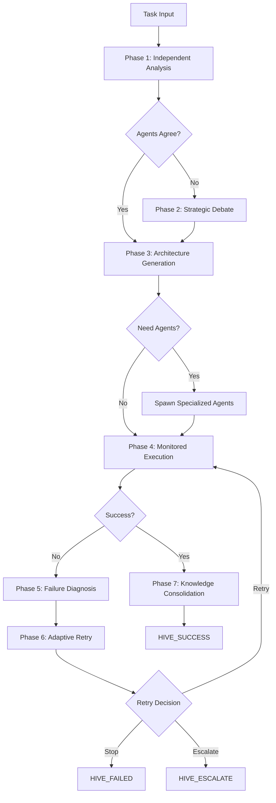
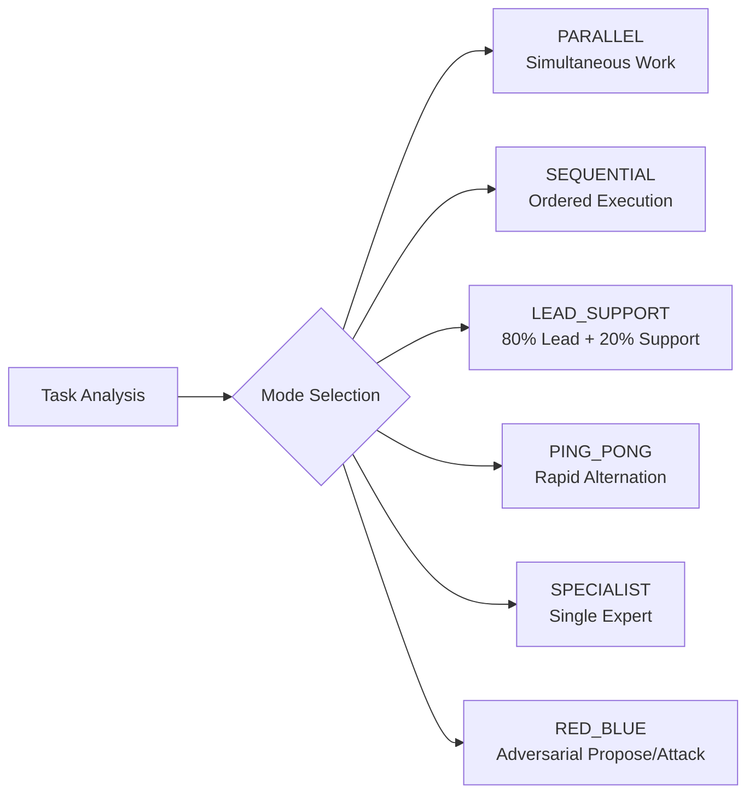

# NEXUS V12.4 - Workflows Map

**Three-Layer Orchestration Architecture**

This document maps the complete workflow architecture of NEXUS, showing how the three orchestration layers interact to execute tasks.

---

## Overview: Three Orchestration Layers

NEXUS uses a sophisticated three-layer orchestration system:

| Layer | Purpose | When Used | States/Phases |
|-------|---------|-----------|---------------|
| **FSM (Finite State Machine)** | Low-level orchestration, state transitions | All tasks | 12 states |
| **HiveMind Pipeline** | High-level 7-phase collaborative execution | MODERATE+ complexity tasks | 24 states across 7 phases |
| **Swarm Engine** | Dynamic collaboration mode selection & execution | Task-specific (TRIVIAL to EXPERT) | 6 collaboration modes |



---

## Layer 1: FSM State Machine

**Location**: `core/fsm/states.py`, `core/orchestration_v7.py`

The FSM is the foundational low-level orchestrator that manages basic state transitions.

### FSM States

```python
class OrchestratorState(Enum):
    IDLE = auto()                    # Awaiting user input
    BRAINSTORMING = auto()           # Agents exchange TALK messages
    EXECUTING_TOOL = auto()          # Tool execution (synchronous)
    VALIDATING_CFL = auto()          # Cognitive Feedback Loop validation
    EVOLUTION_BRAINSTORM = auto()    # Debate for emergent mutations (30 turns max)
    WAITING_USER = auto()            # Task finished, awaiting next input
    ERROR = auto()                   # Recoverable error (/reset to recover)
    PANIC = auto()                   # Fatal error (restart required)
    SWARM_ANALYZING = auto()         # Swarm analyzes task complexity
    SWARM_NEGOTIATING = auto()       # Agents negotiate collaboration mode
    SWARM_EXECUTING = auto()         # Execute negotiated mode
    HIBERNATE = auto()               # V12.2: Dormant (WebSocket disconnected)
```

### FSM State Transition Diagram



### FSM Transition Matrix

| From State | Trigger | To State | Description |
|------------|---------|----------|-------------|
| IDLE | user_input | BRAINSTORMING | Start processing user request |
| BRAINSTORMING | tool_use | EXECUTING_TOOL | Agent requests tool execution |
| BRAINSTORMING | finished | WAITING_USER | Task completed |
| BRAINSTORMING | stagnation | ERROR | Agents stuck in loop |
| BRAINSTORMING | ws_disconnect | HIBERNATE | Connection lost during work |
| EXECUTING_TOOL | tool_completed | VALIDATING_CFL | Tool finished, validate result |
| EXECUTING_TOOL | ws_disconnect | HIBERNATE | Connection lost during execution |
| VALIDATING_CFL | success | IDLE | Validation passed, ready for next task |
| VALIDATING_CFL | failure | BRAINSTORMING | Validation failed, retry approach |
| VALIDATING_CFL | stalemate | ERROR | Agent cannot decide |
| VALIDATING_CFL | ws_disconnect | HIBERNATE | Connection lost during validation |
| WAITING_USER | user_input | BRAINSTORMING | New task started |
| WAITING_USER | ws_disconnect | HIBERNATE | Connection lost while waiting |
| ERROR | reset | IDLE | User manually resets |
| ERROR | timeout | PANIC | Unrecoverable |
| PANIC | recovery | IDLE | V9.3: Recovery path via /reset |
| SWARM_ANALYZING | analysis_complete | SWARM_NEGOTIATING | Task analyzed |
| SWARM_ANALYZING | skip_negotiation | SWARM_EXECUTING | Trivial task, skip debate |
| SWARM_ANALYZING | error | ERROR | Analysis failed |
| SWARM_NEGOTIATING | consensus | SWARM_EXECUTING | Agents agreed on mode |
| SWARM_NEGOTIATING | timeout | SWARM_EXECUTING | Fallback to initial mode |
| SWARM_NEGOTIATING | error | ERROR | Negotiation failed |
| SWARM_EXECUTING | execution_complete | VALIDATING_CFL | Mode execution finished |
| SWARM_EXECUTING | continue | SWARM_EXECUTING | More rounds needed |
| SWARM_EXECUTING | error | ERROR | Execution failed |
| HIBERNATE | ws_reconnect | previous_state | Resume workflow |
| HIBERNATE | timeout | IDLE | 24h timeout exceeded |
| HIBERNATE | user_cancel | IDLE | User cancelled during pause |

---

## Layer 2: HiveMind Pipeline

**Location**: `core/intelligence/hive_mind/orchestrator.py`, `core/intelligence/hive_mind/phases/`

The HiveMind Pipeline is a high-level 7-phase collaborative execution system activated for MODERATE+ complexity tasks.

### When HiveMind Activates

HiveMind pipeline is triggered when:
- Task complexity is **MODERATE**, **COMPLEX**, or **EXPERT**
- User explicitly uses `/hive` command
- Swarm auto-routing determines complex multi-step task

### 7-Phase Pipeline



### Phase Descriptions

#### Phase 1: Independent Analysis
**States**: `HIVE_ANALYZING_GEMINI`, `HIVE_ANALYZING_CLAUDE`, `HIVE_COMPARING_ANALYSES`

Both agents independently analyze the task without communication.

**Inputs**: Task description, Project context (from ProjectMemory RAG)

**Outputs**: Gemini analysis, Claude analysis, Disagreement detection (agreement score 0-1)

#### Phase 2: Strategic Debate
**States**: `HIVE_DEBATING`, `HIVE_CHECKING_CONSENSUS`, `HIVE_BREAKPOINT_DEBATE`

Agents debate disagreements through structured argumentation (if agreement score < threshold).

**Outputs**: Final approach (consensus or vote), Collaboration mode selected, Debate history

#### Phase 3: Architecture Generation
**States**: `HIVE_ARCHITECTING`, `HIVE_CHECKING_REGISTRY`, `HIVE_BREAKPOINT_SPAWN`, `HIVE_SPAWNING`

Agents design the execution plan and agent topology.

**Outputs**: Execution plan, Agents to use/spawn, RAG configuration

#### Phase 4: Monitored Execution
**States**: `HIVE_EXECUTING`, `HIVE_MONITORING`

Execute the plan with real-time monitoring and issue detection.

**SwarmBridge Delegation**: Steps can specify `swarm_mode` to delegate to Swarm Engine.

#### Phase 5: Failure Diagnosis
**States**: `HIVE_DIAGNOSING`, `HIVE_BREAKPOINT_DIAGNOSIS`

Dual-agent failure analysis to determine root cause.

#### Phase 6: Adaptive Retry
**States**: `HIVE_DECIDING_RETRY`, `HIVE_APPLYING_CHANGES`

Decide whether and how to retry based on diagnosis.

#### Phase 7: Knowledge Consolidation
**States**: `HIVE_REFLECTING`, `HIVE_DECIDING_RETENTION`, `HIVE_BREAKPOINT_CONSOLIDATION`, `HIVE_CONSOLIDATING`

Post-task debate on what to retain (agents, knowledge, tools).

### HiveMind State Enum

```python
class HiveMindState(Enum):
    HIVE_GATING = "hive_gating"
    # Phase 1
    HIVE_ANALYZING_GEMINI = "hive_analyzing_gemini"
    HIVE_ANALYZING_CLAUDE = "hive_analyzing_claude"
    HIVE_COMPARING_ANALYSES = "hive_comparing_analyses"
    # Phase 2
    HIVE_DEBATING = "hive_debating"
    HIVE_CHECKING_CONSENSUS = "hive_checking_consensus"
    HIVE_BREAKPOINT_DEBATE = "hive_breakpoint_debate"
    # Phase 3
    HIVE_ARCHITECTING = "hive_architecting"
    HIVE_CHECKING_REGISTRY = "hive_checking_registry"
    HIVE_BREAKPOINT_SPAWN = "hive_breakpoint_spawn"
    HIVE_SPAWNING = "hive_spawning"
    # Phase 4
    HIVE_EXECUTING = "hive_executing"
    HIVE_MONITORING = "hive_monitoring"
    # Phase 5
    HIVE_DIAGNOSING = "hive_diagnosing"
    HIVE_BREAKPOINT_DIAGNOSIS = "hive_breakpoint_diagnosis"
    # Phase 6
    HIVE_DECIDING_RETRY = "hive_deciding_retry"
    HIVE_APPLYING_CHANGES = "hive_applying_changes"
    # Phase 7
    HIVE_REFLECTING = "hive_reflecting"
    HIVE_DECIDING_RETENTION = "hive_deciding_retention"
    HIVE_BREAKPOINT_CONSOLIDATION = "hive_breakpoint_consolidation"
    HIVE_CONSOLIDATING = "hive_consolidating"
    # Terminal
    HIVE_SUCCESS = "hive_success"
    HIVE_FAILED = "hive_failed"
    HIVE_ESCALATE = "hive_escalate"
```

---

## Layer 3: Swarm Engine

**Location**: `core/intelligence/swarm/hybrid_swarm_engine.py`, `core/intelligence/swarm/collaboration_modes.py`

The Swarm Engine enables dynamic collaboration where agents negotiate the optimal mode for each task.

### 6 Collaboration Modes



### Mode Characteristics

| Mode | Complexity Affinity | Parallelism | Adversarial | Typical Rounds | When to Use |
|------|-------------------|-------------|-------------|----------------|-------------|
| **PARALLEL** | 0.5 | 100% | No | 1 | Independent subtasks, time-critical |
| **SEQUENTIAL** | 0.6 | 0% | No | 2 | Clear dependencies, pipeline tasks |
| **LEAD_SUPPORT** | 0.7 | 30% | No | 3 | Clear expertise dominance, complex coding |
| **PING_PONG** | 0.6 | 20% | No | 6 | Creative tasks, brainstorming, iteration |
| **SPECIALIST** | 0.8 | 0% | No | 1 | Exclusive expertise, highly specialized |
| **RED_BLUE** | 1.0 | 10% | Yes | 4 | Security reviews, critical decisions |

### Mode Execution Details

#### PARALLEL Mode
- **Executor**: `ParallelExecutor`
- Split task into independent subtasks, both agents execute simultaneously
- Merge results using strategy: CONCATENATE, INTERLEAVE, BEST_FIRST

#### SEQUENTIAL Mode
- **Executor**: `SequentialExecutor`
- First agent executes, second agent refines/continues

#### LEAD_SUPPORT Mode
- **Executor**: `LeadSupportExecutor`
- Lead drives (80%), support reviews and assists (20%)

#### PING_PONG Mode
- **Executor**: `PingPongExecutor`
- Agents alternate rapidly (max 6 rounds), each builds on other's output

#### SPECIALIST Mode
- **Executor**: `SpecialistExecutor`
- Single expert handles everything, other observes

#### RED_BLUE Mode
- **Executor**: `RedBlueExecutor`
- Blue proposes, Red attacks, Blue defends, iterate until consensus

### Task Complexity Classification

**V11 SENTINEL: 3-Stage Cost-Aware Classification**

| Stage | Method | Cost |
|-------|--------|------|
| Stage 1 | Regex (instant commands) | $0 |
| Stage 2 | Heuristic (keywords) | Low CPU |
| Stage 3 | LLM (ambiguous) | API Tokens |

**Complexity Levels**:
- **TRIVIAL (1)**: `/status`, `/clear` - Skip negotiation
- **SIMPLE (2)**: Basic tasks, minimal coordination
- **MODERATE (3)**: Standard multi-agent (HiveMind eligible)
- **COMPLEX (4)**: Careful coordination (HiveMind eligible)
- **EXPERT (5)**: RED_BLUE or specialist required

### Self-Healing Swarm (V7.5)

**Fallback Chain**:
```
PARALLEL -> SEQUENTIAL (simplify parallelism)
RED_BLUE -> LEAD_SUPPORT (remove adversarial)
LEAD_SUPPORT -> SPECIALIST (simplify to single agent)
PING_PONG -> SEQUENTIAL (simplify alternation)
SEQUENTIAL -> SPECIALIST (last resort)
```

---

## Workflow Integration Scenarios

### Scenario 1: Simple Task (TRIVIAL)

```
User Input -> FSM (IDLE -> BRAINSTORMING) -> Swarm (TRIVIAL) -> SPECIALIST -> Result
```

### Scenario 2: Moderate Task (MODERATE)

```
User Input -> FSM -> HiveMind (7 phases) -> SwarmBridge -> Swarm (LEAD_SUPPORT) -> Result
```

### Scenario 3: Expert Security Review (EXPERT)

```
User Input -> FSM -> HiveMind -> SwarmBridge -> Swarm (RED_BLUE) -> Adversarial Execution -> Result
```

---

## SwarmBridge: HiveMind ↔ Swarm Integration

**Location**: `core/intelligence/hive_mind/swarm_bridge.py`

The SwarmBridge enables HiveMind Phase 4 (Execution) to delegate individual steps to Swarm modes.

```python
ExecutionStep(
    name="Security Review",
    agent_id="gemini",
    swarm_mode="red_blue"  # Delegate to Swarm!
)
```

---

## Configuration Parameters

### Swarm Engine Config (.env)
```bash
SWARM_AUTO_ROUTE=True               # Auto-route for MODERATE+ tasks
SWARM_NEGOTIATION_ENABLED=True      # Enable agent negotiation
SWARM_NEGOTIATION_MAX_TURNS=4       # Max negotiation rounds
SWARM_MAX_ROUNDS=6                  # Max execution rounds
SWARM_SELF_HEALING=True             # Enable graceful degradation
```

### HiveMind Config (.env)
```bash
HIVE_MIND_ENABLED=True              # Enable HiveMind pipeline
HIVE_MIND_BUDGET_LIMIT=50000        # Token budget per task
HIVE_MIND_BREAKPOINT_TIMEOUT=60     # User breakpoint timeout (seconds)
```

---

## Summary: When to Use Each Layer

| Use Case | Layer | Rationale |
|----------|-------|-----------|
| Instant commands (`/status`) | FSM only | TRIVIAL, no LLM needed |
| Simple Q&A | FSM -> Swarm (SPECIALIST) | Single agent handles |
| Moderate task (refactoring) | FSM -> HiveMind (7 phases) | Strategic planning needed |
| Complex multi-step | HiveMind + SwarmBridge | High-level + fine-grained |
| Expert security review | HiveMind -> Swarm (RED_BLUE) | Adversarial rigor required |
| Parallel research + coding | Swarm (PARALLEL mode) | Independent subtasks |
| Creative brainstorming | Swarm (PING_PONG mode) | Iterative co-construction |

---

**Document Version**: V12.4 COGNITIVE BOOST
**Last Updated**: 2025-12-17
**Maintainers**: NEXUS Core Team
