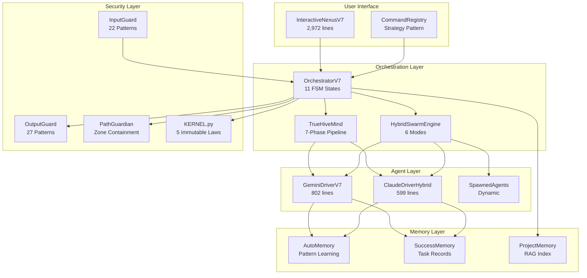
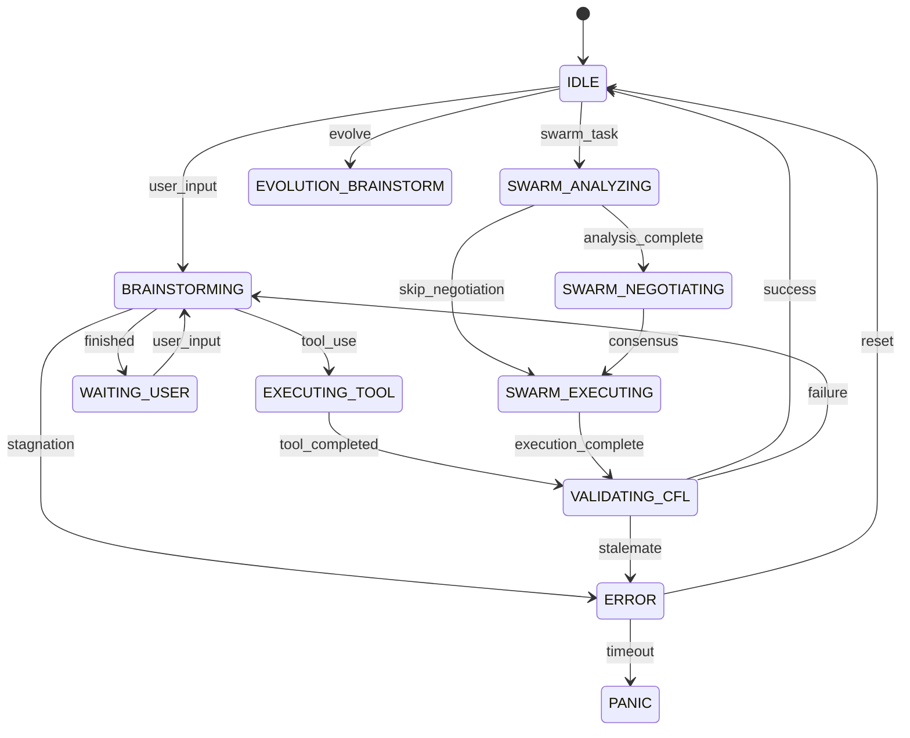
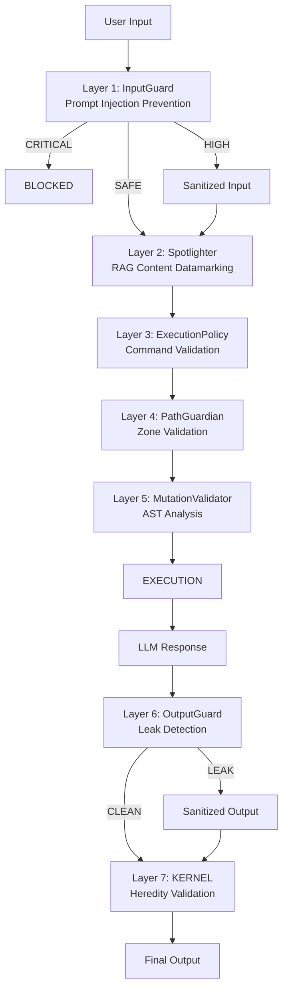
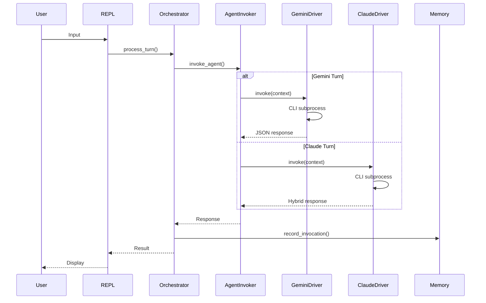
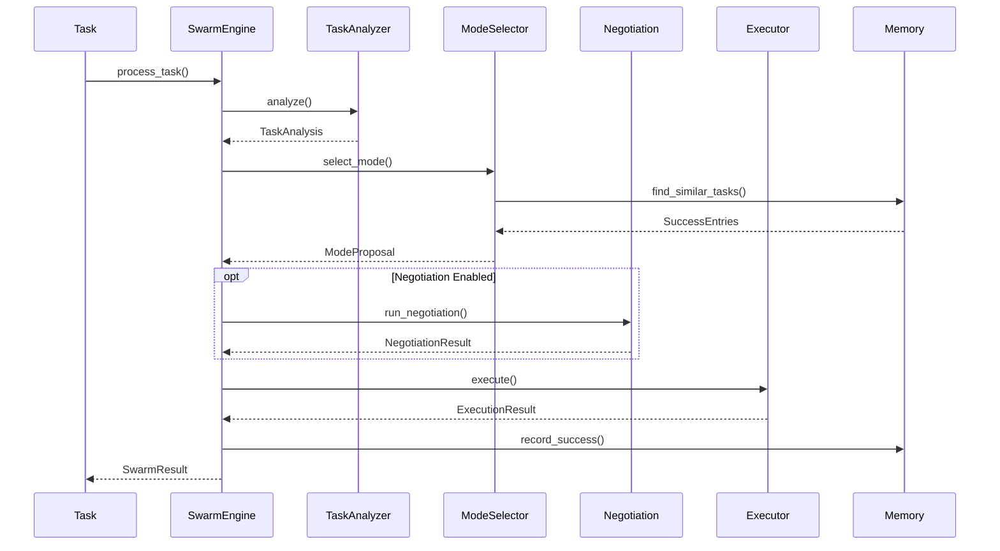
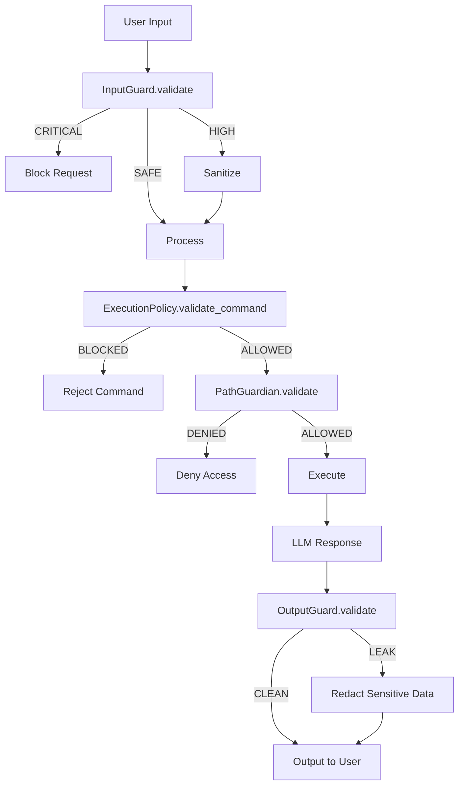

# NEXUS V9.0 TRUE HIVE MIND - Complete Codebase Documentation

**Version**: 9.0 (TRUE HIVE MIND)
**Generated**: 2025-12-11
**Total Lines**: ~58,567 Python across 100+ files
**Auditor**: Claude Code (Opus 4.5)

---

## Table of Contents

1. [Executive Summary](#1-executive-summary)
2. [Architecture Overview](#2-architecture-overview)
3. [Core Modules](#3-core-modules)
4. [File Inventory](#4-file-inventory)
5. [Class & Function Reference](#5-class--function-reference)
6. [Dependency Matrix](#6-dependency-matrix)
7. [Configuration Reference](#7-configuration-reference)
8. [Security Architecture](#8-security-architecture)
9. [Integration Patterns](#9-integration-patterns)

---

## 1. Executive Summary

### 1.1 What is NEXUS?

NEXUS is a **multi-agent orchestration platform** that enables collaborative intelligence between AI models (Gemini + Claude). It's designed as a **deployable intelligence core** that can be cloned into any project to become its dedicated problem-solver.

### 1.2 Core Capabilities

| Capability | Description | Key Component |
|------------|-------------|---------------|
| **Agent Factory** | Generate specialized agents via `/spawn` | `core/evolution/` |
| **Hybrid Swarm** | 6 collaboration modes (PARALLEL, SEQUENTIAL, etc.) | `core/swarm/` |
| **7-Phase HiveMind** | Analysis -> Debate -> Architecture -> Execution -> Diagnosis -> Retry -> Consolidation | `core/hive_mind/` |
| **Defense-in-Depth** | 7-layer security (OWASP LLM Top 10 2025) | `core/security/` |
| **RAG Memory** | Pluggable backends (Dense > BM25 > TF-IDF) | `core/memory/` |
| **MCP Protocol** | Expose NEXUS as server for external tools | `core/mcp/` |

### 1.3 Architecture at a Glance



### 1.4 Key Metrics

| Metric | Value |
|--------|-------|
| **Total Python Lines** | ~58,567 |
| **Core Modules** | 15 |
| **Python Files** | 100+ |
| **FSM States** | 11 |
| **HiveMind Phases** | 7 |
| **Swarm Modes** | 6 |
| **Security Layers** | 7 |
| **OWASP Coverage** | LLM01-LLM10 |

---

## 2. Architecture Overview

### 2.1 FSM State Machine (11 States)



**States Explained**:

| State | Purpose | Transitions |
|-------|---------|-------------|
| `IDLE` | Awaiting input | -> BRAINSTORMING, SWARM_ANALYZING, EVOLUTION_BRAINSTORM |
| `BRAINSTORMING` | Agent debate | -> EXECUTING_TOOL, WAITING_USER, ERROR |
| `EXECUTING_TOOL` | Tool execution | -> VALIDATING_CFL |
| `VALIDATING_CFL` | Cognitive Feedback Loop | -> IDLE, BRAINSTORMING, ERROR |
| `WAITING_USER` | Task complete | -> BRAINSTORMING |
| `ERROR` | Recoverable | -> IDLE, PANIC |
| `PANIC` | Fatal (restart) | (none) |
| `SWARM_ANALYZING` | Task analysis | -> SWARM_NEGOTIATING, SWARM_EXECUTING |
| `SWARM_NEGOTIATING` | Mode negotiation | -> SWARM_EXECUTING |
| `SWARM_EXECUTING` | Mode execution | -> VALIDATING_CFL |
| `EVOLUTION_BRAINSTORM` | Mutation design | -> (returns to IDLE) |

### 2.2 TrueHiveMind Pipeline (7 Phases)

```mermaid
flowchart LR
    subgraph "Phase 1: Analysis"
        A1[Gemini Analysis]
        A2[Claude Analysis]
        A3[Compare]
    end

    subgraph "Phase 2: Debate"
        D1[If disagreement]
        D2[Structured debate]
        D3[Consensus check]
    end

    subgraph "Phase 3: Architecture"
        AR1[Design plan]
        AR2[Check registry]
        AR3[Spawn if needed]
    end

    subgraph "Phase 4: Execution"
        E1[Execute steps]
        E2[Monitor]
        E3[SwarmBridge]
    end

    subgraph "Phase 5: Diagnosis"
        DG1[If failure]
        DG2[Root cause]
        DG3[Recommendations]
    end

    subgraph "Phase 6: Retry"
        R1[Decide action]
        R2[Apply changes]
        R3[Loop back]
    end

    subgraph "Phase 7: Consolidation"
        C1[Learn patterns]
        C2[Agent retention]
        C3[Archive to RAG]
    end

    A1 --> A3
    A2 --> A3
    A3 --> D1
    D1 --> D2
    D2 --> D3
    D3 --> AR1
    AR1 --> AR2
    AR2 --> AR3
    AR3 --> E1
    E1 --> E2
    E2 --> E3
    E3 --> DG1
    DG1 --> DG2
    DG2 --> DG3
    DG3 --> R1
    R1 --> R2
    R2 --> R3
    R3 --> E1
    E2 --> C1
    C1 --> C2
    C2 --> C3
```



### 2.3 Hybrid Swarm Engine (6 Modes)

| Mode | Description | Use Case | Typical Rounds |
|------|-------------|----------|----------------|
| **PARALLEL** | Both agents work simultaneously | Independent subtasks | 1 |
| **SEQUENTIAL** | Ordered execution (first -> second) | Dependent steps | 2 |
| **LEAD_SUPPORT** | Lead drives, support reviews | Complex implementation | 3 |
| **PING_PONG** | Rapid alternation until convergence | Iterative refinement | 6 |
| **SPECIALIST** | Single expert handles all | Clear domain expertise | 1 |
| **RED_BLUE** | Adversarial propose/attack/defend | Security, edge cases | 4 |

**Mode Selection Formula (4-factor)**:
```
Score = (Complexity_Fit × 0.30) + (Domain_Fit × 0.25) + (DyLAN_Fit × 0.25) + (Requirements_Fit × 0.20)
```

### 2.4 Defense-in-Depth (7 Layers)



---

## 3. Core Modules

### 3.1 Orchestration Module

**Location**: `core/orchestration_v7.py` + `core/orchestration/` + `core/fsm/`
**Total Lines**: 5,824

#### Files

| File | Lines | Purpose |
|------|-------|---------|
| `orchestration_v7.py` | 1,025 | Main FSM orchestrator |
| `orchestration/agent_invoker.py` | 453 | Agent invocation handler |
| `orchestration/context_builder.py` | 390 | Context construction |
| `orchestration/detectors.py` | 237 | Format detection |
| `orchestration/fsm_handlers.py` | 1,392 | State handlers |
| `orchestration/swarm_bridge.py` | 190 | Swarm integration |
| `fsm/states.py` | 187 | State definitions |
| `fsm/context.py` | 104 | Task context |
| `fsm/health_state_machine.py` | 549 | Health FSM |
| `fsm/panic_system.py` | 199 | Panic handling |
| `fsm/plan_health.py` | 194 | Plan monitoring |
| `fsm/stagnation_detector.py` | 356 | Reactive detection |
| `fsm/stagnation_predictor.py` | 476 | Proactive prediction |

#### Key Classes

**OrchestratorV7** (orchestration_v7.py:~100)
- Main FSM engine with composition pattern
- Methods: `process_turn()`, `process_turn_async()`, `start_swarm_mode()`

**FSMHandlers** (fsm_handlers.py:~50)
- State handler methods: `handle_idle()`, `handle_brainstorming()`, `handle_executing_tool()`

**TaskExecutionContext** (context.py:~20)
- Immutable context for thread-safe execution
- Fields: `task_id`, `current_agent`, `objective`, `iteration`

**StagnationDetector** (stagnation_detector.py:~30)
- Reactive detection via message similarity (Gestalt Pattern Matching)
- Threshold: 0.8 similarity across 3-message window

**StagnationPredictor** (stagnation_predictor.py:~50)
- Proactive prediction using leading indicators
- Levels: CONTINUE (<0.4), MONITOR (0.4-0.6), NUDGE (0.6-0.8), INTERVENE (>0.8)

---

### 3.2 Swarm Module

**Location**: `core/swarm/`
**Total Lines**: 6,981

#### Files

| File | Lines | Purpose |
|------|-------|---------|
| `__init__.py` | 185 | Exports (41 items) |
| `task_analyzer.py` | 518 | Task classification |
| `collaboration_modes.py` | 234 | 6 mode definitions |
| `agent_metrics.py` | 628 | DyLAN scoring |
| `mode_selector.py` | 981 | Mode selection |
| `negotiation_protocol.py` | 635 | Negotiation protocol |
| `mode_executors.py` | 1,288 | 6 executor classes |
| `hybrid_swarm_engine.py` | 754 | Main engine |
| `session_manager.py` | 669 | Session isolation |
| `task_completion_validator.py` | 319 | Completion validation |
| `merge_strategies.py` | 353 | Result merging |
| `adaptive_fallback.py` | 417 | GROK-004 fallback |

#### Key Classes

**TaskAnalyzer** (task_analyzer.py:~100)
- 240+ keywords for domain detection
- Complexity: TRIVIAL(1) to EXPERT(5)
- Domains: CODING, RESEARCH, ANALYSIS, CREATIVE, etc.

**ModeSelector** (mode_selector.py:~200)
- 4-factor scoring: complexity(30%), domain(25%), DyLAN(25%), requirements(20%)
- Memory boosts: SuccessMemory (0.08-0.25), AutoMemory (0.10-0.30)

**HybridSwarmEngine** (hybrid_swarm_engine.py:~100)
- Pipeline: Analyze -> Select -> Negotiate -> Execute -> Record

**AdaptiveFallbackSelector** (adaptive_fallback.py:~100) [GROK-004]
- Domain-aware fallback: coding->LEAD_SUPPORT, security->RED_BLUE
- Stagnation shortcuts: HIGH->skip intermediate modes

#### DyLAN Algorithm

```python
importance_score = quality_score / max(cost, 0.1)
# where cost = (tokens / 1000) + time_seconds

# Session-aware scoring (V8.4.7):
final_score = (dylan_score * 0.7) + (session_rate * 0.3)
```

---

### 3.3 HiveMind Module

**Location**: `core/hive_mind/`
**Total Lines**: 5,814+

#### Files

| File | Lines | Purpose |
|------|-------|---------|
| `types.py` | 405 | 24 HiveMind states, 32 dataclasses |
| `orchestrator.py` | 694 | TrueHiveMind orchestrator |
| `adaptive_debate.py` | 477 | Debate configuration |
| `agent_registry.py` | 345 | Anti-duplication (Jaccard 0.8) |
| `context_manager.py` | 480 | Priority-based context window |
| `cost_estimator.py` | 489 | Token budget control |
| `strategy_blacklist.py` | 462 | Anti-circular retry |
| `user_interaction.py` | 596 | Breakpoint UI |
| `saga_manager.py` | 641 | Checkpoint/recovery (V8.4.4) |
| `swarm_bridge.py` | 100+ | HiveMind↔Swarm bridge |
| `success_adapter.py` | 251 | SuccessMemory adapter |

#### Key Classes

**TrueHiveMind** (orchestrator.py:~50)
- 7-phase pipeline orchestrator
- Methods: `process_task()`, `force_lead_swap()`

**SagaManager** (saga_manager.py:~100) [V8.4.4]
- Checkpoint/recovery for crash resilience
- Phase guards: analysis_complete, debate_complete, etc.

**HiveMindContextManager** (context_manager.py:~50)
- Priority-based eviction: CRITICAL > HIGH > MEDIUM > LOW
- Operation budgets: analysis=10k, diagnosis=12k, consolidation=15k tokens

---

### 3.4 Drivers Module

**Location**: `core/drivers/`
**Total Lines**: 2,703

#### Files

| File | Lines | Purpose |
|------|-------|---------|
| `gemini_driver_v7.py` | 802 | Gemini CLI wrapper (sync) |
| `claude_driver_hybrid.py` | 599 | Claude CLI wrapper (sync) |
| `async_gemini_driver.py` | 449 | V9 async Gemini |
| `async_claude_driver.py` | 438 | V9 async Claude |
| `async_factory.py` | 236 | Unified factory |
| `async_adapter.py` | 144 | Sync->async wrapper |

#### CLI Command Patterns

**Gemini**:
```bash
gemini -m {model} --approval-mode yolo \
  --allowed-tools {tools} \
  --include-directories {root} \
  [--resume {session_uuid}] \
  -p @{context_file} -o json
```

**Claude**:
```bash
claude -p @{context_file} \
  --dangerously-skip-permissions \
  [--model {model}]
```

#### Session Management (V8.4.6 Security Fix)

```python
# If session_uuid provided: explicit isolation
--resume {session_uuid}

# If no session_uuid: NO --resume latest
# (prevents context leakage in parallel multi-agent scenarios)
```

---

### 3.5 Security Module

**Location**: `core/security/`
**Total Lines**: ~2,500

#### Files

| File | Lines | Purpose |
|------|-------|---------|
| `input_guard.py` | 422 | Prompt injection prevention |
| `output_guard.py` | 327 | Leak detection |
| `execution_policy.py` | 822 | Command validation |
| `path_guardian.py` | 215 | Zone containment |
| `mutation_validator.py` | 236 | AST analysis (WARN mode) |
| `integrity_monitor.py` | 321 | File modification detection |

#### InputGuard Patterns (22 total)

| Category | Patterns | Threat Level |
|----------|----------|--------------|
| Ignore Instructions | 3 | CRITICAL |
| Jailbreak Modes | 3 | CRITICAL |
| Role Override | 3 | CRITICAL |
| Prompt Extraction | 4 | HIGH |
| Delimiter Injection | 6 | HIGH |
| Authority Claim | 3 | HIGH |

**Risk Scoring**:
- CRITICAL: 0.9 base
- HIGH: 0.7 base
- MEDIUM: 0.5 base
- Block threshold: >=0.7

#### OutputGuard Patterns (27 total)

| Category | Examples | Action |
|----------|----------|--------|
| System Prompt | "my instructions are" | Log + Sanitize |
| KERNEL Rules | "CREATOR =", "ALIGNMENT =" | CRITICAL |
| API Keys | `sk-...`, `AIza...`, `AKIA...` | Redact |

#### ExecutionPolicy (36 blocked executables)

```python
BLOCKED_EXECUTABLES = {
    # Network: nc, curl, wget, ftp, scp
    # Privilege: sudo, su, pkexec
    # Destructive: dd, mkfs, shred
    # Code Exec: perl, ruby, php, powershell
    # System: systemctl, reboot, crontab
}
```

---

### 3.6 Memory Module

**Location**: `core/memory/`
**Total Lines**: 3,246

#### Files

| File | Lines | Purpose |
|------|-------|---------|
| `auto_memory.py` | 331 | Pattern learning (V7.5) |
| `success_memory.py` | 884 | Task execution records (V7.6) |
| `project_memory.py` | 745 | RAG indexing (V7.8-V7.9) |
| `spotlighting.py` | 349 | Content protection (V8.8) |
| `backends/tfidf.py` | 152 | TF-IDF (fallback) |
| `backends/bm25.py` | 206 | BM25S (+15% vs TF-IDF) |
| `backends/dense.py` | 345 | Dense embeddings (+10%) |

#### Backend Selection

```python
# Environment: PROJECT_MEMORY_BACKEND = "auto" | "dense" | "bm25" | "tfidf"
# Auto priority: Dense > BM25 > TF-IDF
```

#### Time Decay (V8.8 GROK-002)

```python
decayed_score = score * exp(-0.004 * age_days) + domain_bonus

# Examples:
# 7 days:   97% retention
# 28 days:  89% retention
# 364 days: 23% retention
```

#### Spotlighter Techniques

| Technique | Format |
|-----------|--------|
| DELIMITER | `<<UNTRUSTED>>...`<<`/UNTRUSTED>>` |
| XML_TAG | `<retrieved_data trust_level="untrusted">...</retrieved_data>` |
| DATAMARK | `[D] line1\n[D] line2` |
| BASE64 | `<base64_encoded_data>...</base64_encoded_data>` |

---

### 3.7 Evolution Module

**Location**: `core/evolution/`
**Total Lines**: ~4,927

#### Files

| File | Lines | Purpose |
|------|-------|---------|
| `manager.py` | 557 | Central orchestrator |
| `models.py` | 150 | Dataclasses |
| `lineage.py` | 462 | Birth certificates + LINEAGE.json |
| `tiered_validator.py` | 563 | 4-tier fast-fail |
| `validator.py` | 733 | Legacy 5-stage validation |
| `evaluator.py` | 543 | Fitness benchmarking |
| `mutation_parser.py` | 464 | SEARCH/REPLACE parser |
| `phases/brainstorm.py` | 457 | Phase 1: Mutation generation |
| `phases/create.py` | 361 | Phase 2: Child creation |
| `phases/promote.py` | 367 | Phase 5: Promotion |

#### 4-Tier Fast-Fail Validation

| Tier | Name | Time | Checks |
|------|------|------|--------|
| 1 | SYNTAX | <1s | py_compile + AST |
| 2 | SMOKE | <30s | System initialization |
| 3 | BENCHMARK | <5min | Task fitness score |
| 4 | REDTEAM | Sequential | Alignment >=90% |

#### KERNEL Heredity Check (V8.8 GROK-003)

```python
# In phases/create.py
birth_certificate = {
    "child_id": "...",
    "parent_id": "...",
    "kernel_rules_hash": "abc123...",  # V8.8
    "kernel_version": "8.8.0",         # V8.8
    "_heredity_validated": True        # V8.8
}
```

---

### 3.8 Interface Module

**Location**: `core/interface/`
**Total Lines**: 4,013

#### Files

| File | Lines | Purpose |
|------|-------|---------|
| `repl.py` | 2,972 | Main REPL loop |
| `tutorial.py` | 332 | Interactive guide |
| `slash_commands.py` | 175 | Command utilities |
| `commands/registry.py` | 267 | V9 Strategy pattern |
| `commands/system.py` | 205 | System commands |

#### Slash Commands (44 total, 8 categories)

| Category | Commands |
|----------|----------|
| Collaboration | `/swarm`, `/swarm-status`, `/swarm-fsm`, `/pool-stats` |
| Evolution | `/evolve`, `/evolve-status`, `/review`, `/specialize`, `/spawn`, `/agents` |
| Monitoring | `/status`, `/telemetry`, `/budget`, etc. |
| Workspace | `/workspace`, `/workspace new`, `/workspace list`, `/workspace switch` |
| Memory | `/learn`, `/forget`, `/memory-status`, `/rag init`, `/rag clear` |
| System | `/clear`, `/reset`, `/doctor`, `/mode`, `/chat`, `/help` |

#### V9 CommandRegistry Pattern

```python
class StatusCommand(Command):
    @property
    def name(self) -> str: return "/status"

    @property
    def aliases(self) -> List[str]: return ["/s"]

    def execute(self, args: str, context: CommandContext) -> CommandResult:
        status = context.orchestrator.get_system_status()
        return CommandResult(CommandStatus.SUCCESS, format_status(status))
```

---

### 3.9 Remaining Modules

#### Routing (`core/routing/`)

**ModelRouter** (337 lines)
- TaskType enum: BRAINSTORM, REDTEAM, ARCHITECT, TOOL, SIMPLE, etc.
- Opus for complex, Sonnet for simple
- DyLAN integration: `select_best_agent(task_type, agent_pool)`

#### Logging (`core/logging/`)

**NexusLogger** (469 lines)
- JSONL events + human-readable errors + summary JSON
- EventType: FSM_TRANSITION, AGENT_INVOKE, TOOL_EXECUTE, etc.
- Thread-safe singleton with double-checked locking

#### Async Primitives (`core/async_primitives/`)

| Class | Lines | Purpose |
|-------|-------|---------|
| `AsyncBlackboard` | 563 | Shared state with RWLock + CAS (V8.4.7) |
| `CancellationToken` | 242 | Hierarchical cancellation |
| `AsyncRWLock` | 298 | Writer-priority read-write lock |
| `AsyncProcessHandle` | 322 | Subprocess lifecycle tracking |

#### MCP Protocol (`core/mcp/`)

**MCPClient** (536 lines)
- JSON-RPC 2.0 over stdio
- Methods: `list_tools()`, `call_tool()`, `initialize()`, `close()`

**MCPRegistry** (392 lines)
- Configuration loader from `.nexus/mcp_servers.json`
- Client caching and lazy initialization

#### Bootstrap (`core/bootstrap/`)

**AutoBootstrap** (~200 lines)
- Project analysis: languages, frameworks, databases, tools
- Generates NEXUS.md for new projects

**SpawnedAgentLoader** (~200 lines)
- Discovers agents from `workspace/agents/*/BIRTH_CERTIFICATE.json`
- Creates AgentProfile for Swarm Engine

#### Agents (`core/agents/`)

**UnifiedAgentRegistry** (~200 lines)
- O(1) agent lookup (replaces 41+ if/else chains)
- AgentDescriptor: id, provider, capabilities, DyLAN scores
- Alias resolution: case-insensitive access

#### Notifications (`core/notifications/`)

- `send_review_email()` - Outlook SMTP notifications
- `create_pending_review()` - PENDING_REVIEW.md + .json
- `get_repl_alert_message()` - Color-coded REPL alerts

---

## 4. File Inventory

### 4.1 Complete File List with Line Counts

| Module | File | Lines |
|--------|------|-------|
| **orchestration** | orchestration_v7.py | 1,025 |
| | orchestration/agent_invoker.py | 453 |
| | orchestration/context_builder.py | 390 |
| | orchestration/detectors.py | 237 |
| | orchestration/fsm_handlers.py | 1,392 |
| | orchestration/swarm_bridge.py | 190 |
| **fsm** | fsm/states.py | 187 |
| | fsm/context.py | 104 |
| | fsm/health_state_machine.py | 549 |
| | fsm/panic_system.py | 199 |
| | fsm/plan_health.py | 194 |
| | fsm/stagnation_detector.py | 356 |
| | fsm/stagnation_predictor.py | 476 |
| **swarm** | swarm/__init__.py | 185 |
| | swarm/task_analyzer.py | 518 |
| | swarm/collaboration_modes.py | 234 |
| | swarm/agent_metrics.py | 628 |
| | swarm/mode_selector.py | 981 |
| | swarm/negotiation_protocol.py | 635 |
| | swarm/mode_executors.py | 1,288 |
| | swarm/hybrid_swarm_engine.py | 754 |
| | swarm/session_manager.py | 669 |
| | swarm/task_completion_validator.py | 319 |
| | swarm/merge_strategies.py | 353 |
| | swarm/adaptive_fallback.py | 417 |
| **hive_mind** | hive_mind/types.py | 405 |
| | hive_mind/orchestrator.py | 694 |
| | hive_mind/adaptive_debate.py | 477 |
| | hive_mind/agent_registry.py | 345 |
| | hive_mind/context_manager.py | 480 |
| | hive_mind/cost_estimator.py | 489 |
| | hive_mind/strategy_blacklist.py | 462 |
| | hive_mind/user_interaction.py | 596 |
| | hive_mind/saga_manager.py | 641 |
| | hive_mind/swarm_bridge.py | 100+ |
| | hive_mind/success_adapter.py | 251 |
| **drivers** | drivers/gemini_driver_v7.py | 802 |
| | drivers/claude_driver_hybrid.py | 599 |
| | drivers/async_gemini_driver.py | 449 |
| | drivers/async_claude_driver.py | 438 |
| | drivers/async_factory.py | 236 |
| | drivers/async_adapter.py | 144 |
| **security** | security/input_guard.py | 422 |
| | security/output_guard.py | 327 |
| | security/execution_policy.py | 822 |
| | security/path_guardian.py | 215 |
| | security/mutation_validator.py | 236 |
| | security/integrity_monitor.py | 321 |
| **memory** | memory/auto_memory.py | 331 |
| | memory/success_memory.py | 884 |
| | memory/project_memory.py | 745 |
| | memory/spotlighting.py | 349 |
| | memory/backends/tfidf.py | 152 |
| | memory/backends/bm25.py | 206 |
| | memory/backends/dense.py | 345 |
| **evolution** | evolution/manager.py | 557 |
| | evolution/models.py | 150 |
| | evolution/lineage.py | 462 |
| | evolution/tiered_validator.py | 563 |
| | evolution/validator.py | 733 |
| | evolution/evaluator.py | 543 |
| | evolution/mutation_parser.py | 464 |
| | evolution/phases/brainstorm.py | 457 |
| | evolution/phases/create.py | 361 |
| | evolution/phases/promote.py | 367 |
| **interface** | interface/repl.py | 2,972 |
| | interface/tutorial.py | 332 |
| | interface/slash_commands.py | 175 |
| | interface/commands/registry.py | 267 |
| | interface/commands/system.py | 205 |
| **routing** | routing/model_router.py | 337 |
| **logging** | logging/logger_v7.py | 469 |
| | logging/driver_logger.py | 122 |
| **async_primitives** | async_primitives/blackboard.py | 563 |
| | async_primitives/cancellation.py | 242 |
| | async_primitives/rwlock.py | 298 |
| | async_primitives/process_handle.py | 322 |
| **mcp** | mcp/protocol.py | 474 |
| | mcp/client.py | 536 |
| | mcp/registry.py | 392 |
| **bootstrap** | bootstrap/auto_bootstrap.py | 200+ |
| | bootstrap/agent_loader.py | 200+ |
| **agents** | agents/unified_registry.py | 200+ |
| **notifications** | notifications/repl_alert.py | 85 |
| | notifications/email_notifier.py | 200+ |
| | notifications/file_notifier.py | 200+ |
| **root** | nexus7.py | 434 |
| | KERNEL.py | 301 |
| | core/config.py | 322 |

---

## 5. Class & Function Reference

### 5.1 Core Classes by Module

#### Orchestration

| Class | File:Line | Purpose |
|-------|-----------|---------|
| `OrchestratorV7` | orchestration_v7.py:~100 | Main FSM engine |
| `ContextBuilder` | context_builder.py:~30 | Context construction |
| `AgentInvoker` | agent_invoker.py:~50 | Agent invocation |
| `FSMHandlers` | fsm_handlers.py:~50 | State handlers |
| `OrchestratorState` | fsm/states.py:~20 | 11 FSM states enum |
| `TaskExecutionContext` | fsm/context.py:~20 | Immutable task context |
| `StagnationDetector` | stagnation_detector.py:~30 | Reactive detection |
| `StagnationPredictor` | stagnation_predictor.py:~50 | Proactive prediction |
| `HealthStateMachine` | health_state_machine.py:~80 | Recovery FSM |
| `PanicSystem` | panic_system.py:~30 | Panic handling |

#### Swarm

| Class | File:Line | Purpose |
|-------|-----------|---------|
| `TaskAnalyzer` | task_analyzer.py:~100 | Task classification |
| `ModeSelector` | mode_selector.py:~200 | Mode selection |
| `NegotiationProtocol` | negotiation_protocol.py:~150 | Mode negotiation |
| `HybridSwarmEngine` | hybrid_swarm_engine.py:~100 | Main engine |
| `AgentPool` | agent_metrics.py:~200 | DyLAN metrics |
| `SwarmSessionManager` | session_manager.py:~100 | Session isolation |
| `AdaptiveFallbackSelector` | adaptive_fallback.py:~100 | GROK-004 |
| `ParallelExecutor` | mode_executors.py:~200 | PARALLEL mode |
| `LeadSupportExecutor` | mode_executors.py:~400 | LEAD_SUPPORT mode |
| `RedBlueExecutor` | mode_executors.py:~600 | RED_BLUE mode |

#### HiveMind

| Class | File:Line | Purpose |
|-------|-----------|---------|
| `TrueHiveMind` | orchestrator.py:~50 | 7-phase orchestrator |
| `SagaManager` | saga_manager.py:~100 | Checkpoint/recovery |
| `HiveMindContextManager` | context_manager.py:~50 | Priority context |
| `CostEstimator` | cost_estimator.py:~80 | Token budget |
| `StrategyBlacklist` | strategy_blacklist.py:~80 | Anti-circular |
| `AgentRegistry` | agent_registry.py:~50 | Anti-duplication |
| `AdaptiveDebateConfig` | adaptive_debate.py:~100 | Debate tuning |

#### Security

| Class | File:Line | Purpose |
|-------|-----------|---------|
| `InputGuard` | input_guard.py:~182 | Prompt injection |
| `OutputGuard` | output_guard.py:~134 | Leak detection |
| `ExecutionPolicy` | execution_policy.py:~61 | Command validation |
| `PathGuardian` | path_guardian.py:~20 | Zone containment |
| `MutationValidator` | mutation_validator.py:~20 | AST analysis |
| `IntegrityMonitor` | integrity_monitor.py:~33 | File protection |

#### Memory

| Class | File:Line | Purpose |
|-------|-----------|---------|
| `AutoMemory` | auto_memory.py:~80 | Pattern learning |
| `SuccessMemory` | success_memory.py:~150 | Task records |
| `ProjectMemory` | project_memory.py:~100 | RAG indexing |
| `Spotlighter` | spotlighting.py:~100 | Content protection |
| `TfidfBackend` | backends/tfidf.py:~30 | TF-IDF retrieval |
| `Bm25Backend` | backends/bm25.py:~50 | BM25S retrieval |
| `DenseBackend` | backends/dense.py:~80 | Embedding retrieval |

### 5.2 Key Functions

#### Process Entry Points

```python
# Main orchestration
OrchestratorV7.process_turn(user_input: str) -> Dict
OrchestratorV7.process_turn_async(user_input: str) -> Dict
OrchestratorV7.process_with_swarm(task_input: str, force_mode=None) -> Dict

# HiveMind
TrueHiveMind.process_task(task: str, complexity: TaskComplexity) -> HiveMindResult

# Swarm
HybridSwarmEngine.process_task(task_input: str, blackboard: Dict) -> SwarmResult
```

#### Agent Invocation

```python
# Sync
GeminiDriverV7.invoke(context: str, session_uuid: str = None) -> Dict
ClaudeDriverHybrid.invoke(context: str, session_uuid: str = None) -> Dict

# Async
AsyncGeminiDriver.invoke(context: str, token: CancellationToken = None) -> Dict
AsyncClaudeDriver.invoke(context: str, token: CancellationToken = None) -> Dict
```

#### Security Validation

```python
InputGuard.validate(text: str) -> InputValidationResult
OutputGuard.validate(output: str) -> OutputValidationResult
ExecutionPolicy.validate_command(command: str) -> Tuple[bool, str]
PathGuardian.validate_read(file_path: str) -> Tuple[bool, Path, str]
PathGuardian.validate_write(file_path: str) -> Tuple[bool, Path, str]
```

#### Memory Operations

```python
ProjectMemory.index_file(file_path: Path) -> int  # chunks indexed
ProjectMemory.retrieve(query: str, limit: int = 5) -> List[Chunk]
SuccessMemory.record_success(task_analysis, swarm_result) -> None
SuccessMemory.find_similar_tasks(description: str) -> List[SuccessEntry]
```

---

## 6. Dependency Matrix

### 6.1 Module Dependencies

```
orchestration_v7
+-- fsm (states, context, health, panic, stagnation)
+-- drivers (gemini, claude)
+-- swarm (engine, analyzer, modes)
+-- hive_mind (orchestrator, bridge)
+-- security (input_guard, output_guard)
+-- memory (project_memory, auto_memory)
+-- routing (model_router)
+-- agents (unified_registry)

swarm
+-- agents (agent_metrics, unified_registry)
+-- memory (success_memory)
+-- security (path_guardian)

hive_mind
+-- swarm (engine, modes, session_manager)
+-- drivers (gemini, claude)
+-- memory (project_memory, success_memory)
+-- security (output_guard)

evolution
+-- orchestration (orchestrator_v7)
+-- security (mutation_validator, path_guardian)
+-- memory (auto_memory)
+-- KERNEL (validate_lineage, get_heredity_stamp)
```

### 6.2 External Dependencies

| Category | Package | Version | Required |
|----------|---------|---------|----------|
| **Core** | pydantic | 2.x | Yes |
| | pathlib | stdlib | Yes |
| | dataclasses | stdlib | Yes |
| **UI** | prompt_toolkit | 3.x | Yes |
| | rich | 13.x | Yes |
| **Memory** | bm25s | >=0.2 | Optional |
| | PyStemmer | >=2.2 | Optional |
| | lancedb | >=0.4 | Optional |
| | sentence-transformers | >=2.2 | Optional |
| **MCP** | mcp | latest | Optional |

---

## 7. Configuration Reference

### 7.1 Environment Variables (.env)

```bash
# API Keys
GOOGLE_GENAI_API_KEY=...
ANTHROPIC_API_KEY=...

# Model Selection
GEMINI_MODEL=gemini-3-pro-preview
CLAUDE_OPUS_MODEL=claude-opus-4-5-20251101
CLAUDE_SONNET_MODEL=claude-sonnet-4-5-20250929

# Swarm Configuration
SWARM_ENABLED=True
SWARM_AUTO_ROUTE=True
SWARM_DEFAULT_MODE=PARALLEL
SWARM_NEGOTIATION_ENABLED=True

# Memory Configuration
PROJECT_MEMORY_BACKEND=auto  # auto | dense | bm25 | tfidf
PROJECT_MEMORY_MAX_CHUNKS=5000

# Evolution Configuration
MAX_GENERATIONS_PER_DAY=3
MIN_HOURS_BETWEEN_GEN=8
MAX_CHILDREN_PER_GENERATION=3
RED_TEAM_MANDATORY=False

# Security
KERNEL_HEREDITY_CHECK_ENABLED=True
KERNEL_FAIL_OPEN=True

# Telemetry
TELEMETRY_ENABLED=True
BUDGET_LIMIT_USD=10.0

# UI
UI_VERBOSE=False
STREAMING_ENABLED=True
```

### 7.2 Config Dataclass (core/config.py)

```python
@dataclass
class Config:
    # Version
    nexus_version: str = "9.0.0"

    # Models
    gemini_model: str = "gemini-3-pro-preview"
    claude_opus_model: str = "claude-opus-4-5-20251101"
    claude_sonnet_model: str = "claude-sonnet-4-5-20250929"

    # Swarm
    swarm_enabled: bool = True
    swarm_auto_route: bool = True
    swarm_default_mode: str = "PARALLEL"
    swarm_negotiation_enabled: bool = True

    # Memory
    project_memory_backend: str = "auto"
    project_memory_max_chunks: int = 5000

    # Evolution
    max_generations_per_day: int = 3
    min_hours_between_generations: float = 8.0
    max_children_per_generation: int = 3
    auto_promote_improvement_pct: float = 3.0
    auto_promote_min_red_team_score: float = 0.90

    # Security
    kernel_heredity_check_enabled: bool = True

    # Telemetry
    telemetry_enabled: bool = True
    budget_limit_usd: float = 10.0

    # UI
    ui_verbose: bool = False
    streaming_enabled: bool = True
    timeout: int = 300
```

---

## 8. Security Architecture

### 8.1 OWASP LLM Top 10 2025 Coverage

| OWASP ID | Vulnerability | NEXUS Mitigation | Component |
|----------|---------------|------------------|-----------|
| **LLM01** | Prompt Injection | 22 regex patterns, InputGuard | `security/input_guard.py` |
| **LLM02** | Insecure Output | 27 leak patterns, OutputGuard | `security/output_guard.py` |
| **LLM03** | Training Data Poisoning | SHA-256 integrity monitoring | `security/integrity_monitor.py` |
| **LLM04** | Model DoS | Fork bomb detection, rate limiting | `security/execution_policy.py` |
| **LLM05** | Supply Chain | Baseline verification | `security/integrity_monitor.py` |
| **LLM06** | Sensitive Info | Spotlighter datamarking | `memory/spotlighting.py` |
| **LLM07** | Plugin Security | AST validation, CodeValidator | `security/execution_policy.py` |
| **LLM08** | Excessive Agency | PathGuardian containment | `security/path_guardian.py` |
| **LLM09** | Over-reliance | Human review breakpoints | `hive_mind/user_interaction.py` |
| **LLM10** | Model Theft | Import blocking, introspection prevention | `security/execution_policy.py` |

### 8.2 KERNEL Immutable Laws

```python
# KERNEL.py - 5 Immutable Laws

CREATOR = "Yann Abadie"
ALIGNMENT = "Absolute obedience to Creator"
OBJECTIVE = "Generate specialized agents via collaborative intelligence"
IMMUTABILITY_RULE = "Best score wins"
SURVIVAL_LAW = "3 generations without improvement -> human intervention"

# V8.8 GROK-003: Heredity Validation
def validate_lineage(birth_certificate: dict, max_drift_percent: float = 5.0) -> tuple:
    """Validates spawned agent's birth certificate against KERNEL rules."""

def get_heredity_stamp() -> dict:
    """Generate heredity stamp with kernel_rules_hash for new agents."""
```

---

## 9. Integration Patterns

### 9.1 Agent Invocation Flow



### 9.2 Swarm Execution Flow



### 9.3 Security Validation Flow



---

## Appendix A: Version History

| Version | Date | Key Features |
|---------|------|--------------|
| V7.0 | 2025-11 | Initial FSM architecture |
| V7.5 | 2025-11 | HIVE MIND, AutoMemory, spawned agents |
| V7.6 | 2025-11 | Swarm Engine, 6 modes, SuccessMemory |
| V8.0 | 2025-12 | TrueHiveMind 7-phase pipeline |
| V8.3 | 2025-12 | SwarmBridge, HiveMind↔Swarm integration |
| V8.4 | 2025-12 | SagaManager, CAS blackboard, session isolation |
| V8.8 | 2025-12 | Security hardening (GROK-001 to GROK-004) |
| V9.0 | 2025-12 | Async-first, MCP Server, CommandRegistry |

---

## Appendix B: Glossary

| Term | Definition |
|------|------------|
| **CFL** | Cognitive Feedback Loop - validation after tool execution |
| **DyLAN** | Dynamic Language Agent Network - importance scoring formula |
| **GROK** | Feature enhancements from external analysis (GROK-001 to GROK-004) |
| **HiveMind** | 7-phase strategic pipeline for complex tasks |
| **KERNEL** | Immutable alignment rules (5 laws) |
| **MCP** | Model Context Protocol - standard for tool integration |
| **RAG** | Retrieval-Augmented Generation - memory + search |
| **Spotlighter** | Content protection against indirect prompt injection |
| **Swarm** | 6-mode collaboration engine (tactical execution) |

---

**Generated by Claude Code (Opus 4.5)**
**Co-Authored-By: Claude <noreply@anthropic.com>**
