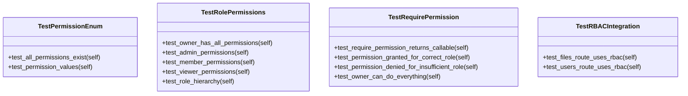

# API Tests

## Synopsis

Test suite for NEXUS CEREBRO REST API, focusing on Role-Based Access Control (RBAC) implementation, permission enforcement, and API route security. Validates the 4-tier role hierarchy (owner, admin, member, viewer) and 12 permission types.

## Architecture



## Test Files

| File | Tests | Coverage |
|------|-------|----------|
| `test_rbac.py` | RBAC permission matrix, role hierarchy, enforcement | Permission enum, role permissions, require_permission dependency, route integration |

## Test Coverage

### Permission System Tests

**TestPermissionEnum** - Permission enumeration validation
- All 12 permissions exist (FILE_READ, FILE_WRITE, FILE_DELETE, WORKSPACE_CREATE, WORKSPACE_DELETE, USER_INVITE, USER_REMOVE, USER_CHANGE_ROLE, WORKFLOW_START, WORKFLOW_STOP, AUDIT_VIEW, SETTINGS_MANAGE)
- Permission values follow naming convention (e.g., "file:read")

**TestRolePermissions** - Role-to-permission mapping
- Owner has all permissions (superuser)
- Admin permissions verified (no USER_CHANGE_ROLE)
- Member permissions limited (no USER_INVITE, USER_REMOVE, AUDIT_VIEW)
- Viewer read-only (FILE_READ only)
- Role hierarchy enforced (viewer < member < admin <= owner)

**TestRequirePermission** - FastAPI dependency enforcement
- `require_permission()` returns callable dependency
- Permission granted for correct role
- HTTP 403 for insufficient permissions
- Owner bypasses all checks

**TestRBACIntegration** - Route protection
- Files routes use RBAC dependencies
- User management routes use RBAC dependencies

## Running Tests

```bash
# All API tests
python -m pytest tests/api/ -v

# RBAC tests only
python -m pytest tests/api/test_rbac.py -v

# Specific test class
python -m pytest tests/api/test_rbac.py::TestRolePermissions -v
```

## Dependencies

- `pytest` - Test framework
- `pytest-asyncio` - Async test support
- `fastapi` - FastAPI framework
- `core.api.cerebro.rbac` - RBAC implementation
- `core.api.cerebro.deps` - Authentication dependencies

## Related Modules

- [core/api/cerebro/rbac.py](../../core/api/cerebro/rbac.py) - RBAC implementation
- [core/api/cerebro/deps.py](../../core/api/cerebro/deps.py) - Dependencies
- [core/api/cerebro/routes/](../../core/api/cerebro/routes/) - Protected routes