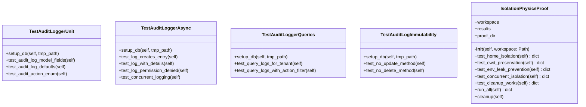

# Audit Tests

## Synopsis

System integrity audit tests validating isolation physics, workspace boundaries, environment variable protection, and concurrent execution safety. Ensures NEXUS maintains strict isolation between sessions, workspaces, and tenants.

## Architecture



## Test Files

| File | Tests | Coverage |
|------|-------|----------|
| `test_isolation_physics.py` | Workspace isolation, CWD preservation, env leak prevention | Home isolation, concurrent isolation, cleanup verification |

## Test Coverage

### Isolation Physics Tests

**IsolationPhysicsProof** - Comprehensive isolation verification
- `test_home_isolation()` - HOME environment variable isolation per workspace
- `test_cwd_preservation()` - Current working directory (CWD) preservation
- `test_env_leak_prevention()` - Environment variable leak prevention
- `test_concurrent_isolation()` - Concurrent session isolation (no cross-contamination)
- `test_cleanup_works()` - Workspace cleanup verification

**Validation Approach**:
- Creates multiple isolated workspaces
- Verifies HOME is set to workspace path
- Ensures CWD is preserved across operations
- Tests concurrent operations for race conditions
- Validates cleanup removes all workspace data

## Running Tests

```bash
# All audit tests
python -m pytest tests/audit/ -v

# Isolation physics only
python -m pytest tests/audit/test_isolation_physics.py -v

# Run isolation proof manually
python tests/audit/test_isolation_physics.py
```

## Dependencies

- `pytest` - Test framework
- `pathlib` - Path operations
- `tempfile` - Temporary directories
- `concurrent.futures` - Concurrent execution

## Critical Guarantees

These tests verify NEXUS maintains:
1. **Workspace Isolation** - Each workspace has independent HOME
2. **CWD Preservation** - Operations don't change working directory
3. **Env Protection** - Environment variables don't leak between sessions
4. **Concurrent Safety** - Multiple sessions don't interfere
5. **Clean Teardown** - Workspaces are fully removed on cleanup

## Related Modules

- [core/workspace/](../../core/workspace/) - Workspace management
- [core/session/](../../core/session/) - Session management
- [KERNEL.py](../../KERNEL.py) - Security boundaries