# FSM Tests

## Synopsis

Finite State Machine tests covering HIBERNATE state functionality, stagnation prediction with multilingual support, and state transition validation. Tests the predictive stagnation detection system that uses 5 factors (leading indicators, trajectory, tool mentions, similarity, context) to proactively detect and intervene in stagnating conversations.

## Architecture

```mermaid
classDiagram
    class TestHibernateState {
        +test_hibernate_state_exists(self)
        +test_hibernate_in_transition_matrix(self)
        +test_hibernate_exit_transitions(self)
        +test_active_states_can_enter_hibernate(self)
    }
    class TestHibernationManager {
        +setup_db(self, tmp_path)
        +test_enter_hibernate(self)
        +test_get_hibernation(self)
        +test_exit_hibernate(self)
        +test_no_hibernation_returns_none(self)
        +test_exit_nonexistent_returns_none(self)
        +test_new_hibernate_replaces_old(self)
    }
    class TestHibernationStateModel {
        +setup_db(self, tmp_path)
        +test_model_fields(self)
        +test_is_expired(self)
        +test_not_expired(self)
    }
    class TestHibernationWorkspaceIsolation {
        +setup_db(self, tmp_path)
        +test_different_workspaces_independent(self)
        +test_different_tenants_independent(self)
    }
    class TestLeadingIndicators {
        +test_indicator_detection_english(self, predictor)
        +test_indicator_detection_french(self, predictor)
        +test_no_indicators_returns_low_score(self, predictor)
        +test_mixed_language_indicators(self, predictor)
    }
    class TestTrajectoryAnalysis {
        +test_trajectory_decreasing_length(self, predictor)
        +test_trajectory_stable_length(self, predictor)
        +test_trajectory_increasing_length(self, predictor)
    }
    class TestToolFactor {
        +test_tool_mention_without_use(self, predictor)
        +test_tool_mention_with_use(self, predictor)
        +test_no_tool_mention(self, predictor)
    }
    class TestSimilarityFactor {
        +test_similarity_increase_detection(self, predictor)
        +test_different_messages_low_similarity(self, predictor)
    }
    class TestPredictionLevels {
        +test_prediction_continue(self, predictor)
        +test_prediction_monitor(self, predictor)
        +test_prediction_nudge(self, predictor)
        +test_prediction_intervene(self, predictor)
    }
    class TestPredictionResult {
        +test_prediction_has_all_fields(self, predictor)
        +test_probability_in_range(self, predictor)
        +test_factors_dict_structure(self, predictor)
    }
    class TestEdgeCases {
        +test_single_message(self, predictor)
        +test_empty_predictor(self, predictor)
        +test_very_long_message(self, predictor)
        +test_unicode_messages(self, predictor)
        +test_empty_message(self, predictor)
    }
    class TestAccuracy {
        +test_precision_on_stagnant_samples(self, predictor, stagnation_samples)
        +test_precision_on_normal_samples(self, predictor, stagnation_samples)
        +test_overall_accuracy(self, predictor, stagnation_samples)
    }
    class TestStatistics {
        +test_get_stats(self, predictor)
        +test_reset(self, predictor)
    }
```



## Test Files

| File | Tests | Coverage |
|------|-------|----------|
| `test_hibernate.py` | HIBERNATE state transitions, database persistence, expiry | State existence, transition matrix, hibernation manager, workspace isolation |
| `test_stagnation_predictor.py` | Predictive stagnation detection (5 factors), multilingual support | Leading indicators (EN/FR), trajectory analysis, tool factor, similarity factor, prediction levels |

## Test Coverage

### HIBERNATE State Tests

**TestHibernateState** - State definition and transition matrix
- HIBERNATE state exists in OrchestratorState enum
- HIBERNATE in TRANSITION_MATRIX with valid transitions
- Can exit to IDLE, BRAINSTORMING, WAITING_USER
- All active states can enter HIBERNATE (WebSocket disconnect)

**TestHibernationManager** - Database persistence
- Enter hibernate stores session state to database
- Get hibernation retrieves stored state
- Exit hibernate removes record and returns state
- Multiple hibernations per workspace (newest replaces old)

**TestHibernationStateModel** - Expiry logic
- Database model has all required fields
- `is_expired()` correctly detects expiry (default 24h)
- Not expired within TTL window

**TestHibernationWorkspaceIsolation** - Multi-tenancy
- Different workspaces have independent hibernation
- Different tenants cannot access each other's hibernation

### Stagnation Predictor Tests

**Prediction System** (5 Factors):
1. **Leading Indicators** - Keywords predicting stagnation (EN: "seems", "might be"; FR: "peut-être", "semble")
2. **Trajectory Analysis** - Message length trends (decreasing = stagnation)
3. **Tool Factor** - Tool mentions without execution (red flag)
4. **Similarity Factor** - Increasing semantic similarity (circular reasoning)
5. **Context Factor** - Cumulative conversation context

**TestLeadingIndicators** - Keyword detection
- English indicators detected ("seems", "might be", "I think")
- French indicators detected ("peut-être", "semble", "je pense")
- No indicators returns low score
- Mixed language support

**TestTrajectoryAnalysis** - Message length trends
- Decreasing length raises stagnation score
- Stable length keeps low score
- Increasing length keeps low score

**TestToolFactor** - Tool usage patterns
- Tool mentioned but not used raises score
- Tool mentioned and used keeps low score
- No tool mentions neutral

**TestSimilarityFactor** - Semantic repetition
- Increasing similarity detected (circular reasoning)
- Different messages have low similarity

**TestPredictionLevels** - Intervention thresholds
- CONTINUE (p < 0.3) - No intervention
- MONITOR (0.3 <= p < 0.5) - Watch closely
- NUDGE (0.5 <= p < 0.7) - Gentle prompt
- INTERVENE (p >= 0.7) - Force action

**TestAccuracy** - Real-world validation
- High precision on stagnant samples (from `stagnation_samples.json`)
- Low false positives on normal samples
- Overall accuracy >80%

## Running Tests

```bash
# All FSM tests
python -m pytest tests/fsm/ -v

# Hibernate tests only
python -m pytest tests/fsm/test_hibernate.py -v

# Stagnation predictor tests
python -m pytest tests/fsm/test_stagnation_predictor.py -v

# Specific test class
python -m pytest tests/fsm/test_stagnation_predictor.py::TestLeadingIndicators -v
```

## Dependencies

- `pytest` - Test framework
- `pytest-asyncio` - Async test support
- `core.fsm.stagnation_predictor` - Predictor implementation
- `core.fsm.hibernation_manager` - Hibernation manager
- `tests/fixtures/stagnation_samples.json` - Real conversation samples

## Related Modules

- [core/fsm/stagnation_predictor.py](../../core/fsm/stagnation_predictor.py) - Prediction algorithm
- [core/fsm/hibernation_manager.py](../../core/fsm/hibernation_manager.py) - Hibernation persistence
- [core/fsm/states.py](../../core/fsm/states.py) - State definitions
- [core/db/models.py](../../core/db/models.py) - HibernationState model