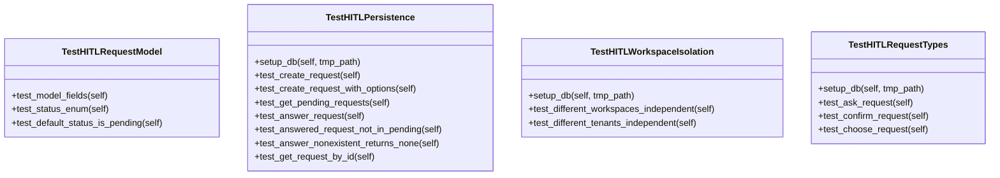

# Interaction Tests

## Synopsis

Human-in-the-Loop (HITL) interaction tests validating persistent request storage, workspace isolation, and multi-tenant support. Tests the database-backed HITL system that allows NEXUS to pause execution, request user input, and resume from exact state.

## Architecture



## Test Files

| File | Tests | Coverage |
|------|-------|----------|
| `test_hitl_persistence.py` | HITL database persistence, request lifecycle, workspace isolation | Request model, CRUD operations, multi-tenancy, request types (ask/confirm/choose) |

## Test Coverage

### HITL Request Model Tests

**TestHITLRequestModel** - Database model validation
- All fields present (request_id, workspace_id, tenant_id, request_type, prompt, options, status, answer, created_at, answered_at)
- Status enum (PENDING, ANSWERED, CANCELLED)
- Default status is PENDING

### HITL Persistence Tests

**TestHITLPersistence** - Database operations
- `create_request()` - Store HITL request to database
- `create_request_with_options()` - Store request with multiple choice options
- `get_pending_requests()` - Retrieve unanswered requests for workspace
- `answer_request()` - Mark request as answered, store response
- Answered requests removed from pending list
- Answer non-existent request returns None
- `get_request_by_id()` - Retrieve specific request

### Workspace Isolation Tests

**TestHITLWorkspaceIsolation** - Multi-tenancy
- Different workspaces have independent request queues
- Different tenants cannot see each other's requests
- Workspace ID and tenant ID enforce strict isolation

### Request Type Tests

**TestHITLRequestTypes** - All HITL request variants
- `ask` - Free-form text input
- `confirm` - Yes/No confirmation
- `choose` - Multiple choice selection

## Running Tests

```bash
# All interaction tests
python -m pytest tests/interaction/ -v

# HITL persistence tests
python -m pytest tests/interaction/test_hitl_persistence.py -v

# Specific test class
python -m pytest tests/interaction/test_hitl_persistence.py::TestHITLPersistence -v
```

## Dependencies

- `pytest` - Test framework
- `pytest-asyncio` - Async test support
- `sqlalchemy` - Database ORM
- `core.db.models` - HITLRequest model
- `core.interaction.hitl_manager` - HITL manager

## HITL Workflow

1. **Agent pauses execution** - Calls `hitl_manager.ask()` / `confirm()` / `choose()`
2. **Request persisted** - Stored to database with PENDING status
3. **User notified** - (via UI/API/webhook)
4. **User responds** - Calls `hitl_manager.answer()`
5. **Request updated** - Status changed to ANSWERED
6. **Agent resumes** - Returns answer to agent

## Related Modules

- [core/interaction/hitl_manager.py](../../core/interaction/hitl_manager.py) - HITL manager implementation
- [core/interaction/](../../core/interaction/) - Interaction providers
- [core/db/models.py](../../core/db/models.py) - HITLRequest model
- [core/api/cerebro/routes/hitl.py](../../core/api/cerebro/routes/hitl.py) - HITL API routes