# Torture Tests

## Synopsis

Comprehensive stress testing and chaos engineering for NEXUS resilience validation. Tests SagaManager crash recovery, HiveMind robustness, concurrent operations, and graceful degradation under extreme conditions. Uses chaos injectors (crash, race, corruption, timeout) to simulate production failures.

## Overview

| Metric | Value |
|--------|-------|
| **Path** | `C:\Code\NEXUS\NEXUS-N7A\tests\torture` |
| **Modules** | 4 |
| **Total Lines** | 949 |
| **Classes** | 8 |
| **Functions** | 3 |

## Architecture

```mermaid
classDiagram
    class TortureResultV8 {
        +str scenario
        +str test_id
        +bool success
        +float duration_ms
        +bool recovery_attempted
        +bool recovery_succeeded
        +bool panic_occurred
        +Optional[str] error
        +Dict[str, Any] metrics
        +str timestamp
    }
    class TortureBase {
        +workspace
        +metrics
        +lock
        +log_file
        -__init__(self, workspace_name: str=...)
        +sagas_dir(self) Path
        +log_result(self, result: TortureResultV8)
        +run_test(self, scenario: str, test_id: str, test_func, expect_recovery: bool=...) TortureResultV8
        +generate_report(self)
        +assert_targets(self, success_target: float=..., recovery_target: float=..., panic_target: float=..., hot_swap_target: float=...)
        +cleanup(self)
    }
    class CrashInjector {
        +crash_count
        +crash_at
        -__init__(self)
        +crash_after_n_checkpoints(self, n: int)
        +crash_during_persist(self)
        +crash_during_fsync(self)
        +crash_during_rename(self)
        +crash_at_phase(self, phase: str)
    }
    class RaceInjector {
        +delays
        -__init__(self)
        +delay_persist(self, delay_ms: int)
        +delay_operation(self, delay_ms: int)
        +concurrent_checkpoints(self, saga, phases: list, delay_between_ms: int=...)
        +concurrent_operations(self, operations: list, stagger_ms: int=...)
    }
    class CorruptionInjector {
        +CORRUPTION_TYPES
        +corrupt_json(self, filepath: Path, corruption_type: str=...)
        +truncate_file(self, filepath: Path, bytes_to_keep: int=...)
        +create_empty_file(self, filepath: Path)
        +create_locked_file(self, filepath: Path)
        +create_saga_with_unknown_phase(self, saga_dir: Path, task_id: str)
        +create_saga_with_future_timestamp(self, saga_dir: Path, task_id: str)
        +create_incomplete_saga(self, saga_dir: Path, task_id: str)
    }
    class TimeoutInjector {
        +timeout(self, timeout_ms: int)
        +async_timeout(self, coro, timeout_ms: int)
    }
    class ScenarioMetrics {
        +str name
        +bool success
        +float duration_ms
        +bool recovery_attempted
        +bool recovery_succeeded
        +bool panic_occurred
        +Optional[str] error_message
        +str timestamp
        +to_dict(self) Dict[str, Any]
    }
    class MetricsCollector {
        +List[ScenarioMetrics] scenarios
        +datetime start_time
        +record_test(self, name: str, success: bool, duration_ms: float, recovery_attempted: bool=..., recovery_succeeded: bool=..., panic_occurred: bool=..., error: Optional[str]=...)
        +calculate_rates(self) Dict[str, Any]
        -_calculate_hot_swap_rate(self) float
        +get_failures(self) List[ScenarioMetrics]
        +get_panics(self) List[ScenarioMetrics]
        +get_slowest(self, n: int=...) List[ScenarioMetrics]
        +to_jsonl(self, filepath: Path)
        +to_dict(self) Dict[str, Any]
        +summary(self) str
        +assert_targets(self, success_target: float=..., recovery_target: float=..., panic_target: float=..., hot_swap_target: float=...)
    }
```



## Modules

| Module | Description | Classes | Functions |
|--------|-------------|---------|-----------|
| [base](base.py) | Torture Protocol V8 - Base Classes and Fixtures | 2 | 3 |
| [chaos_injectors](chaos_injectors.py) | Torture Protocol V8 - Chaos Injectors | 4 | 0 |
| [metrics_collector](metrics_collector.py) | Torture Protocol V8 - Metrics Collector | 2 | 0 |

## Subpackages

| Package | Description | Modules |
|---------|-------------|---------|
| [scenarios/](C:\Code\NEXUS\NEXUS-N7A\tests\torture\scenarios/README.md) |  | 0 |


## Test Infrastructure

### Base Classes (base.py)

**TortureResultV8** - Single test result
- Fields: scenario, test_id, success, duration_ms, recovery_attempted, recovery_succeeded, panic_occurred, error, metrics, timestamp

**TortureBase** - Base class for torture scenarios
- Workspace setup, result logging, metrics collection
- `run_test()` - Execute test with chaos injection
- `generate_report()` - Generate JSON report
- `assert_targets()` - Validate success/recovery/panic rates

### Chaos Injectors (chaos_injectors.py)

**CrashInjector** - Simulates crashes
- `crash_after_n_checkpoints(n)` - Crash after N saga checkpoints
- `crash_during_persist()` - Crash during state persistence
- `crash_during_fsync()` - Crash during fsync operation
- `crash_at_phase(phase)` - Crash at specific HiveMind phase

**RaceInjector** - Simulates race conditions
- `delay_persist(delay_ms)` - Delay persistence operations
- `concurrent_checkpoints(saga, phases)` - Concurrent checkpoint writes
- `concurrent_operations(operations)` - Stagger multiple operations

**CorruptionInjector** - Simulates data corruption
- `corrupt_json(filepath, type)` - Corrupt JSON (invalid_json, truncated, missing_field, wrong_type)
- `truncate_file(filepath, bytes)` - Partial file write
- `create_saga_with_unknown_phase()` - Invalid saga state
- `create_saga_with_future_timestamp()` - Time paradox

**TimeoutInjector** - Simulates timeouts
- `timeout(timeout_ms)` - Synchronous timeout
- `async_timeout(coro, timeout_ms)` - Async timeout

### Metrics Collector (metrics_collector.py)

**MetricsCollector** - Aggregates test results
- `record_test()` - Record single test outcome
- `calculate_rates()` - Success/recovery/panic rates
- `get_failures()` - List all failures
- `get_panics()` - List all panics
- `get_slowest(n)` - N slowest tests
- `to_jsonl()` - Export to JSONL
- `assert_targets()` - Validate against thresholds

## Torture Scenarios

Located in [scenarios/](scenarios/):
- **compensation.py** - Compensation action execution
- **context_edge.py** - Context limit edge cases
- **hive_integration.py** - HiveMind + Saga integration
- **saga_concurrency.py** - Concurrent saga operations
- **saga_crash.py** - Saga crash recovery

## Running Torture Tests

```bash
# All torture tests
python -m pytest tests/torture/ -m torture -v

# Specific scenario
python -m pytest tests/torture_v8.py -k saga_crash -v

# Run torture suite directly
python tests/torture_v8.py
```

## Success Criteria

Torture tests validate:
- **Success Rate** >=90% - Most tests pass
- **Recovery Rate** >=80% - Crash recovery works
- **Panic Rate** <=5% - Fatal failures rare
- **Hot Swap Rate** >=75% - Dynamic lead swapping works

## Dependencies

- `pytest` - Test framework
- `pytest-asyncio` - Async test support
- `core.resilience.saga_manager` - Saga pattern implementation
- `core.hive_mind/` - HiveMind pipeline
- `concurrent.futures` - Concurrent execution

## Related Modules

- [core/resilience/saga_manager.py](../../core/resilience/saga_manager.py) - Saga manager
- [core/hive_mind/](../../core/hive_mind/) - HiveMind pipeline
- [tests/torture/scenarios/](scenarios/) - Torture scenarios