# Torture Scenarios

## Synopsis

Specific chaos engineering scenarios testing NEXUS resilience across 5 categories: crash recovery (20 tests), concurrency stress (15 tests), context limits (12 tests), compensation failures (10 tests), and HiveMind integration (38 tests). Each scenario simulates real-world production failures.

## Architecture

```mermaid
classDiagram
    class MockContextItem {
        +str content
        +int token_estimate
    }
    class MockDequeContextManager {
        -_items
        -_current_tokens
        -__init__(self, items=...)
    }
    class MockListContextManager {
        +messages
        -__init__(self, messages=...)
    }
    class MockBothContextManager {
        -_items
        -_current_tokens
        +messages
        -__init__(self, items=..., messages=...)
    }
    class MockNoTokenContextManager {
        -_items
        -_current_tokens
        -__init__(self, items=...)
    }
    class NoTokenItem {
        +content
        -__init__(self, content)
    }
    class InvalidContextManager {
    }
    class CustomObject {
        +value
        -__init__(self, value)
    }
    class MockConfig {
        +int hive_mind_budget_limit
        +int hive_mind_breakpoint_timeout
    }
    class MockDriver {
        +name
        +call_count
        +last_prompt
        -_fail_at_call
        -_responses
        -__init__(self, name: str=...)
        +generate(self, prompt: str, **kwargs) str
        +set_fail_at(self, call_number: int)
        +add_response(self, response: str)
    }
    class MockHiveMindPhase {
        +name
        -_default_result
        -_fail
        -_delay_ms
        +execute_count
        -__init__(self, name: str, default_result: Any=...)
        +execute(self, *args, **kwargs) Any
        +set_fail(self, should_fail: bool=...)
        +set_delay(self, delay_ms: int)
    }
    class AnalysisResult {
        +comparison
        +needs_debate
        -__init__(self)
    }
    class DebatePhaseResult {
        +debate_result
        +final_approach
        +was_skipped
        -__init__(self)
    }
    class ExecutionResult {
        +success
        +output
        +step_results
        +total_duration
        +total_tokens
        +artifacts_created
        -__init__(self)
    }
```



## Scenario Categories

### saga_crash.py (20 tests)
Saga pattern crash recovery validation:
- Crash during saga execution
- Crash during compensation action
- Crash during checkpoint write
- Crash after fsync but before rename
- Crash with partial saga state
- Crash with corrupted JSON
- Multiple consecutive crashes
- Saga recovery after restart

### saga_concurrency.py (15 tests)
Concurrent saga execution stress tests:
- Multiple sagas executing simultaneously
- Concurrent checkpoint writes (race conditions)
- Interleaved compensation actions
- Saga state contention
- Deadlock prevention
- Staggered operation timing

### compensation.py (10 tests)
Compensation action failure scenarios:
- Compensation action throws exception
- Compensation action times out
- Compensation action partially completes
- Multiple compensation failures
- Nested saga compensation
- Compensation during crash recovery

### context_edge.py (12 tests)
Context manager edge cases:
- Context at token limit boundary
- Context overflow handling
- Missing token_estimate attribute
- Deque vs List context managers
- Invalid context structure
- Empty context handling
- Custom object serialization

### hive_integration.py (38 tests)
HiveMind + Saga integration tests:
- HiveMind phase failures during saga
- Saga checkpoint during HiveMind debate
- Compensation during HiveMind retry
- Phase 1-7 failure scenarios
- Driver failures (Gemini/Claude crash)
- Timeout during HiveMind execution
- Budget limit enforcement
- Hot swap during saga execution

## Running Scenarios

```bash
# All scenarios
python -m pytest tests/torture/scenarios/ -v

# Specific category
python -m pytest tests/torture/scenarios/saga_crash.py -v
python -m pytest tests/torture/scenarios/hive_integration.py -v

# Specific test
python -m pytest tests/torture/scenarios/saga_crash.py::test_crash_during_checkpoint -v
```

## Scenario Pattern

Each scenario follows this pattern:
1. **Setup** - Create workspace, initialize dependencies
2. **Inject Chaos** - Use chaos injectors to simulate failure
3. **Execute** - Run the operation
4. **Verify** - Check recovery behavior, state consistency
5. **Cleanup** - Remove test artifacts

## Success Criteria

Scenarios validate:
- **State Consistency** - Saga state correct after recovery
- **Data Integrity** - No partial writes or corruption
- **Idempotency** - Re-running saga produces same result
- **Compensation** - Rollback actions execute correctly
- **No Panics** - System recovers gracefully

## Related

- [tests/torture/](../) - Torture test infrastructure
- [tests/torture/base.py](../base.py) - TortureBase class
- [tests/torture/chaos_injectors.py](../chaos_injectors.py) - Chaos injectors
- [core/resilience/saga_manager.py](../../../core/resilience/saga_manager.py) - Saga implementation