# V10 Tests (PRISM Isolation Suite)

## Synopsis

NEXUS V10 PRISM multi-tenant architecture tests. Validates tenant/workspace isolation, shared embedding engine optimization, Redis event bus, CEREBRO API skeleton, and MEMORIA unified memory architecture. Ensures strict data separation while maximizing resource efficiency.

## Overview

| Metric | Value |
|--------|-------|
| **Path** | `C:\Code\NEXUS\NEXUS-N7A\tests\v10` |
| **Modules** | 5 |
| **Total Lines** | 1807 |
| **Classes** | 27 |
| **Functions** | 0 |

## Architecture

```mermaid
classDiagram
    class TestCerebroEventTypes {
        +test_event_type_values(self)
        +test_event_creation(self)
        +test_event_to_json(self)
        +test_event_from_json(self)
        +test_event_channel_name(self)
        +test_wildcard_channel(self)
    }
    class TestRedisEventBus {
        +reset_singleton(self)
        +test_singleton_pattern(self)
        +test_initial_state(self)
        +test_graceful_degradation_publish(self)
        +test_health_check_disconnected(self)
    }
    class TestRedisLogHandler {
        +test_handler_creation(self)
        +test_start_stop_lifecycle(self)
        +test_emit_non_blocking(self)
        +test_queue_overflow_drops(self)
        +test_get_stats(self)
    }
    class TestCerebroAPI {
        +client(self)
        +test_root_endpoint(self, client)
        +test_health_endpoint(self, client)
        +test_ping_endpoint(self, client)
        +test_ready_endpoint(self, client)
    }
    class TestHeadlessProviderIntegration {
        +reset_singleton(self)
        +test_ask_publishes_event(self)
        +test_confirm_publishes_event(self)
        +test_publish_events_disabled(self)
    }
    class TestMiddleware {
        +test_create_jwt_token(self)
        +test_decode_invalid_jwt(self)
    }
    class TestDependencies {
        +test_create_ws_url(self)
        +test_create_ws_url_with_token(self)
    }
    class TestEmbeddingEngineSingleton {
        +test_singleton_same_object(self)
        +test_singleton_via_class(self)
        +test_properties_before_load(self)
    }
    class TestEmbeddingEngineEncoding {
        +engine(self)
        +test_encode_single_text(self, engine)
        +test_encode_batch(self, engine)
        +test_encode_single_convenience(self, engine)
        +test_encode_empty_list(self, engine)
        +test_get_info(self, engine)
    }
    class TestIsolatedStorage {
        +test_dense_backend_accepts_engine(self)
        +test_different_storage_paths(self)
    }
    class TestMemorySingletonMigration {
        +test_auto_memory_has_prism_pattern(self)
        +test_success_memory_has_prism_pattern(self)
        +test_spotlighter_has_prism_pattern(self)
    }
    class TestServiceFactoryMemoryMethods {
        +test_get_embedding_engine_exists(self)
        +test_get_project_memory_exists(self)
        +test_get_auto_memory_exists(self)
        +test_get_success_memory_exists(self)
        +test_get_spotlighter_exists(self)
        +test_embedding_engine_is_global(self)
    }
    class TestONNXFallback {
        +test_backend_detection(self)
        +test_onnx_availability_check(self)
    }
    class TestDenseBackendIntegration {
        +backend(self)
        +test_get_info_includes_engine(self, backend)
        +test_dependencies_string_updated(self, backend)
    }
    class TestSessionContext {
        +test_context_creation(self)
        +test_context_immutable(self)
        +test_context_requires_tenant_id(self)
        +test_use_context_sets_and_resets(self)
        +test_nested_contexts(self)
        +test_get_current_session_raises_without_context(self)
    }
```



## Test Files

| File | Purpose | Key Tests |
|------|---------|-----------|
| `test_prism_isolation.py` | Multi-tenant data isolation | Tenant/workspace isolation, session context, PRISM pattern |
| `test_cerebro.py` | Redis event bus and API | Event types, pub/sub, graceful degradation, health checks |
| `test_memory_optimization.py` | Shared embedding engine | Singleton pattern, isolated storage, ONNX fallback |
| `test_synapse_telemetry.py` | Telemetry bridge and instrumentation | Session tracking, TTL persistence |

## Test Coverage

### PRISM Isolation (test_prism_isolation.py)
- **SessionContext** - Tenant/workspace context management
- **Memory Isolation** - AutoMemory, SuccessMemory, Spotlighter isolated per tenant
- **ServiceFactory** - Global embedding engine, isolated memory instances
- **PRISM Pattern** - All memory classes use PRISM isolation

### CEREBRO API (test_cerebro.py)
- **Event Types** - CerebroEventType enum, channel naming
- **Redis Event Bus** - Singleton, pub/sub, graceful degradation
- **RedisLogHandler** - Non-blocking log streaming, queue overflow handling
- **API Skeleton** - Root, health, ping, ready endpoints
- **Middleware** - JWT token creation/validation, WebSocket URL generation

### Memory Optimization (test_memory_optimization.py)
- **Embedding Engine Singleton** - Shared across all tenants
- **Encoding** - Single text, batch encoding
- **Isolated Storage** - DenseBackend accepts engine, different storage paths per tenant
- **ONNX Fallback** - Automatic backend detection
- **Integration** - Engine info included in DenseBackend

### Synapse Telemetry (test_synapse_telemetry.py)
- **TelemetryBridge** - Session tracking, state persistence
- **TTL** - 24-hour default expiration
- **Integration** - Telemetry data includes tenant/workspace context

## Running Tests

```bash
# All V10 tests
python -m pytest tests/v10/ -v

# Specific test files
python -m pytest tests/v10/test_prism_isolation.py -v
python -m pytest tests/v10/test_cerebro.py -v
python -m pytest tests/v10/test_memory_optimization.py -v
```

## V10 PRISM Architecture

**Key Principles**:
1. **Tenant Isolation** - Strict data separation (tenant_id + workspace_id)
2. **Resource Efficiency** - Shared embedding engine (expensive to load)
3. **Graceful Degradation** - Works without Redis (single instance)
4. **Multi-tenancy** - Supports SaaS deployment

**PRISM Pattern**:
```python
# Memory classes use PRISM isolation
memory = AutoMemory.get_instance(tenant_id="tenant1", workspace_id="ws1")
memory2 = AutoMemory.get_instance(tenant_id="tenant1", workspace_id="ws2")
# memory != memory2 (isolated storage)

# Embedding engine shared globally
engine = EmbeddingEngine.get_instance()
# Same instance for all tenants (efficiency)
```

## Dependencies

- `pytest` - Test framework
- `fakeredis` - Redis mocking
- `fastapi` - API framework
- `core.memory.` - Memory modules
- `core.api.cerebro.` - CEREBRO API

## Related Modules

- [core/memory/](../../core/memory/) - Memory system
- [core/api/cerebro/](../../core/api/cerebro/) - CEREBRO API
- [core/session/session_context.py](../../core/session/session_context.py) - Session context