# V11 Tests (SENTINEL Security Suite)

## Synopsis

NEXUS V11 SENTINEL/SYNCHROTRON security and async core tests. Validates async concurrency limiting, deadlock prevention, JWT/CORS security, CORTEX API integration, KEYMAKER authentication, and MEMORIA unified memory architecture. Ensures production-grade security and async robustness.

## Overview

| Metric | Value |
|--------|-------|
| **Path** | `C:\Code\NEXUS\NEXUS-N7A\tests\v11` |
| **Modules** | 7 |
| **Total Lines** | 2090 |
| **Classes** | 32 |
| **Functions** | 0 |

## Architecture

```mermaid
classDiagram
    class TestConcurrencyLimiter {
        +setup_method(self)
        +test_singleton_pattern(self)
        +test_get_concurrency_limiter(self)
        +test_max_concurrent_from_constants(self)
        +test_sync_acquire_release(self)
        +test_async_acquire_release(self)
        +test_concurrency_limit_enforced(self)
        +test_sync_timeout(self)
        +test_async_timeout(self)
        +test_stats_tracking(self)
    }
    class TestEventLoopResponsiveness {
        +test_event_loop_not_blocked(self)
        +test_concurrent_tasks_fair(self)
    }
    class TestGracefulShutdown {
        +test_cancellation_cleanup(self)
    }
    class TestExecutorIntegration {
        +test_base_executor_import(self)
        +test_parallel_invocations_limited(self)
    }
    class TestDeadlockPrevention {
        +test_gemini_driver_has_stderr_drain(self)
        +test_claude_driver_has_stderr_drain(self)
        +test_gemini_driver_has_process_wait_timeout(self)
        +test_claude_driver_has_process_wait_timeout(self)
    }
    class TestHeadlessProviderInteractive {
        +test_default_non_interactive(self)
        +test_interactive_mode_enabled(self)
        +test_get_pending_requests_empty(self)
        +test_resolve_interaction_not_found(self)
    }
    class TestFileSizeLimit {
        +test_max_file_size_constant(self)
        +test_large_file_returns_413(self)
    }
    class TestStateSnapshot {
        +test_snapshot_includes_pending_interactions(self)
    }
    class TestInteractionEndpoint {
        +test_pending_empty_initially(self)
    }
    class TestWorkflowEndpoint {
        +test_workflow_start(self)
        +test_workflow_not_found(self)
    }
    class TestTelemetryBridgePersistence {
        +test_state_ttl_24_hours(self)
        +test_persist_state_method_exists(self)
    }
    class TestCORTEXRoutes {
        +test_routes_in_app(self)
    }
    class TestBackwardCompatibility {
        +test_headless_provider_sync_methods_unchanged(self)
        +test_ask_returns_default_non_interactive(self)
        +test_confirm_returns_default_non_interactive(self)
    }
    class TestJWTSecurity {
        +test_jwt_secret_from_env(self)
        +test_jwt_secret_fallback_warning(self)
        +test_jwt_secret_not_hardcoded(self)
    }
    class TestCORSSecurity {
        +test_cors_origins_from_env(self)
        +test_cors_default_localhost(self)
        +test_cors_not_wildcard(self)
    }
```



## Test Files

| File | Purpose | Key Tests |
|------|---------|-----------|
| `test_async_core.py` | Async concurrency, deadlock prevention | ConcurrencyLimiter, event loop responsiveness, executor integration |
| `test_sentinel.py` | Logic hardening, deadlock prevention | Stderr drain, process wait timeout |
| `test_hardening.py` | Security hardening | JWT secrets, CORS origins, file size limits |
| `test_keymaker.py` | Authentication system | JWT token validation, user management |
| `test_cortex.py` | CORTEX API integration | Routes, endpoints, backward compatibility |
| `test_memoria.py` | Unified memory architecture | Memory consolidation, telemetry persistence |

## Test Coverage

### Async Core (test_async_core.py)
**TestConcurrencyLimiter** - Prevent async overload
- Singleton pattern (one limiter per system)
- Sync/async acquire/release
- Concurrency limit enforced (max concurrent tasks)
- Timeout on acquire (prevent deadlock)
- Stats tracking (acquired, rejected, timeouts)

**TestEventLoopResponsiveness** - Event loop health
- Event loop not blocked by long operations
- Concurrent tasks execute fairly (no starvation)

**TestGracefulShutdown** - Cleanup on cancel
- Cancellation cleanup releases resources

**TestExecutorIntegration** - Integration with executors
- Base executor imports work
- Parallel invocations limited by concurrency limiter

### SENTINEL (test_sentinel.py)
**TestDeadlockPrevention** - Driver deadlock prevention
- Gemini driver has stderr drain (subprocess.PIPE deadlock fix)
- Claude driver has stderr drain
- Gemini driver has process wait timeout
- Claude driver has process wait timeout

### Hardening (test_hardening.py)
**TestJWTSecurity** - JWT secret management
- JWT secret from environment variable
- Warning logged if fallback to default
- No hardcoded secrets in code

**TestCORSSecurity** - CORS origin restriction
- CORS origins from environment variable
- Default to localhost only
- Never wildcard (*) in production

**TestFileSizeLimit** - File upload protection
- MAX_FILE_SIZE constant defined
- Large files return HTTP 413 (Payload Too Large)

### KEYMAKER (test_keymaker.py)
**JWT Token Management**:
- Token creation with user claims
- Token validation and decoding
- Invalid token handling
- Token expiration

**User Authentication**:
- User registration
- Login with credentials
- Password hashing (bcrypt)
- User session management

### CORTEX (test_cortex.py)
**API Integration**:
- CORTEX routes registered in app
- Headless provider interactive mode
- Pending interactions endpoint
- Workflow endpoints
- State snapshot includes interactions

**Backward Compatibility**:
- Headless provider sync methods unchanged
- ask() returns default in non-interactive
- confirm() returns default in non-interactive

### MEMORIA (test_memoria.py)
**Memory Architecture**:
- Unified memory consolidation
- Telemetry bridge persistence (24h TTL)
- Memory instance isolation

## Running Tests

```bash
# All V11 tests
python -m pytest tests/v11/ -v

# Specific test files
python -m pytest tests/v11/test_async_core.py -v
python -m pytest tests/v11/test_sentinel.py -v
python -m pytest tests/v11/test_hardening.py -v
```

## V11 Security Principles

1. **Async Safety** - No event loop blocking or deadlocks
2. **Concurrency Limiting** - Prevent resource exhaustion
3. **JWT Security** - Secure token management
4. **CORS Restriction** - Prevent unauthorized origins
5. **File Size Limits** - DoS protection
6. **Subprocess Safety** - Prevent pipe deadlocks

## Dependencies

- `pytest` - Test framework
- `pytest-asyncio` - Async test support
- `fastapi` - API framework
- `jwt` - JSON Web Tokens
- `bcrypt` - Password hashing

## Related Modules

- [core/async_primitives/concurrency_limiter.py](../../core/async_primitives/concurrency_limiter.py) - Concurrency limiter
- [core/api/cerebro/middleware.py](../../core/api/cerebro/middleware.py) - JWT/CORS middleware
- [core/drivers/](../../core/drivers/) - LLM drivers with deadlock prevention