# Workflow Tests

## Synopsis

Distributed workflow tests for NEXUS V12.3 SCALE-OUT multi-instance deployment. Tests Redis-backed distributed locking, workflow registry, graceful degradation without Redis, and multi-tenant isolation.

## Overview

| Metric | Value |
|--------|-------|
| **Path** | `C:\Code\NEXUS\NEXUS-N7A\tests\workflow` |
| **Modules** | 3 |
| **Total Lines** | 785 |
| **Classes** | 12 |
| **Functions** | 0 |

## Architecture

```mermaid
classDiagram
    class TestDistributedLockNoOp {
        +test_acquire_without_redis(self)
        +test_release_without_redis(self)
        +test_context_manager_without_redis(self)
        +test_multiple_locks_without_redis(self)
    }
    class TestDistributedLockWithMockRedis {
        +mock_redis(self)
        +test_acquire_success(self, mock_redis)
        +test_acquire_failure(self, mock_redis)
        +test_release_success(self, mock_redis)
        +test_release_not_acquired(self, mock_redis)
        +test_release_wrong_owner(self, mock_redis)
        +test_extend_success(self, mock_redis)
        +test_extend_not_acquired(self, mock_redis)
        +test_context_manager_success(self, mock_redis)
        +test_context_manager_acquisition_failure(self, mock_redis)
    }
    class TestDistributedLockKey {
        +test_key_format(self)
        +test_key_prefix(self)
    }
    class TestConvenienceFunctions {
        +test_acquire_workflow_lock_success(self)
        +test_acquire_workflow_lock_failure(self)
        +test_try_acquire_workflow_lock_success(self)
        +test_try_acquire_workflow_lock_failure(self)
    }
    class TestGracefulDegradation {
        +test_acquire_on_redis_error(self)
        +test_release_on_redis_error(self)
        +test_extend_on_redis_error(self)
    }
    class TestLockOwnership {
        +test_custom_owner_id(self)
        +test_auto_generated_owner_id(self)
        +test_different_instances_different_owners(self)
    }
    class TestDefaultTTL {
        +test_default_ttl(self)
        +test_custom_ttl(self)
    }
    class TestWorkflowStatusEnum {
        +test_status_values(self)
    }
    class TestRedisWorkflowRegistryUnit {
        +reset_registry(self)
        +test_singleton_pattern(self)
        +test_configure(self)
        +test_initial_state(self)
    }
    class TestRedisWorkflowRegistryInMemory {
        +setup_registry(self)
        +test_create_workflow(self)
        +test_get_workflow(self)
        +test_get_workflow_wrong_tenant(self)
        +test_update_status(self)
        +test_update_status_with_result(self)
        +test_update_status_with_error(self)
        +test_list_workflows(self)
        +test_list_workflows_status_filter(self)
        +test_list_workflows_tenant_isolation(self)
        +test_delete_workflow(self)
        +test_get_stats(self)
    }
    class TestWorkflowLifecycle {
        +setup_registry(self)
        +test_full_lifecycle(self)
        +test_failure_lifecycle(self)
        +test_cancellation_lifecycle(self)
    }
    class TestConcurrentOperations {
        +setup_registry(self)
        +test_concurrent_creates(self)
        +test_concurrent_updates(self)
    }
```



## Test Files

| File | Tests | Coverage |
|------|-------|----------|
| `test_distributed_lock.py` | Distributed locking with Redis, graceful degradation | No-op without Redis, acquire/release, context manager, TTL, key format, ownership |
| `test_redis_registry.py` | Workflow registry persistence, lifecycle, tenant isolation | CRUD operations, status updates, filtering, stats, concurrent operations |

## Test Coverage

### Distributed Lock Tests

**TestDistributedLockNoOp** - Graceful degradation without Redis
- Acquire/release without Redis (no-op mode)
- Context manager works without Redis
- Multiple locks don't conflict

**TestDistributedLockWithMockRedis** - Redis-backed locking
- Acquire success with SET NX
- Acquire failure when key exists
- Release success with Lua script
- Release ignores if not acquired
- Release validates lock ownership
- Extend TTL for long-running operations
- Context manager automatic acquire/release

**TestDistributedLockKey** - Key format validation
- Key format: `nexus:workflow:lock:{workflow_id}`
- Consistent prefix for all locks

**TestConvenienceFunctions** - Helper functions
- `acquire_workflow_lock()` - High-level acquire
- `try_acquire_workflow_lock()` - Non-blocking acquire

**TestGracefulDegradation** - Redis failure handling
- Acquire succeeds on Redis error (logs warning)
- Release succeeds on Redis error
- Extend succeeds on Redis error

**TestLockOwnership** - Multi-instance isolation
- Custom owner ID supported
- Auto-generated owner ID unique per instance
- Different instances have different owners

**TestDefaultTTL** - Lock expiration
- Default TTL 30 seconds
- Custom TTL configurable

### Workflow Registry Tests

**TestWorkflowStatusEnum** - Status enumeration
- PENDING, RUNNING, COMPLETED, FAILED, CANCELLED

**TestRedisWorkflowRegistryUnit** - Registry singleton
- Singleton pattern enforced
- Configuration method exists
- Initial state valid

**TestRedisWorkflowRegistryInMemory** - CRUD operations (fakeredis)
- Create workflow with metadata
- Get workflow by ID
- Get workflow enforces tenant isolation
- Update status (PENDING -> RUNNING -> COMPLETED)
- Update status with result/error
- List workflows for tenant
- List workflows filtered by status
- Tenant isolation enforced
- Delete workflow
- Get stats (count by status)

**TestWorkflowLifecycle** - Full workflow lifecycle
- PENDING -> RUNNING -> COMPLETED (success)
- PENDING -> RUNNING -> FAILED (with error)
- PENDING -> RUNNING -> CANCELLED

**TestConcurrentOperations** - Concurrency
- Concurrent workflow creates
- Concurrent status updates

## Running Tests

```bash
# All workflow tests
python -m pytest tests/workflow/ -v

# Distributed lock tests
python -m pytest tests/workflow/test_distributed_lock.py -v

# Workflow registry tests
python -m pytest tests/workflow/test_redis_registry.py -v
```

## Dependencies

- `pytest` - Test framework
- `fakeredis` - Redis mocking
- `redis` - Redis client
- `core.workflow.distributed_lock` - Lock implementation
- `core.workflow.redis_registry` - Registry implementation

## Multi-Instance Deployment

These tests validate NEXUS can run multiple instances:
- **Distributed Lock** - Prevents duplicate work across instances
- **Workflow Registry** - Centralized state in Redis
- **Tenant Isolation** - Each tenant has independent workflows
- **Graceful Degradation** - Works without Redis (single instance)

## Related Modules

- [core/workflow/distributed_lock.py](../../core/workflow/distributed_lock.py) - Lock implementation
- [core/workflow/redis_registry.py](../../core/workflow/redis_registry.py) - Registry implementation